Building BeepBeep in Eclipse
============================

[Home](index.html)

If you are interested in contributing to BeepBeep's development, you will need to download the sources and build them by yourself. We shall now see how to build BeepBeep and setup a development environment using Eclipse.

## <a name="prerequisites">Prerequisites</a>

- The **Java Development Kit**, version 6 or later. Depending on your operating system, you can use Oracle's JDK, or the OpenJDK, at your convenience.
- [Eclipse](http://www.eclipse.org). BeepBeep is not particularly picky about what version you use; for sure, any 4.x version will do. You can, of course, use any other developemnt environment you wish; simply adapt the following instructions to the specifics of your favorite IDE.
- [Git](http://www.git-scm.com) to pull/push the latest version of BeepBeep's source code.
- Apache [Ant](https://ant.apache.org/); this is optional. You may need Ant if you wish to build the sources from the command line or automatically download the dependencies that some projects have.

## <a name="source">Downloading the Source Code</a>

BeepBeep's code is split across two main code repositories. Both are hosted on [GitHub](https://github.com).

- The [beepbeep-3](https://github.com/liflab/beepbeep-3) repository contains BeepBeep's "core": the minimum set of classes to perform anything useful.
- The [beepbeep-3-palettes](https://github.com/liflab/beepbeep-3) repository contains small packets of code, called "palettes", that extend BeepBeep's functionalities in various ways. Although anybody can create palettes, this set is maintained directly by BeepBeep's development team and hence counts as a "semi-core" to the software.

It is recommended that you setup a development environment that includes both.

To download the source code, first create a `beepbeep` folder in the location of your choice. Within this folder, you will now need to *clone* both repositories. In order to do so, you need to fetch the clone URL that is shown on GitHub. This is represented by a green button on the repository's main page:

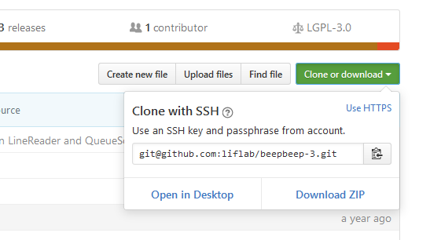

You can clone the code of both repository, simply type at the command line (from the `beepbeep` folder you just created):

    $ git clone git@github.com:liflab/beepbeep-3.git
    $ git clone git@github.com:liflab/beepbeep-3-palettes.git

The SSH cloning method shown above will only work if you have a registered account on GitHub with the SSH keys correctly setup on your machine (this is out of the scope of these instructions; ask your friend Google). If you wish to only *pull* code from the repository, you can instead use the HTTP cloning method:

    $ git clone https://github.com/liflab/beepbeep-3.git
    $ git clone https://github.com/liflab/beepbeep-3-palettes.git

Whatever method you choose, these commands will create and fill two folders within `beepbeep`, respectively named `beepbeep-3` and `beepbeep-3-palettes`.

## <a name="project">Creating the First Project</a>

You are now ready to open Eclipse and import this source code as projects in a new workspace. To this end, open Eclipse; when asked for a workspace to select, type the path to the `beepbeep` root folder you created:

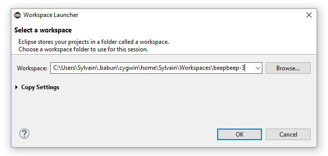

In the empty workspace, move your mouse to the left panel (labelled "Package Explorer"); right-click, and select New/Java Project.

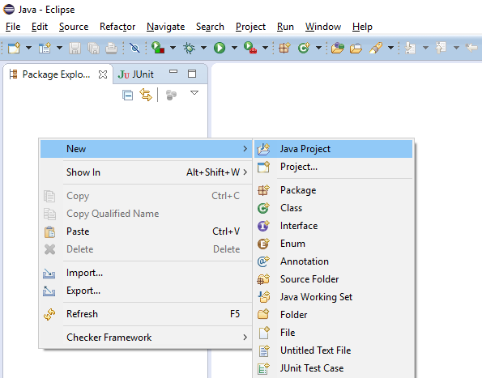

This will summon a dialog box where you need to type a number of things:

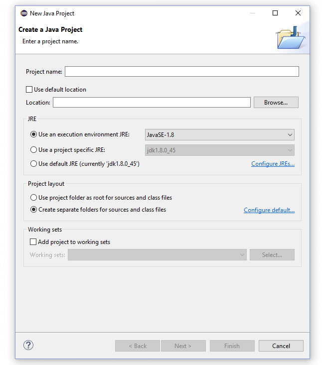

Let us start by creating a project for BeepBeep's core. This corresponds to the `Core` folder in the `beepbeep-3` folder. In the dialog box, type:

- Project name: `Core`
- Uncheck "Use default location"
- In the "Location" box, browse to (or type) the `beepbeep-3/Core` folder
- Leave the remaining options to their default values
- Click "Finish"

This will create a new project in the workspace, named "Core":

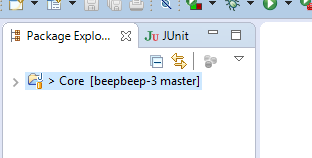

## <a name="encoding">A Note on File Encoding</a>

This applies especially for Windows users. **All source code should be edited as UTF-8.** Otherwise, you may see some garbled characters. The developers would be especially mad at you if you push source files with another encoding, or if you mess up with the file encoding of existing files (which sometimes is converted without your knowledge if your project has the wrong settings). Therefore, once the project is created, right-click on it, select "Properties", and go to the "Resource" section at the left. In the panel, make sure that the "Text file encoding" setting is "UTF-8".

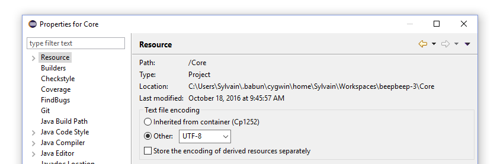

UTF-8 is the default setting in Linux, so you should not have problems. However, in Windows it will most likely be Cp1252, so you **need** to change it.

## <a name="ref-another">Adding a Reference to Another Project</a>

You can now repeat the same procedure for the `beepbeep-3/CoreTest` folder. However, simply importing it will create a ton of error messages, as its code refers to classes that are defined in `Core`. Hence, when creating the project, **don't click on "Finish"**; there is still one more step! Instead, click "Next"; in the next window, select the "Projects" tab (meaning you wish to add a reference to another project):

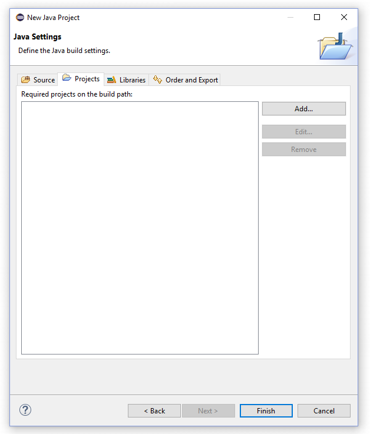

In this tab, click "Add", and select the "Core" project:

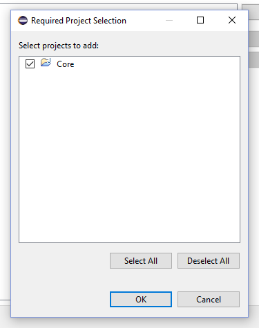

## <a name="ref-junit">Adding a Reference to JUnit</a>

There is yet one more thing to do before finalizing this project. CoreTest also requires a reference to the [JUnit](http://junit.org) library, as it consists almost uniquely of test cases. Fortunately, Eclipse already ships with this library. Back in the Settings dialog, go to the "Libraries" tab, and then click on "Add Library":

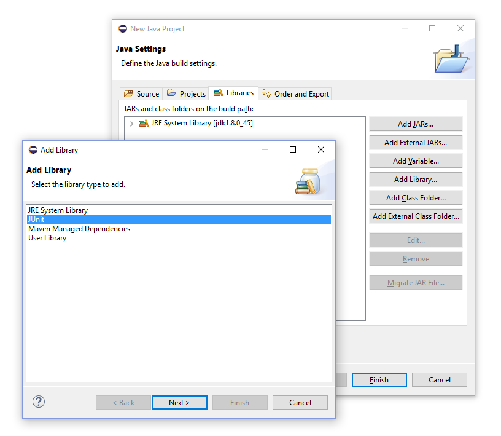

Select "JUnit", then click "Next". In the next panel, make sure you select "JUnit 4", then click "Finish":

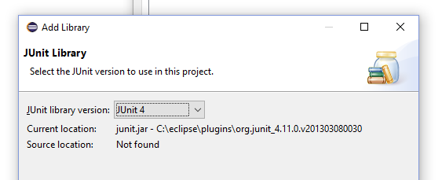

You can now click "Finish" in the settings dialog. This will create the `CoreTest` project in the Package Explorer pane of the main window.

Remember these steps, as **all the other projects you will import** require a reference to `Core` and to JUnit.

## <a name="later">Adding References Later On</a>

In case you missed these instructions, references can be added to a project after it has been created. Simply right-click on the project in the Package Explorer, select "Properties". This will open a window for the project settings; what you are looking for is the "Java Build Path" entry at the left. Select it and you will get a panel with the same "Projects" and "Libraries" tabs we've seen before.

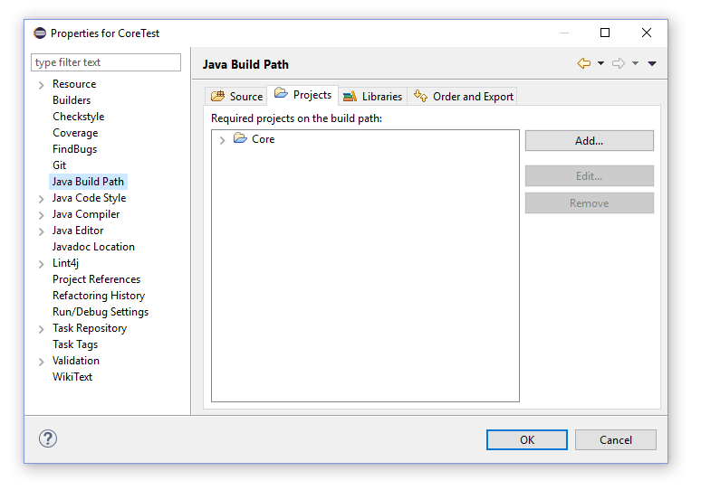

## <a name="dependencies">Dependencies for the Remaining Projects</a>

Create one new project for all the folders you find in `beepbeep-3-palettes`. Don't forget to add the reference to `Core` and JUnit for each of them.

If you see error messages in the console panel, this means that some of these projects also have dependencies to other libraries (JAR files). They should normally ship with these JAR files inside a subfolder named `dep`. If not, they should come with an Ant script that can download them for you. Go to the project's subfolder, and from the command-line, type:

    $ ant download-deps

Once the JAR files are in the `dep` folder, you can add a reference to them in Eclipse. In the "Libraries" tab of the "Project Settings" dialog, click on "Add External JAR" and select the JAR file(s) you find in the `dep` folder of that project. This should fix the error messages immediately.

## <a name="junit-tests">JUnit Test Cases</a>

It is **extremely** recommended to write JUnit test cases for any new functionality you develop, and to regularly run the existing test cases to spot any regression as soon as possible.

### Running Tests

Running the tests in Eclipse is easy. To run the tests associated to a specific project, right-click on it in the Package Explorer, select "Run As/JUnit Test":

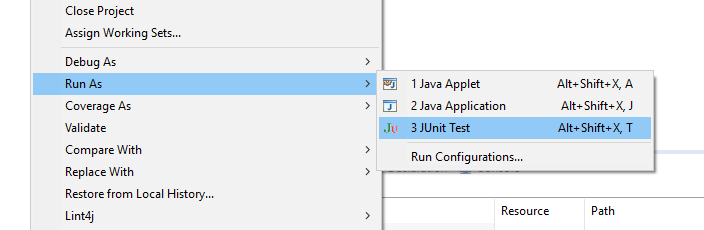

A summary of the execution of the tests is shown in the JUnit panel besides the Package Explorer:

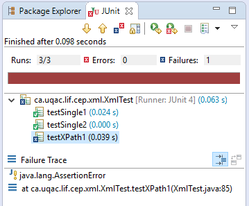

### Writing Tests

Writing tests is also easy. Simply create a new class; by convention, make sure its name ends with "Test" (e.g. "MyNewTest"). This convention is used by the Ant build scripts, which do not include test classes in the JAR files they create. Hence, do not intersperse test cases with actual "code", and concentrate them all in files that end in `Test`.

A new test case is simply a method that is prefixed by the `@Test` annotation. Have a look at existing test files to get a feel of what you can do.

<!-- :mode=markdown:wrap=soft: -->
---
slug: building-eclipse
section-slug: doc
lang: en
template: right-sidebar.php
...