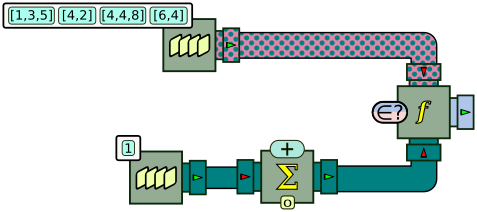
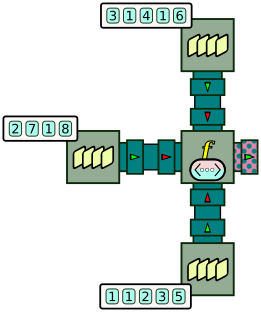
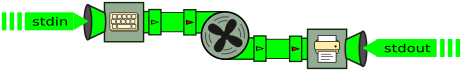
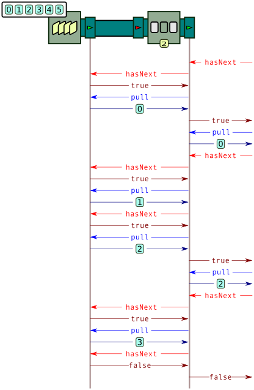
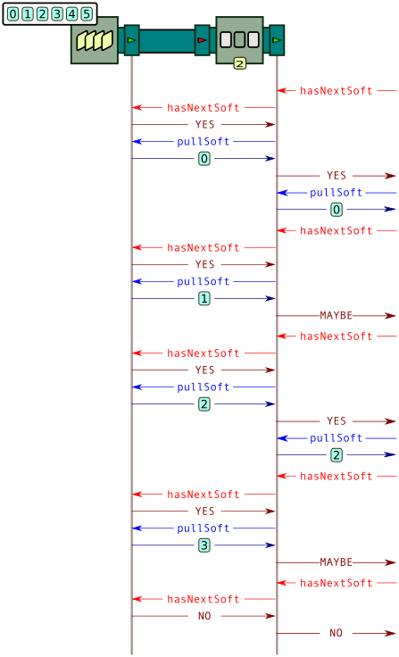

Advanced features
=================

The previous chapters have shown the fundamental concepts around BeepBeep and the basic processors that can be used in general use cases. In this chapter, we shall see a number of more special-purpose processors that come in BeepBeep's core that you are likely to use in one of your processor chains.

## Lists, sets and maps

Up to this point, all the examples we have seen use event streams that are one of Java's primitive types: numbers (`int`s or `float`s), `Strings` and `Booleans`. However, we have said in the very beginning that one of BeepBeep's design principles is that everything (that is, any Java object) can be used as an event. To this end, the `util` package provides functions and processors to manipulate a few common data structures, especially lists, sets and maps.

A few of these functions are grouped under the [`Bags`](http://liflab.github.io/beepbeep-3/javadoc/ca/uqac/lif/cep/util/Bags.html) utility class. It contains references to functions that can be used to query arbitrary <!--\index{Bags@\texttt{Bags}} collections-->collections<!--/i--> of objects.

[`Bags.getSize`](http://liflab.github.io/beepbeep-3/javadoc/ca/uqac/lif/cep/util/Bags/getSize.html) refers to a function <!--\index{Bags@\texttt{Bags}!GetSize@\texttt{GetSize}} \texttt{GetSize}-->`GetSize`<!--/i--> that takes a Java `Collection` object for input, and returns the size of this collection. For example, if `list` is a `List` object with a few elements inside, one could use `GetSize` like any other function:

``` java
Object[] outs = new Object[1];
Bags.getSize.evaluate(new Object[]{list}, outs);
// outs[0] contains the size of list
```

[`Bags.contains`](http://liflab.github.io/beepbeep-3/javadoc/ca/uqac/lif/cep/util/Bags/contains.html) refers to a function <!--\index{Bags@\texttt{Bags}!Contains@\texttt{Contains}} \texttt{Contains}-->`Contains`<!--/i--> that takes as input a Java `Collection` and an object *o*, and returns a Boolean value indicating whether the collection contains *o*. Its usage can be illustrated in the following code example:

``` java
QueueSource src1 = new QueueSource();
src1.addEvent(UtilityMethods.createList(1f, 3f, 5f));
src1.addEvent(UtilityMethods.createList(4f, 2f));
src1.addEvent(UtilityMethods.createList(4f, 4f, 8f));
src1.addEvent(UtilityMethods.createList(6f, 4f));
QueueSource src2 = new QueueSource();
src2.setEvents(1);
ApplyFunction contains = new ApplyFunction(Bags.contains);
Connector.connect(src1, 0, contains, 0);
Cumulate counter = new Cumulate(new CumulativeFunction<Number>(Numbers.addition));
Connector.connect(src2, counter);
Connector.connect(counter, 0, contains, 1);
Pullable p = contains.getPullableOutput();
for (int i = 0; i < 4; i++)
{
    System.out.println(p.pull());
}
```
[⚓](https://github.com/liflab/beepbeep-3-examples/blob/master/Source/src/util/BagsContains.java#L42)


We first create a `QueueSource` as usual; note that this time, each event in the source is itself a *list* (method `createList` is a small utility method that creates a `List` object out of its arguments). We then pipe this source as the first argument of an `ApplyFunction` processor that evaluates `Bags.contains`; its second argument comes from a stream of numbers that increments by one. The end result is a stream where the *n*-th output event is the value `true` if and only if the *n*-th input list in `src1` contains the value *n*. This can be illustrated like this:



This drawing introduces the "polka dot" pattern. The base color to represent collections (sets, lists or arrays) is pink; the dots on the pipes are used to indicate the type of the elements inside the collection (here, numbers). When the type of the elements inside the collection is not known or may vary, the pipes will be represented in flat pink without the dots. Note also the symbol used to depict the `Contains` function.

As expected, the output of the program is:

```
true
true
false
true
```

The `Bags` class also provides a function called [`ApplyToAll`](http://liflab.github.io/beepbeep-3/javadoc/ca/uqac/lif/cep/util/Bags/ApplyToAll.html). This function is intantiated by giving it a `Function` object *f*; given a set/list/array, <!--\index{Bags@\texttt{Bags}!ApplyToAll@\texttt{ApplyToAll}} \texttt{ApplyToAll}-->`ApplyToAll`<!--/i--> returns a *new* set/list/array whose content is the result of applying *f* to each element. This can be shown in the following example:

``` java
List<Object> list = UtilityMethods.createList(-3, 6, -1, -2);
Object[] out = new Object[1];
Function f = new Bags.ApplyToAll(Numbers.absoluteValue);
f.evaluate(new Object[]{list}, out);
System.out.println(out[0]);
```
[⚓](https://github.com/liflab/beepbeep-3-examples/blob/master/Source/src/util/BagsFunctions.java#L35)


The output of this code snippet is indeed a new list with the absolute value of the elements of the input list:

```
[3.0, 6.0, 1.0, 2.0]
```

The [`FilterElements`](http://liflab.github.io/beepbeep-3/javadoc/ca/uqac/lif/cep/util/Bags/FilterElements.html) function can be used to remove elements form a collection. Like `ApplyToAll`, <!--\index{Bags@\texttt{Bags}!FilterElements@\texttt{FilterElements}} \texttt{FilterElements}-->`FilterElements`<!--/i--> is instantiated by passing a `Function` object *f* to its constructor. This function must be 1:1 and return a Boolean value. Given a set/list/array, `FilterElements` will return a new set/list/array containing only elements for which *f* returns `true`. Using the same list as above, the following code:

``` java
Function filter = new Bags.FilterElements(Numbers.isEven);
filter.evaluate(new Object[]{list}, out);
System.out.println(out[0]);
```
[⚓](https://github.com/liflab/beepbeep-3-examples/blob/master/Source/src/util/BagsFunctions.java#L42)


will produce this output:

```
[6, -2]
```

It is also possible to take the input of multiple streams, and to create a collection out of each front of events. This can be done with the help of function <!--\index{Bags@\texttt{Bags}!ToList@\texttt{ToList}} \texttt{ToList}-->`ToList`<!--/i-->. Consider the following code example:

``` java
QueueSource src1 = new QueueSource().setEvents(3, 1, 4, 1, 6);
QueueSource src2 = new QueueSource().setEvents(2, 7, 1, 8);
QueueSource src3 = new QueueSource().setEvents(1, 1, 2, 3, 5);
ApplyFunction to_list = new ApplyFunction(
        new Bags.ToList(Number.class, Number.class, Number.class));
Connector.connect(src1, 0, to_list, 0);
Connector.connect(src2, 0, to_list, 1);
Connector.connect(src3, 0, to_list, 2);
Pullable p = to_list.getPullableOutput();
for (int i = 0; i < 4; i++)
{
    System.out.println(p.pull());
}
```
[⚓](https://github.com/liflab/beepbeep-3-examples/blob/master/Source/src/util/ToListExample.java#L47)


We first create three sources of numbers, and pipe them into an `ApplyFunction` processor that is given the `ToList` function. When instantiated, this function must be given the type (that is, the `Class` object) of each of its inputs. Here, the function is instructed to receive three arguments, and is told that all three are instances of `Number`.

Graphically, this can be illustrated as follows (note the symbol used to represent `ToList`):



When run, this program will take each front of events from the sources, and create a list object of size three with those three events. The output of this program is therefore:

```
[3, 2, 1]
[1, 7, 1]
[4, 1, 2]
[1, 8, 3]
```

The functions <!--\index{Bags@\texttt{Bags}!ToSet@\texttt{ToSet}} \texttt{ToSet}-->`ToSet`<!--/i--> and <!--\index{Bags@\texttt{Bags}!ToArray@\texttt{ToArray}} \texttt{ToArray}-->`ToArray`<!--/i--> operate in a similar way, but create respectively a `Set` object and an array instead of a list.

Finally, the `Bags` class also defines a `Processor` object called [`RunOn`](http://liflab.github.io/beepbeep-3/javadoc/ca/uqac/lif/cep/util/Bags/RunOn.html). When instantiated, <!--\index{Bags@\texttt{Bags}!RunOn@\texttt{RunOn}} A-->`RunOn`<!--/i--> must be given a 1:1 processor P. When it receives a collection as its input, `RunOn` takes each element of the collection, pushes it into P, and collects its last output.

Consider the following code example:

``` java
QueueSource src1 = new QueueSource();
src1.addEvent(UtilityMethods.createList(1f, 3f, 5f));
src1.addEvent(UtilityMethods.createList(4f, 2f));
src1.addEvent(UtilityMethods.createList(4f, 4f, 8f));
src1.addEvent(UtilityMethods.createList(6f, 4f));
Bags.RunOn run = new Bags.RunOn(
        new Cumulate(new CumulativeFunction<Number>(Numbers.addition)));
Connector.connect(src1, run);
Pullable p = run.getPullableOutput();
for (int i = 0; i < 4; i++)
{
    System.out.println(p.pull());
}
```
[⚓](https://github.com/liflab/beepbeep-3-examples/blob/master/Source/src/util/RunOnExample.java#L49)


A `RunOn` processor is created, and is given a `Cumulate` processor that is instructed to compute the cumulative sum of a stream of events. When receiving a collection, `RunOn` pushes each element into a fresh copy `Cumulate`; the last event is collected and returned. The end result is a program that computes the sum of elements in each set:

```
9.0
6.0
16.0
10.0
```

The following picture shows how to depict the `RunOn` processor graphically. Like the other processors we have seen earlier (such as `Window` and `Slice`), `RunOn` can take any `Processor` object as an argument. However, if we want to pass a chain of processors, we must take care to encapsulate that chain inside a `GroupProcessor`.


### Set-specific objects

The `util` package also provides a few functions and processors specific to some particular types of collections. The [`Sets`](http://liflab.github.io/beepbeep-3/javadoc/ca/uqac/lif/cep/util/Sets.html) class has a member field <!--\index{Sets@\texttt{Sets}!IsSubsetOrEqual@\texttt{IsSubsetOrEqual}} \texttt{Sets.isSubsetOrEqual}-->`Sets.isSubsetOrEqual`<!--/i--> which refers to a function `IsSubsetOrEqual` that compares two `Set` objects. It also defines a processor [`PutInto`](http://liflab.github.io/beepbeep-3/javadoc/ca/uqac/lif/cep/util/Sets/PutInto.html) which receives arbitrary objects as input, and accumulates them into a set, which it returns as its output.

The following program shows the basic usage of <!--\index{Sets@\texttt{Sets}!PutInto@\texttt{PutInto}} \texttt{PutInto}-->`PutInto`<!--/i-->.

``` java
QueueSource src = new QueueSource().setEvents("A", "B", "C", "D");
Sets.PutInto put = new Sets.PutInto();
Connector.connect(src, put);
Pullable p = put.getPullableOutput();
Set<Object> set1, set2;
p.pull();
set1 = (Set<Object>) p.pull();
System.out.println("Set 1: " + set1);
p.pull();
set2 = (Set<Object>) p.pull();
System.out.println("Set 2: " + set2);
System.out.println("Set 1: " + set2);
```
[⚓](https://github.com/liflab/beepbeep-3-examples/blob/master/Source/src/util/PutIntoExample.java#L32)


It produces the following output:

```
Set 1: [A, B]
Set 2: [A, B, C, D]
Set 1: [A, B, C, D]
```

Note how after the second call to `pull`, the variable `set1` is a set that contains the first two events, "A" and "B". Two calls to `pull` later, variable `set2` contains, as expected, the first four events. The last call to `println` is more surprising. It reveals that `set1` now also contains the first four events! This is because the variables `set1` and `set2` actually are two references to the same object. In other words, processor `PutInto` keeps returning the same `Set`, each time with a new element added to it. We say that `PutInto` is a <!--\index{mutator processor} \textbf{mutator}-->**mutator**<!--/i--> processor: it modifies the state of the objects it returns.

If we want to have a different set for every output event, we must rather use [`PutIntoNew`](http://liflab.github.io/beepbeep-3/javadoc/ca/uqac/lif/cep/util/Sets/PutIntoNew.html). Upon each input event, this processor creates a new set, copies the content of the previous one, and adds the <!--\index{Sets@\texttt{Sets}!PutIntoNew@\texttt{PutIntoNew}}  new-->new<!--/i--> event into it. Since this processor performs a copy every time, it runs much slower than `PutInto`.

### List-specific objects

Functions and processors that work on arbitrary collections obviously also work on lists. BeepBeep provides a few more for collections that are *ordered*, such as lists and arrays. For example, [`NthElement`](http://liflab.github.io/beepbeep-3/javadoc/ca/uqac/lif/cep/util/NthElement.html) is a function that returns the <!--\index{NthElement@\texttt{NthElement}} element-->element<!--/i--> at the *n*-th position in an ordered collection.

The [`Lists`](http://liflab.github.io/beepbeep-3/javadoc/ca/uqac/lif/cep/util/Lists.html) class defines two processors that work on lists in a special way. The first is called [`Pack`](http://liflab.github.io/beepbeep-3/javadoc/ca/uqac/lif/cep/util/Lists/Pack.html) and has two input pipes. The first, called the *data* pipe, is a stream of arbitrary events. The second, called the *control* pipe, is a stream of Boolean values. You may remember that the `Filter` processor seen in the previous chapter had two similarly-named input pipes.

Processor <!--\index{Lists@\texttt{Lists}!Pack@\texttt{Pack}} \texttt{Pack}-->`Pack`<!--/i--> accumulates events received from the input pipe, as long as the corresponding event in the control pipe is the Boolean value `false`. When the value in the control pipe is `true`, `Pack` outputs the list of events accumulated so far, instantiates a new empty list, and puts the incoming event into it. Consider the following example:

``` java
QueueSource src1 = new QueueSource();
src1.setEvents(3, 1, 4, 1, 5, 9, 2, 6, 5, 3, 5);
QueueSource src2 = new QueueSource();
src2.setEvents(false, true, false, false, false, true, false, true);
Lists.Pack pack = new Lists.Pack();
Connector.connect(src1, 0, pack, 0);
Connector.connect(src2, 0, pack, 1);
Pullable p = pack.getPullableOutput();
for (int i = 0; i < 4; i++)
{
    System.out.println(p.pull());
}
```
[⚓](https://github.com/liflab/beepbeep-3-examples/blob/master/Source/src/util/PackExample.java#L48)


We create a data and a control stream, connect them to a `Pack` processor and pull events from its output. The program prints:

```
[3]
[1, 4, 1, 5]
[9, 2]
[6, 5]
```

One can see how the control stream acts as a "trigger" that tells the `Pack` processor when to release a list of events.

The [`Unpack`](http://liflab.github.io/beepbeep-3/javadoc/ca/uqac/lif/cep/util/Lists/Unpack.html) processor is the exact opposite of `Pack`. It receives a stream of lists, and outputs the event of each list one by one:

``` java
QueueSource src1 = new QueueSource();
src1.addEvent(UtilityMethods.createList(1f, 3f, 5f));
src1.addEvent(UtilityMethods.createList(4f, 2f));
src1.addEvent(UtilityMethods.createList(4f, 4f, 8f));
src1.addEvent(UtilityMethods.createList(6f, 4f));
Lists.Unpack unpack = new Lists.Unpack();
Connector.connect(src1, 0, unpack, 0);
Pullable p = unpack.getPullableOutput();
for (int i = 0; i < 6; i++)
{
    System.out.println(p.pull());
}
```
[⚓](https://github.com/liflab/beepbeep-3-examples/blob/master/Source/src/util/UnpackExample.java#L51)


Of course, putting an <!--\index{Lists@\texttt{Lists}!Unpack@\texttt{Unpack}} \texttt{Unpack}-->`Unpack`<!--/i--> processor next to a `Pack` processor will recreate the original stream. This means that the following procsesor chain is equivalent to a `Passthrough` processor on the stream of numbers 3, 1, 4, ...


Note that the end result of this program does not depend on the Boolean stream at the bottom. This control stream merely changes the way events are grouped into lists, but does not change the relative ordering of each event. Since the lists are unpacked immediately, the output from `Unpack` will always be the same.

One final remark must be made about `Unpack` when it is used in <!--\index{push mode} push mode-->push mode<!--/i-->. Consider the following simple chain:


Suppose that `p` is `Unpack`'s `Pushable` object; what do you think the following program will print?

``` java
List<Object> list = UtilityMethods.createList(1, 2, 3, 4);
System.out.println("Before first push");
p.push(list);
list = UtilityMethods.createList(5, 6, 7);
System.out.println("\nBefore second push");
p.push(list);
System.out.println("\nAfter second push");
```
[⚓](https://github.com/liflab/beepbeep-3-examples/blob/master/Source/src/util/UnpackPush.java#L54)


Let us see what happens on the first call to `push`. The `Unpack` processor is given a list of numbers. Its task is to output these numbers one by one; since we are in push mode, these numbers will hence be pushed to its output pipe and down to the `Print` processor. But how many such numbers will be pushed? Only the first one?

The answer is **all at once**. That is, on the single call to `push`, the `Unpack` processor will push all four events one after the other. The output of the program is therefore:

```
Before first push
1,2,3,4,
Before second push
5,6,7,
After second push
```

Notice how the first call to `push` on `Unpack` results in four calls to `push` on the downstream `Print` processor. We had already seen that the number of calls to `pull` may not be uniform across a processor chain; we now know that the same is true for calls to `push`. As a matter of fact, the `Pack` and `Unpack` processors are called **non-uniform**: for a single output event, the number of output events they produce is not always the same. In contrast, <!--\index{processor!uniform} uniform-->uniform<!--/i--> processors produce the same number of output events for each input event.

We have already seen other non-uniform processors before: the `Filter`, `CountDecimate` and `Trim` processors sometimes produce zero output event from an input event. Here, we see a non-uniform processor in the opposite way: it sometimes produces more than one output event from a single input event.

### Map-specific objects

There is one last Java collection we haven't talked about: <!--\index{Map@\texttt{Map} (interface)} \texttt{Map}-->`Map`<!--/i-->. As you know, a map is a data structure that associates arbitrary *keys* to arbitrary *values*. A map can be queried for the value corresponding to a key using a method called `get()`. BeepBeep provides a [`Maps`](http://liflab.github.io/beepbeep-3/javadoc/ca/uqac/lif/cep/Maps.html) class that defines a few functions and processors specific to the manipulation of such <!--\index{Maps@\texttt{Maps}} maps-->maps<!--/i-->. The first one is [`Get`](http://liflab.github.io/beepbeep-3/javadoc/ca/uqac/lif/cep/util/Maps/Get.html), which, as you may guess, fetches a <!--\index{Maps@\texttt{Maps}!Get@\texttt{Get}} value-->value<!--/i--> from a map given the name of a key. A simple usage would be the following:

``` java
Map map = ...
Function get = new Maps.Get("foo");
Object[] out = new Object[1];
get.evaluate(new Object[]{map}, out);
// out[0] contains the value of key foo
```

The `Maps` class also defines a processor <!--\index{Maps@\texttt{Maps}!PutInto@\texttt{PutInto}} maps-->`PutInto`<!--/i--> that works in the same way as the one we have seen in `Sets` and `Lists`. It receives two input streams: the first one is made of the "keys", and the second one is made of the "values". When receiving an event front, it creates a key-value pair from the two events and uses it to update the map, which it then returns. For example, the following program:

``` java
QueueSource keys = new QueueSource().setEvents("foo", "bar", "foo", "baz");
QueueSource values = new QueueSource().setEvents(1, "abc", "def", 6);
Maps.PutInto put = new Maps.PutInto();
Connector.connect(keys, 0, put, 0);
Connector.connect(values, 0, put, 1);
Pullable p = put.getPullableOutput();
for (int i = 0; i < 4; i++)
{
    System.out.println(p.pull());
}
```
[⚓](https://github.com/liflab/beepbeep-3-examples/blob/master/Source/src/util/MapPutInto.java#L42)


...will produce the following output:

```
{foo=1}
{bar=abc, foo=1}
{bar=abc, foo=def}
{bar=abc, foo=def, baz=6}
```

Note how the map is *updated*: if a key already exists in the map, its corresponding value is replaced by the new one. Also note how types can be mixed in the map: the value for key "foo" is first a number, and is replaced later by string. A variant of `PutInto` is called <!--\index{Maps@\texttt{Maps}!PutIntoArray@\texttt{PutIntoArray}} maps-->`PutIntoArray`<!--/i-->, which takes a single input stream, whose events are *arrays*. The first element of the array contains the key, and the second contains the value.

One last function of interest is called [`Values`](http://liflab.github.io/beepbeep-3/javadoc/ca/uqac/lif/cep/util/Maps/Values.html). This function takes a map as input, and returns the collection made of all the <!--\index{Maps@\texttt{Maps}!Values@\texttt{Values}} values-->values<!--/i--> occurring in the key-value pairs it contains. This function performs the equivalent of the `values()` method in Java's `Map` interface.

## Pumps and tanks

All the processor chains we have given as examples operate either in <!--\index{pull mode} pull mode-->pull mode<!--/i--> or in <!--\index{push mode} push mode-->push mode<!--/i-->. In pull mode, a chain must be closed upstream by having the chain start by processors of input arity 0. To opposite applies for push mode: the chain must be closed downstream by ending each branch by a processor of output arity 0. Because of this, we cannot mix pull and push in the same chain.

There exist situations, however, where it would be desirable to use both modes. Consider this simple program:

``` java
QueueSource source = new QueueSource().setEvents(1, 2, 3, 4);
Print print = new Print();
Pullable pl = source.getPullableOutput();
Pushable ps = print.getPushableInput();
while (true)
{
    ps.push(pl.pull());
    Thread.sleep(1000);
}
```
[⚓](https://github.com/liflab/beepbeep-3-examples/blob/master/Source/src/basic/WithoutPump.java#L35)


Here, we pull events from a `QueueSource`, which we then push into the `Print` processor to display them on the console. Since the only way for a processor to push events downstream is to be pushed events from upstream, `source` cannot be asked to push events to `print`. For the reverse reason, `print` cannot be asked to pull events from `source`. The only way to make these two objects interact is by the hand-written `while` loop, which acts as a "bridge" between an upstream chain that works in pull mode, and a downstream chain that works in push mode.

While the loop works well in this example, the fact that the link between `print` and `source` is done outside of BeepBeep's objects has a few negative implications:

- The upstream and downstream parts are two separate groups of processors that are completely unaware of each other. Since they are not a continuous chain of processors, they cannot be encapsulated in a `GroupProcessor` and passed to other processors. This also breaks the traceability chain, meaning that is becomes impossible to trace an output event back to one or more input events.
- The connection between `source` and `print` is not done through `Connector`'s `connect` method; this bypasses a few sanity checks, such as the verification that input and output types are compatible.
- There is no easy way to start/stop this process on demand, or to ask this chain to process one event at a time. The control flow of the program must stay in the `while` loop as long as events need to be processed.

Fortunately, BeepBeep has a processor that can do the equivalent of our manual pull/push loop. This processor is appropriately called the [`Pump`](http://liflab.github.io/beepbeep-3/javadoc/ca/uqac/lif/cep/tmf/Pump.html). Using a <!--\index{Pump@\texttt{Pump}} \texttt{Pump}-->`Pump`<!--/i-->, our previous program can be replaced by this one:

``` java
QueueSource source = new QueueSource().setEvents(1, 2, 3, 4);
Pump pump = new Pump(1000);
Print print = new Print();
Connector.connect(source, pump, print);
Thread th = new Thread(pump);
th.start();
```
[⚓](https://github.com/liflab/beepbeep-3-examples/blob/master/Source/src/basic/WithPump.java#L36)


A pump is created and connected between `source` and  `print`. This object is then placed inside a Java <!--\index{Thread@\texttt{Thread}} \texttt{Thread}-->`Thread`<!--/i-->, and this thread is then started. This has for effect of starting the pump itself, which will push/pull one event every 1,000 milliseconds (as was specified in its constructor). As you can understand, a pump implements Java's  <!--\index{Runnable@\texttt{Runnable} (interface)} \texttt{Runnable}-->`Runnable`<!--/i--> interface so that it can be put inside a thread. Graphically, this program can be represented as follows:


Notice that this chain of processors, contrary to the examples we have seen so far, is closed on both ends. The only way to move events around is by the internal action of the pump. This can also be done manually by calling method `turn`, which activates for a single pull/push.

There also exists a processor that performs the reverse operation, by bridging an upstream "push" section to a downstream "pull" section. This processor is called the <!--\index{Tank@\texttt{Tank}} \texttt{Tank}-->`Tank`<!--/i-->. In a processor chain that uses a tank, events are pushed from upstream until they reach the tank, at which point they are accumulated indefinitely. The downstream part of the chain can be queried using calls to `pull`; these calls propagate until they reach the tank, which outputs the accumulated events one by one.

Consider the following program:

``` java
ApplyFunction to_number = new ApplyFunction(Numbers.numberCast);
Tank tank = new Tank();
Cumulate sum = new Cumulate(new CumulativeFunction<Number>(Numbers.addition));
Connector.connect(to_number, tank, sum);
```
[⚓](https://github.com/liflab/beepbeep-3-examples/blob/master/Source/src/basic/WithTank.java#L33)


A function processor that casts strings into numbers is connected to a tank, which itself is connected to a processor that computes a cumulative sum. This can be illustrated like this:


A telling sign that `Tank` is the true dual of `Pump`: note that the chain, this time, is open at both ends. This means we can push events from one end, and pull events from the other independently.

``` java
Pushable ps = to_number.getPushableInput();
Pullable pl = sum.getPullableOutput();
ps.push("1");
ps.push("2");
System.out.println(pl.pull());
System.out.println(pl.pull());
System.out.println(pl.pull());
```
[⚓](https://github.com/liflab/beepbeep-3-examples/blob/master/Source/src/basic/WithTank.java#L39)


However, we cannot pull more events from the tank than were pushed to it beforehand. On the last call to `pull` in our example, the tank is empty; this will throw an exception, as if the processor were connected to nothing. Therefore, the program outputs:

```
1.0
3.0
Exception in thread "main" java.util.NoSuchElementException
```

## Basic input/output

So far, the data sources we used in our examples were simple, hard-coded `QueueSource`s. Obviously, the events in real-world use cases are more likely to come from somehwere else: a file, the program's standard input, or some other source. BeepBeep's `io` package provides a few functionalities for connecting processor chains to the outside world.

### Reading from a file

Consider for example a text <!--\index{file!reading from} files-->file<!--/i--> containing single numbers, each on a separate line:

    3
    1
    4
    1
    5
    9
    2.2

The [`ReadLines`](http://liflab.github.io/beepbeep-3/javadoc/ca/uqac/lif/cep/io/ReadLines.html) processor takes a Java <!--\index{InputStream@\texttt{InputStream}} \texttt{InputStream}-->`InputStream`<!--/i-->, and returns as its output events each text line that can be extracted from that stream. Pulling from a <!--\index{ReadLines@\texttt{ReadLines}} \texttt{ReadLines}-->`ReadLines`<!--/i--> processor is then straightfoward:

``` java
InputStream is = LineReaderExample.class.getResourceAsStream("pi.txt");
ReadLines reader = new ReadLines(is);
ApplyFunction cast = new ApplyFunction(Numbers.numberCast);
Connector.connect(reader, cast);
Pullable p = cast.getPullableOutput();
while (p.hasNext())
{
    Number n = (Number) p.next();
    System.out.println(n + "," + n.getClass().getSimpleName());
}
p.pull();
```
[⚓](https://github.com/liflab/beepbeep-3-examples/blob/master/Source/src/io/LineReaderExample.java#L52)


A few important observations must be made form this code sample. The first is that since we are reading from a file, eventually the `ReadLines` processor will reach the end of the file, and no further output event will be produced when pulled. Therefore, we must repeatedly ask the `Pullable` object whether there is a new output event available. This can be done using method <!--\index{Pullable@\texttt{Pullable}!hasNext@\texttt{hasNext}} \texttt{hasNext}-->`hasNext()`<!--/i-->. This method returns `true` when a new event can be pulled, and `false` when the corresponding processor has no more events to produce. Therefore, in our code sample, we loop until `hasNext` returns `false`.

Note also that instead of using method `pull`, we use method <!--\index{Pullable@\texttt{Pullable}!next@\texttt{next}} \texttt{next}-->`next()`<!--/i--> to get a new event. Methods `pull` and `next` are in fact *synonyms*: they do exactly the same thing. However, the pair of methods `hasNext`/`next` makes a `Pullable` look like a plain old Java <!--\index{Iterator@\texttt{Iterator}} \texttt{Iterator}-->`Iterator`<!--/i-->. As a matter of fact, this is precisely the case: although we did not mention it earlier, a `Pullable` does implement Java's `Iterator` interface, meaning that a `Pullable` can be used in a program wherever an `Iterator` is expected. This makes it very handy to use BeepBeep objects inside an existing program, without even being aware that they actually refer to processor chains.

The last remark is that the output events of `ReadLines` are *strings*. This means that if we want to pipe them into arithmetical functions, they must be converted into `Number` objects beforehand; forgetting to do so is a common programming mistake. A special function of utility class <!--\index{Numbers@\texttt{Numbers}} \texttt{Numbers}-->`Numbers`<!--/i-->, called [`NumberCast`](http://liflab.github.io/beepbeep-3/javadoc/ca/uqac/lif/cep/util/Numbers/NumberCast.html), is designed especially for that. This function takes as input any Java `Object`, and does its best to turn it into a `Number`. In particular, if the object is a `String`, it tries to parse that string into either an `int` or, if that fails, into a `float`. In our code example, we pipe the output of `reader` into an `ApplyFunction` processor that invokes this function on each event; the function is referred to by the static member field <!--\index{Numbers@\texttt{Numbers}!NumberCast@\texttt{NumberCast}} \texttt{Numbers.numberCast}-->`Numbers.numberCast`<!--/i-->.

The expected output of the program is:

    3,Integer
    1,Integer
    4,Integer
    1,Integer
    5,Integer
    9,Integer
    2.2,Float
    Exception in thread "main" java.util.NoSuchElementException
	    at ...

Note how the first lines of the file have been cast as an `Integer` number; the last number could not be parsed as an integer, therefore it has been cast as a `Float`.

The last printed lines show that an exception has been thrown by the program. This is caused by the very last instruction in the code, which makes one last `pull` on `p`. However, this happens right after `p.hasNext()` returns false, which has taken us out of the loop. As we have said earlier, attempting to pull an event from a `Pullable` that has no more event to produce causes such an exception to be thrown. Yet another programming mistake is to disregard the return value of `hasNext` (or not even calling it in the first place) and attempting to pull from a source that has "run dry".

The processor chain in this program can be represented as follows:


This diagram introduces two new elements. First, the `ReadLines` processor is a box with a white sheet as its pictogram. As expected, the processor has one output pipe, which is painted in purple --the color that represents streams of `String` objects. Second, the processor seems to have an input pipe, but of a different shape than the ones we have seen earlier. This symbol does *not* represent a pipe, as can be confirmed by the fact that the input arity of `ReadLines` is zero. The funnel-shaped symbol rather represents a Java `InputStream` object. As we know, an `InputStream` can refer to an arbitrary source of bytes: a file, a network connection, and so on. Therefore, this symbol is intended to indicate that the line reader takes its source of bytes from some outside source --more precisely, from something that is not a BeepBeep processor. BeepBeep's square pipes cannot be connected into funnels, and vice-versa. The light-green color of the funnel indicates that the input stream provides raw bytes to the reader. The leftmost diskette symbol indicates that this particular input stream is connected to a file source.

### Reading from the standard input

As we have seen earlier, we can read lines from a source of text by passing an `InputStream` to a `ReadLines` processor. However, it is possible to read from arbitrary streams of bytes, and in particular from the special system stream called the <!--\index{standard input} \textbf{standard input}-->**standard input**<!--/i-->. The standard input is an implicit stream that every running program has; external processes can connect to this stream and send bytes that the program can then read.

In Java, the standard input can be manipulated like any `InputStream`, using the static member field `System.in`. We could pass it to a `ReadLines` processor as we have done before; however, instead of complete lines of text ending with the newline character (`\n`), let us read abitrary chunks of characters. This can be done using another processor called [`ReadStringStream`](http://liflab.github.io/beepbeep-3/javadoc/ca/uqac/lif/cep/io/ReadStringStream.html). The following program reads characters from the standard input and, using a `Print` processor, prints them back onto the standard output.

``` java
ReadStringStream reader = new ReadStringStream(System.in);
reader.setIsFile(false);
Pump pump = new Pump(100);
Thread pump_thread = new Thread(pump);
Connector.connect(reader, pump);
Print print = new Print();
Connector.connect(pump, print);
pump_thread.start();
while (true)
{
    Thread.sleep(10000);
}
```
[⚓](https://github.com/liflab/beepbeep-3-examples/blob/master/Source/src/io/ReadStdin.java#L114)


Since <!--\index{ReadStreamString@\texttt{ReadStreamString}} it-->`ReadStringStream`<!--/i--> works only in pull mode, and `Print` works only in `Push` mode, a `Pump` must be placed in between to repeatedly pull bytes from the input and push them to the output. This can be represented graphically as follows:



In this picture, the leftmost processor is the [`StreamReader`](http://liflab.github.io/beepbeep-3/javadoc/ca/uqac/lif/cep/io/StreamReader.html). As you can see, <!--\index{StreamReader@\texttt{StreamReader}} it-->it<!--/i--> takes its input from the standard input; note how its left-hand side input has the "funnel" shape that represents system streams (and not BeepBeep pipes). A similar comment can be done for the <!--\index{Print@\texttt{Print}} \texttt{Print}-->`Print`<!--/i--> processor, which we have seen earlier. It receives input events, but as far as BeepBeep is concerned, does not produce any output events. Rather, it sends whatever it receives to the "outside world", this time through the `stdout` system stream. This is also what does the `Print` processor in examples from the previous chapters; however, the "stdout" output which was implicit in those examples is written here explicitly in the drawing. 

You can compile this program as a runnable JAR file (e.g. `read-stdin.jar`) and try it out on the command line. Suppose you type:

```
$ java -jar read-stdin.jar 
```

Nothing happens; however, if you type a few characters and press `Enter`, you should see the program reprint exactly what you typed (followed by a comma, as the `Print` processor is instructed to insert one between each event).

Let's try something slightly more interesting. If you are at a Unix-like command prompt, you can create a [named pipe](https://en.wikipedia.org/wiki/Named_pipe). Let us create one with the <!--\index{named pipe} name-->name<!--/i--> `mypipe`:

```
$ mkfifo mypipe
```

Now, let us launch `read-stdin.jar`, by redirecting `mypipe` into its standard input:

```
$ cat mypipe > java -jar read-stdin.jar
```
If you open another command prompt, you can then push characters into `mypipe`; for example using the command `echo`. Hence, if you type

```
$ echo "foo" > mypipe
```

you should see the string `foo` being immediately printed at the other command prompt. This happens because `read-stdin.jar` continuously polls its standard input for new characters, and pushes them down the processor chain whenever it receives some.

As you can see, the use of stream readers in BeepBeep, combined with system pipes on the command line, makes it possible for BeepBeep to interact with other programs from the command line, in exactly the same way Unix programs can be connected into each other.

This can be used to read a file. Instead of redirecting a named pipe to the program, one can use the `cat` command with an actual filename:

```
$ cat somefile.txt > java -jar read-stdin.jar
```

This will have for effect of reading and pushing the entire contents of `somefile.txt` into the processor chain.

### Separating the input into tokens

In general, reading from an external source is done in "chunks" of bytes that do not necessarily correspond to the boundaries of data elements. For example, suppose that `somefile.txt` contains a list of words separated by commas:

    the,quick,brown,fox,jumps,over,...

A `StreamReader` processor connected to this file will output events in the form of character strings; however, to this processor, the commas that are present in the file have no special meaning. Therefore, the output of the `StreamReader` is likely to be made of pieces of text like this:

    the,qui
    ck,brown,fo
    x,jumps,o
    ver,...

As you can see, words can be cut across two successive chunks, and a single chunk may contain more than one word. Extra work must be done in order to reconstruct words out of these events: this involves glueing together some events, and cutting the strings to re-align them with the comma delimiters. In other words, we need to re-create "tokens" out of the sequence of strings, through a process that we call <!--\index{tokenization} \textbf{tokenization}-->**tokenization**<!--/i-->.

BeepBeep's [`FindPattern`](http://liflab.github.io/beepbeep-3/javadoc/ca/uqac/lif/cep/util/FindPattern.html) can be used for this purpose. The <!--\index{FindPattern@\texttt{FindPattern}} \texttt{FindPattern}-->`FindPattern`<!--/i--> processor receives pieces of text as its input, and produces for its output the portions of the text that match a specific <!--\index{regular expression} \emph{regular expression}-->*regular expression*<!--/i--> as individual events. (A regular expression --"regex" for short-- is a way of specifying a pattern of characters that is commonly used in programming.)

The following program shows a simple use of `FindPattern`:

``` java
ReadStringStream reader = new ReadStringStream(System.in);
reader.setIsFile(false);
Pump pump = new Pump(100);
Thread pump_thread = new Thread(pump);
Connector.connect(reader, pump);
FindPattern feeder = new FindPattern("(.*?),");
Connector.connect(pump, feeder);
Print print = new Print().setSeparator("\n");
Connector.connect(feeder, print);
pump_thread.start();
while (true)
{
    Thread.sleep(10000);
}
```
[⚓](https://github.com/liflab/beepbeep-3-examples/blob/master/Source/src/io/ReadTokens.java#L94)


Upstream, the `FindPattern` processor is connected to a `Pump`, itself connected to a `ReadStringStream` that polls the standard input. Downstream, `FindPattern` is connected to a `Print` processor that will show its output on the console. The pattern to look for, in this case, is represented by the regex "`(.*?),`". This expression matches any number of characters (`.*?`), followed by a comma. The parentheses do not match actual characters, but rather represent what is called a *capture group*; when a piece of text matches the whole regex, the `FindPattern` processor only outputs the part inside the capture group. Here, this means that the trailing comma will be taken out of each output event.

Let us compile this program as a runnable file called `read-tokens.jar`, and run it by redirecting the named pipe `mypipe` as in the previous example:

    $ cat mypipe > java -jar read-tokens.jar

From a second command line window, you can now push strings to the program by `echo`ing them to `mypipe`:

```
$ echo "abc,def," > mypipe
```

The program will output

```
abc
def
```

Note here how each of "abc" and "def" have been printed on *two* separate lines. This is because the processor broke the input string into two events, since there are two commas that indicate the presence of two tokens. This also means that `feeder` waits until the
comma before outputting an event; hence writing:
```
$ echo "gh" > mypipe
```
will result in no output. The processor buffers the character string until it sees the desired pattern. Typing:
```
$ echo "i,jkl," > mypipe
```
will produce
```
ghi
jkl
```

### Reading from an HTTP request

Instead of reading local files, it is also possible to obtain text from a remote source using the  <!--\index{HTTP} HTTP-->HTTP<!--/i--> protocol. The [`HttpGet`](http://liflab.github.io/beepbeep-3/javadoc/ca/uqac/lif/cep/io/HttpGet.html) processor is a source which, when pulled, sends an HTTP GET request to a predefined URL, and returns as its output the contents of the response to the request. For example, the following <!--\index{HttpGet@\texttt{HttpGet}} program-->program<!--/i--> polls an URL every 10 seconds and prints the response to the console.

``` java
HttpGet get = new HttpGet("http:
Pump pump = new Pump(10000);
Thread pump_thread = new Thread(pump);
Connector.connect(get, pump);
Print print = new Print();
Connector.connect(pump, print);
pump_thread.start();
while (true)
{
    Thread.sleep(10000);
}
```
[⚓](https://github.com/liflab/beepbeep-3-examples/blob/master/Source/src/io/ReadHttp.java#L39)


The interest of this technique lies in the fact that the resource at the end of the URL does not need to be a static file. If the server that replies to the request returns content that changes over time, a repeated polling can be used as a dynamic source of events.

## Soft vs. hard pulling

So far, we have used `Pullable` objects like ordinary Java iterators. Method `hasNext` is used to ask whether a new event is available; if the answer is `true`, we can then use `pull` to fetch this new event, with the guarantee that there is indeed a new event to fetch. On the contrary, if the answer is `false`, this means that the processor to which the `Pullable` is attached has stopped producing events for good. Like for an iterator over a normal collection of objects, it is useless to try to call `hasNext` at a later time: no new event will ever come out.

What happens when a processor may have more events to produce, but just not yet? In such a case, the correct answer to `hasNext` is neither `true` (there is no event available right now) nor `false` (the stream is not necessarily over). This is why BeepBeep `Pullable`s provide two ways for querying and pulling events: the "hard" and the "soft" methods. To illustrate the difference between the two, consider the following code:

``` java
QueueSource source = new QueueSource().loop(false);
source.setEvents(0, 1, 2, 3);
CountDecimate decim = new CountDecimate(2);
Connector.connect(source, decim);
Pullable p = decim.getPullableOutput();
```
[⚓](https://github.com/liflab/beepbeep-3-examples/blob/master/Source/src/basic/PullHard.java#L40)


In this simple example, a source of eight numbers is connected to a `CountDecimate` processor that will keep every third event. The source is configured *not* to loop to the first event of its list once the first ten have been output.

### Hard pulling

**Hard** <!--\index{pull mode!hard pulling} pulling-->pulling<!--/i--> is the pull mode we have used so far. Let us call `hasNext` and `pull` a few times on this chain, as follows:

``` java
for (int i = 0; i < 5; i++)
{
  boolean b = p.hasNext();
  System.out.println(b);
  if (b == true)
  {
    System.out.println(p.pull());
  }
}
```
[⚓](https://github.com/liflab/beepbeep-3-examples/blob/master/Source/src/basic/PullHard.java#L47)


The program prints, as expected:

```
true
0
true
2
false
false
false
```

It is worth taking some time to understand precisely what happens under the hood in this example. The sequence of method calls is summarized in the next figure.



In the first call to `hasNext` on `p`, the `Pullable` object asks `decim` whether it can produce a new output event. This triggers `decim` calling `hasNext` on  `source`'s own pullable; `source` does have an event to output, so `decim` then calls `pull` to receive the number 0. Since 0 is `decim`'s first event, it can be output, so it places it in its output queue and the call to `hasNext` returns `true`, the first line of the program's output.

The next instruction is a call to `p`'s `pull` method. Since the number 0 is already waiting in `decim`'s output queue, `p` simply removes and returns it: this is the second line of the program's output.

The program then proceeds to a second turn of the loop. Method `hasNext` is again called on `p`; in turn, processor `decim` calls `hasNext` on `source`'s pullable and receives the number 1. However, what happens after is different. Since `decim` only outputs every third event, it cannot output 1 and has to discard it. But then, this means that `decim` still does not know if it can output a new event. Therefore, it calls `hasNext` and then `next` on `source`'s pullable and receives the number 3; this time, the event can be output. It places the number in the output queue, and the call to `p`'s `hasNext` returns `true`. This corresponds to the third line of the output.

As we had remarked early on in this book, a single call to `hasNext` on `p` has resulted on `decim` pulling three events from `source` before returning `true`. In hard pulling, a processor keeps pulling on its upstream processor until one of two things happen:

- it can produce an output event; in this case, the call to `hasNext` returns `true`
- it is told by the upstream processor that no more events will ever come (i.e., its own call to `hasNext` on the upstream processor returns `false`); in this case, the call to `hasNext` returns `false`.

The rest of the program proceeds in the same way. Note that, after outputting the number 6, the call to `p`'s `hasNext` that follows returns `false`. Indded, `decim` queries and obtains the number 7 from `source`, which it discards; the next call to `hasNext` on `source`'s pullable returns `false` (the source will never output a new event), which entails that `decim` will never output a new event. Object `p` remembers this, so that on any subsequent call to `hasNext`, it does not even bother to ask `decim` for new events and directly returns `false`.

### Soft pulling

**Soft** <!--\index{pull mode!soft pulling} pulling-->pulling<!--/i--> behaves a little differently. To illustrate this, we shall use the same processor chain as above, but replace calls to `hasNext` and `pull` by calls to two new methods: `hasNextSoft` and `pullSoft`.

``` java
for (int i = 0; i < 5; i++)
{
  Pullable.NextStatus s = p.hasNextSoft();
  System.out.println(s);
  if (s == Pullable.NextStatus.YES)
  {
    System.out.println(p.pullSoft());
  }
}
```
[⚓](https://github.com/liflab/beepbeep-3-examples/blob/master/Source/src/basic/PullSoft.java#L47)


We can observe that `hasNextSoft`, contrary to `hasNext`, does not return a Boolean, but rather a special value of type <!--\index{Pullable@\texttt{Pullable}!NextStatus} \texttt{NextStatus}-->`NextStatus`<!--/i-->. This type is actually an enumeration of three symbolic constants: `YES`, `NO` and `MAYBE`. A call to `hasNextSoft` that returns `YES` or `NO` has the same meaning as a call to `hasNext` returning `true` or `false`, respectively. When `YES` is the answer, a new event is available and ready to be pulled. When `NO` is the answer, no new event will ever come out of this `Pullable` object.

However, `hasNextSoft` can also return `MAYBE`, which indicates that the underlying processor does not have a new event to output, but *may* have one on a subsequent call to `hasNextSoft`. Let us look at the output of our modified program:

```
YES
0
MAYBE
YES
2
MAYBE
NO
```

The sequence of method calls that occurs is illustrated in the following figure.



The beginning of the sequence unfolds in a very similar way to the "hard" example. The call to `hasNextSoft` on `p` triggers a call to `hasNextSoft` on `source`'s Pullable; since an event is available, it returns the value `YES`; `p` then calls `pullSoft`, and obtains the number 0. Processor `decim` produces an output event (i.e. 0), which is then relayed by `p` to the main program.

The sequence starts to differ at the second call to `hasNextSoft` on `p`. Again, `p` queries and receives the number 1 form `source`; as before, `decim` does not produce an output event from it. The difference lies in the fact that, rather than asking for another input event, `p` returns immediately with the value `MAYBE`. This is consistent with the definition of this value that we gave earlier: `decim` cannot produce an output event right away, but the possibility that it emits an event on a subsequent call to `hasNextSoft` is not ruled out. Indeed, the next call to `hasNextSoft` has `decim` produce an output event, so its return value is `YES`; the next call to `pullSoft` returns the event 2.

Calling `hasNextSoft` one more time on `p` produces again the value `MAYBE`, as `decim` cannot produce an output event from the number 3 it received from `source`. Finally, in the last call to `hasNextSoft`, `p` calls `hasNextSoft` on `source`, but this time receives the answer `NO`. This means that `source` will never be able to produce a new output event again, and so the call on `p` also returns `NO` for the same reason.

As you can see, using hard and soft pulling ultimately produces the same stream of output events in the main program. The difference lies in how these events are queried. Intuitively, soft pulling can be seen as doing exactly "one turn of the crank" on the whole chain of processors: every processor in the chain asks exactly once for an input event from upstream, which may or may not lead to the production of an output event. In contrast, hard pulling can be seen as doing soft pulling as long as needed to obtain an output event. Another way of seeing this is to say that soft pulling always returns, but maybe note with a new event; hard pulling, on its side, blocks until an output event is available.

For the same processor, mixing calls to soft and hard methods is discouraged. As a matter of fact, the `Pullable`'s behaviour in such a situation is left undefined.

## The state of a processor

We have said a couple of times that the main distinction between functions and processors is the fact that the latter are *stateful*. That is, given the same inputs, a function always returns the same output; in contrast, the output produced by a processor for an event may depend on what other events have been seen before. As a consequence, a `Processor` object must have some memory of the past --hence the term "stateful". 

Consider for example a `CountDecimate` processor instructed to keep one event every *k*. In order to correctly perform its task, this processor must keep a record of the number of events that have been discarded since the last time an output event was produced. This value is incremented by one, modulo *k*, every time a new input event is received; when the value reaches 0, a new output event is produced. Hence, the *state* of a `CountDecimate` processor corresponds to the current value of its counter. Typically, given the same input event *and the same state*, a processor is expected to always behave in the same way, i.e. produce the same output, if any.  Depending on the processor type, the state may be a single numerical value, or something more complex. For example, in a `Window` processor, the current state consists of the input events that have been accumulated in partial windows.

Each `Processor` subclass is expected to have a well-defined initial state, in which all instances are expected to start (unless the class' constructor accepts arguments that may modulate that initial state). In addition, processors can be reset to their initial state using a method called <!--\index{Processor@\texttt{Processor}!reset@\texttt{reset}} \texttt{reset()}-->`reset`<!--/i-->.

Let us take as an example a `Window` processor that computes the cumulative sum of a sliding window of three events, as in the following program:

``` java
Window w = new Window(new Cumulate(
    new CumulativeFunction<Number>(Numbers.addition)), 3);
Connector.connect(w, new Print());
Pushable p = w.getPushableInput();
p.push(3).push(1).push(4).push(1).push(6);
w.reset();
p.push(2).push(7).push(1).push(8).push(3);
```
[⚓](https://github.com/liflab/beepbeep-3-examples/blob/master/Source/src/basic/ResetWindow.java#L38)


As expected, the first two calls to `push` do not send anything to the `Print` processor, since three input events are required for `Window` to output something. The remaining three calls to `push` produce the first three numbers printed on the console:

```
8,6,11,
```

Then, the window processor `w` is reset to its initial state, and new events are pushed to it. Notice how, again, the first two calls to `push` after the reset has been made still don't print anything. Processor `w` has been put back into its initial state, meaning in this case that its window is cleared of all its events, and its associated `Cumulate` processor is also reset to a count of zero. This is why the next three calls to `push` print on the console:

```
10,16,12,
```

In the case of a `GroupProcessor`, a call to `reset` has for effect of calling `reset` on all the processors it contains, as well as emptying all the input and output queues of these processors.

In addition to objects and member fields specific to the implementation of each  `Processor` descendent, BeepBeep processors also have some more memory elements that are carried by every processor instance. We discuss them in the following.


### Numerical identifier

Each `Processor` object has a unique numerical identifier, called the <!--\index{processor!ID} \emph{processor ID}-->*processor ID*<!--/i-->. In the current implementation of BeepBeep, identifiers start at zero when a program is launched, and are incremented by one every time the constructor of class `Processor` is called (in other words, every time a new processor of any kind is created). The assignment of an ID to each processor is synchronized, meaning that race conditions are avoided in the case where processors are instantiated from multiple threads in parallel.

The ID pf a processor has no special meaning, and you will seldom have to use this value when writing processor chains in your daily work. Processor IDs are used by the BeepBeep library itself, mostly for two purposes:

- correctly copying `GroupProcessors` when the `duplicate` method is called (see below);
- tracking the relationship between input and output events throughout a chain of processors (a very embryonic feature called *provenance*, which will be further developed in future versions of the software).

Nevertheless, IDs can be queried using a public method called <!--\index{Processor@\texttt{Processor}!getId@\texttt{getId}} \texttt{getId()}-->`getId()`<!--/i-->. The following code shows an example of this:

``` java
QueueSource source = new QueueSource().loop(false);
source.setEvents(0, 1, 2, 3);
CountDecimate decim = new CountDecimate(2);
System.out.println("ID of source: " + source.getId());
System.out.println("ID of decim: " + decim.getId());
```
[⚓](https://github.com/liflab/beepbeep-3-examples/blob/master/Source/src/basic/ProcessorId.java#L33)


The program simply create two processors and prints their respective ID:

```
ID of source: 0
ID of decim: 1
```

We insist on the fact that *every* instance has a distinct ID. Consider the following class, which creates a `GroupProcessor` containing a single `Passthrough`:

``` java
public static class MyGroup extends GroupProcessor
{
  protected Passthrough pt;
  public MyGroup()
  {
    super(1, 1);
    pt = new Passthrough();
    addProcessor(pt);
    associateInput(0, pt, 0);
    associateOutput(0, pt, 0);
  }
  public Passthrough getInstance()
  {
    return pt;
  }
}
```
[⚓](https://github.com/liflab/beepbeep-3-examples/blob/master/Source/src/basic/ProcessorIdGroup.java#L47)


Let us create an instance of this group, and look at the IDs of the processors:

``` java
MyGroup g1 = new MyGroup();
System.out.println("ID of g1: " + g1.getId());
System.out.println("ID inside g1: " + g1.getInstance().getId());
```
[⚓](https://github.com/liflab/beepbeep-3-examples/blob/master/Source/src/basic/ProcessorIdGroup.java#L34)


The output of this program is:

```
ID of g1: 0
ID inside g1: 1
```

As you can see, the `GroupProcessor` in itself has its own ID (0), and the instance of `Passthrough` it contains has a distinct ID. Let us continue the program and create a second instance of `MyGroup`:

``` java
MyGroup g2 = new MyGroup();
System.out.println("ID of g2: " + g2.getId());
System.out.println("ID inside g2: " + g2.getInstance().getId());
```
[⚓](https://github.com/liflab/beepbeep-3-examples/blob/master/Source/src/basic/ProcessorIdGroup.java#L39)


The next two printed lines are:

```
ID of g1: 2
ID inside g1: 3
```

As you can see, the uniqueness of processor IDs is *global* across the entire run of a program. Even for multiple copies of the same `GroupProcessor`, every processor it contains is given an ID different from that of any other processor. However, you *cannot* assume that the same processor instance gets the same ID every time the program is run: this may depend on the interlacing of threads, or any other source of non-determinism (such as enumerations over unordered collections, user input, etc.).


### Context

In addition, each processor instance is also associated with a <!--\index{processor!context} \textbf{context}-->**context**<!--/i-->. A context is a persistent and modifiable map that associates names to arbitrary objects. A processor's context can be manually modified using method `setContext`, as in the following example:

``` java
ApplyFunction af = new ApplyFunction(new FunctionTree(
        Numbers.addition,
        StreamVariable.X,
        new ContextVariable("foo")));
Connector.connect(af, new Print());
af.setContext("foo", 10);
Pushable p = af.getPushableInput();
p.push(3);
af.setContext("foo", 6);
p.push(4);
```
[⚓](https://github.com/liflab/beepbeep-3-examples/blob/master/Source/src/basic/ContextExample.java#L37)


An `ApplyFunction` processor is created, and an association between the key "foo" and the number 10 is added to the processor's context object. This context can be referred to in a `FunctionTree` by using a `ContextVariable`. Here, such a variable is created and is instructed to fetch the value associated to key "foo" in the current processor's context. Therefore, the output of the program is:

```
10,13,
```

Note how the context can be modified by further calls to `setContext`. If a processor requires the evaluation of a function, the current context of the processor is passed to the function. Hence the function's arguments may contain references to names of context elements, which are replaced with their concrete values before evaluation. Basic processors, such as those described so far, do not use context. However, some special processors defined in extensions to BeepBeep's core (the Moore machine and the first-order quantifiers, among others) manipulate their [`Context`](http://liflab.github.io/beepbeep-3/javadoc/ca/uqac/lif/cep/Context.html) object.

## Duplicating processors

In some occasions, it may be useful to create a copy of an existing processor instance. This process is called <!--\index{processor!duplication} \textbf{duplication}-->**duplication**<!--/i-->, and is done using a processor's method `duplicate()`.  There are two types of duplication: *stateless* and *stateful*.

### Stateless duplication

The following example shows how to perform what is called *stateless* duplication:

``` java
Cumulate sum1 = new Cumulate(
    new CumulativeFunction<Number>(Numbers.addition));
Connector.connect(sum1, new Print()
    .setPrefix("sum1: ").setSeparator("\n"));
Pushable p_sum1 = sum1.getPushableInput();
p_sum1.push(3).push(1).push(4);
```
[⚓](https://github.com/liflab/beepbeep-3-examples/blob/master/Source/src/basic/DuplicateNoState.java#L37)


In this example, a `Cumulate` processor is connected to a `Print` sink, and a few events are pushed to it. The first part of the program prints, as expected:

```
sum1: 3
sum1: 4
sum1: 8
```

Let us now use method <!--\index{Processor@\texttt{Processor}!duplicate@\texttt{duplicate}} \texttt{duplicate()}-->`duplicate()`<!--/i--> to create a new copy of `sum1`, and push events to it as well:

``` java
Cumulate sum2 = (Cumulate) sum1.duplicate();
Connector.connect(sum2, new Print()
    .setPrefix("sum2: ").setSeparator("\n"));
Pushable p_sum2 = sum2.getPushableInput();
p_sum2.push(2).push(7).push(1);
```
[⚓](https://github.com/liflab/beepbeep-3-examples/blob/master/Source/src/basic/DuplicateNoState.java#L48)


The next three lines the program prints are:

```
sum2: 2
sum2: 9
sum2: 10
```

This output reveals two things. First, `sum2` is a new `Cumulate` processor that adds numbers; this is indeed a copy of `sum1`. Second, `sum2` accumulates numbers into a sum of its own: it does not keep on adding to the numbers that were accumulated by `sum1` at the moment it was duplicated. Indeed, the default behaviour of `duplicate` is to create a new processor copy, and to place it into its *initial state* --that is, the state in which the processor would be if we called its constructor directly. This is why it is called *stateless* duplication: the current state of the original processor is not preserved.

However, when a processor is duplicated, its *context* is duplicated as well. To illustrate this, let us create a processor that applies a simple function:

``` java
ApplyFunction f1 = new ApplyFunction(new FunctionTree(
    Numbers.addition, StreamVariable.X, new ContextVariable("foo")));
Connector.connect(f1, new Print()
    .setPrefix("f1: ").setSeparator("\n"));
Pushable p_f1 = f1.getPushableInput();
f1.setContext("foo", 10);
p_f1.push(3).push(1);
ApplyFunction f2 = (ApplyFunction) f1.duplicate();
Connector.connect(f2, new Print()
    .setPrefix("f2: ").setSeparator("\n"));
Pushable p_f2 = f2.getPushableInput();
p_f2.push(2).push(7).push(1);
```
[⚓](https://github.com/liflab/beepbeep-3-examples/blob/master/Source/src/basic/DuplicateContext.java#L40)


The function adds the value of a processor's context variable called "foo" to each input event. In the beginning, this variable is set to the value 10 by a call to `setContext` on `f1`. Processor `f1` is then duplicated, and a few more events are pushed on its copy `f2`. The output of the program is:

```
f1: 13
f1: 11
f2: 12
f2: 17
f2: 11
```

This shows that the value of "foo" (10) has been transferred over from `f1` to its duplicate `f2`. From then on, `f1` and `f2` have separate context objects; changing the value of "foo" in `f1`'s context has no effect on `f2`, and vice versa. Keep in mind that duplication is like any other processor instantiation, and that the duplicated processor always has a distinct numerical ID, regardless of everything else.

### Stateful dupliction

It is also possible to duplicate a processor *and* its state at the same time. To this end, method `duplicate` accepts an optional Boolean argument; if set to `true`, this will instruct to create a copy of the process, and to place that processor in the same state as the original (instead of its initial state). Let us examine the difference by revisiting our original example on duplication, and adding the parameter `true` to the call to `duplicate`:

``` java
Cumulate sum2 = (Cumulate) sum1.duplicate(true);
```
[⚓](https://github.com/liflab/beepbeep-3-examples/blob/master/Source/src/basic/DuplicateState.java#L47)


The output of the program becomes the following; notice how `sum2`'s count does not start at 0, but rather at `sum1`'s count at the moment it was duplicated.

```
sum1: 3
sum1: 4
sum1: 8
sum2: 10
sum2: 17
sum2: 18
```

### Duplication on `GroupProcessor`s

Duplication has uses for single processor instances, but proves even more handy when manipulating a `GroupProcessor`. In this case, the `duplicate` method takes care of creating a copy of the group; moreover, it duplicates every processor contained in that group, and re-pipes these copies to match exactly the way they are piped in the original. This is in line with the intent that a `GroupProcessor` makes a set of processors connected together behave as if they were a single box. When users call `duplicate` on an instance of a `Processor` object, they do not have to care whether they are duplicating a single processor, or a complex chain of processors encapsulated into a group.

To make things more concrete, let us examine this code example:

``` java
QueueSource source1 = new QueueSource().setEvents(3, 1, 4, 1, 5);
GroupProcessor gp1 = new GroupProcessor(1, 1);
{
  Stutter st = new Stutter(2);
  Cumulate sum = new Cumulate(
      new CumulativeFunction<Number>(Numbers.addition));
  Connector.connect(st, sum);
  gp1.addProcessors(st, sum);
  gp1.associateInput(0, st, 0);
  gp1.associateOutput(0, sum, 0);
}
Connector.connect(source1, gp1);
Pullable p_gp1 = gp1.getPullableOutput();
System.out.println(p_gp1.pull());
```
[⚓](https://github.com/liflab/beepbeep-3-examples/blob/master/Source/src/basic/DuplicateGroup.java#L39)


We first create a `GroupProcessor` that encapsulates a `Stutter` processor conntected to a `Cumulate`. The `Stutter` processor simply repeats each input event a specified number of times (here, 2). We then connect this group to an upstream source of numbers, and proceed to pull one event out of this chain. Without surprise, the output that is printed at the console is `3`.

The next part of the program will duplicate `gp1` into `gp2`, connect it to a new upstream source of numbers, and pull one event from `gp2`:

``` java
QueueSource source2 = new QueueSource().setEvents(2, 7, 1, 8);
GroupProcessor gp2 = gp1.duplicate(true);
Connector.connect(source2, gp2);
Pullable p_gp2 = gp2.getPullableOutput();
System.out.println(p_gp2.pull());
```
[⚓](https://github.com/liflab/beepbeep-3-examples/blob/master/Source/src/basic/DuplicateGroup.java#L58)


The second line that is printed at the console is `6`. To understand how we got this number, we must have a look at what occurred under the hood. The first call to `pull` on `gp1` triggered a call to `pull` on the group's `sum` processor, which in turn triggered a call to `pull` on `stutter`, and finally a call to `pull` on `source1`. In return, the processor `stutter` received the event `3`, and placed *two* events in its output queue (the number `3` twice). Processor `sum` took the first of these two events, processed it and returned the value `3`, which in turn was returned by `gp1`.

Therefore, after the first call on `pull`, processor `stutter` inside `gp1` has one event waiting in its output queue (the second copy of the number `3`). The program then creates a duplicate of `gp1`, and the use of parameter `true` instructs BeepBeep to create a *stateful* duplicate. Therefore, `gp2` not only has processors connected in the same way as in `gp1`, but each processor inside has input and output queues that replicate the contents of the original. This means that the copy of `stutter` inside `gp2` also has the number `3` waiting in its output queue.

Once we understand this, the rest of the program is not surprising. Upon the call to `pull` on `gp2`, `sum` will fetch the second copy of number `3` from `stutter`; it will then add this value to its current total, which is 3 (don't forget that `sum` is also a stateful copy of its corresponding processor in `gp1`). This explains the return value of 6.

Copying the contents of input and output queues inside `GroupProcessor`s is essential for such processors to behave like black boxes. In our example, we could create a single `Processor` object `p` that computes the cumulative sum of the double of each input event; this object would behave exactly like `gp1`. However, in our example program, a duplicate of `gp1` that would not preserve queue contents would return a different value than `p` on the second event (3 instead of 6) --meaning that this duplicate is not in the same internal state.

The discussion in this section is a bit technical, and BeepBeep is designed precisely so that you don't need to bother about these intricate details. However, it may sometimes be useful to get a deeper understanding of what is happening at a lower level of abstraction.

## Exercises

1. Create a chain of processors that receives a stream of collections of integers, and outputs `true` for a collection if and only if it contains a number that corresponds to its size. For example, the set {1,3,6} is of size 3, and it contains the number 3, so the answer would be `true`. Do it...
  a. Using a `FunctionTree`
  b. Without using a `FunctionTree`

2. Create a chain of processors that receives three streams of numbers as its input. Its output should be a stream of *sets* of numbers. The output set at position *i* should contain the *i*-th element of each input stream, only if this element is positive. That is, if the first event of each stream is respectively -1, 3, 4, the first output set should be {3,4}.

3. Create a chain of processors that receives a stream of collections of numbers, and returns...
  a. the average of each collection
  b. the largest number of each collection

4. The `Strings` utility class in BeepBeep defines a `Function` object called `SplitString`. Use it to create a processor chain that receives a stream of arbitrary strings, and returns a stream made of each individual word, except those that start with the letter "a". For example, on the input event "this is an abridged text", the chain would produce the output events "this", "is", "text". (Hint: a simple solution involves the use of  `Unpack`.)

5. Consider a stream of letters of the alphabet. Create a processor chain that always returns the number of occurrences of the letter that has been seen most often so far. For example, on the input stream a,b,a,c,c,b,a, the processor would return 1,1,2,2,2,2,3. (Hint: a possible solution involves `Slice`, `Cumulate`, `Maps.Values` and `Numbers.max`, among others.)

6. Create a processor chain that reads an HTML file as input, and counts how many times each HTML tag appears in the document. (Hint: use a `FindPattern` and a `Slice`, among others.)

7. In the section about processor states, one of the examples apply the `duplicate()` method on a `Cumulate` processor. Try the same process on other elementary processors, such as `Trim` or `CountDecimate`. Can you guess what is their initial state?

<!-- :wrap=soft: -->