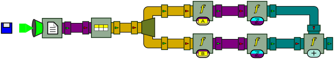

Advanced features
=================

The previous chapters have shown the fundamental concepts around BeepBeep and the basic processors that can be used in general use cases. In this chapter, we shall see a number of more special-purpose processors that come in BeepBeep's core or some of BeepBeep's standard palettes, and that you are likely to use in one of your processor chains.

## Reading from a text file

So far, the data sources we used in our examples were simple, hard-coded `QueueSource`s. Obviously, the events in real-world use cases are more likely to come from somehwere else --and probably very often from <!--\index{file!reading from} files-->files<!--/i-->.

Consider for example a text file containing single numbers, each on a separate line:

    3
    1
    4
    1
    5
    9
    2.2

The [`ReadLines`](http://liflab.github.io/beepbeep-3/javadoc/ca/uqac/lif/cep/io/ReadLines.html) processor takes a Java <!--\index{InputStream@\texttt{InputStream}} \texttt{InputStream}-->`InputStream`<!--/i-->, and returns as its output events each text line that can be extracted from that stream. Pulling from a <!--\index{ReadLines@\texttt{ReadLines}} \texttt{ReadLines}-->`ReadLines`<!--/i--> processor is then straightfoward:

``` java
InputStream is = LineReaderExample.class.getResourceAsStream("pi.txt");
ReadLines reader = new ReadLines(is);
ApplyFunction cast = new ApplyFunction(Numbers.numberCast);
Connector.connect(reader, cast);
Pullable p = cast.getPullableOutput();
while (p.hasNext())
{
    Number n = (Number) p.next();
    System.out.println(n + "," + n.getClass().getSimpleName());
}
p.pull();
```
[⚓](https://github.com/liflab/beepbeep-3-examples/blob/master/Source/src/io/LineReaderExample.java#L35)


A few important observations must be made form this code sample. The first is that since we are reading from a file, eventually the `ReadLines` processor will reach the end of the file, and no further output event will be produced when pulled. Therefore, we must repeatedly ask the `Pullable` object whether there is a new output event available. This can be done using method <!--\index{Pullable!hasNext@\texttt{hasNext}} \texttt{hasNext}-->`hasNext()`<!--/i-->. This method returns `true` when a new event can be pulled, and `false` when the corresponding processor has no more events to produce. Therefore, in our code sample, we loop until `hasNext` returns `false`.

Note also that instead of using method `pull`, we use method <!--\index{Pullable!next@\texttt{next}} \texttt{next}-->`next()`<!--/i--> to get a new event. Methods `pull` and `next` are in fact *synonyms*: they do exactly the same thing. However, the pair of methods `hasNext`/`next` makes a `Pullable` look like a plain old Java <!--\index{Iterator@\texttt{Iterator}} \texttt{Iterator}-->`Iterator`<!--/i-->. As a matter of fact, this is precisely the case: although we did not mention it earlier, a `Pullable` does implement Java's `Iterator` interface, meaning that a `Pullable` can be used in a program wherever an `Iterator` is expected. This makes it very handy to use BeepBeep objects inside an existing program, without even being aware that they actually refer to processor chains.

The last remark is that the output events of `ReadLines` are *strings*. This means that if we want to pipe them into arithmetical functions, they must be converted into `Number` objects beforehand; forgetting to do so is a common programming mistake. A special function of utility class <!--\index{Numbers@\texttt{Numbers}} \texttt{Numbers}-->`Numbers`<!--/i-->, called [`NumberCast`](http://liflab.github.io/beepbeep-3/javadoc/ca/uqac/lif/cep/util/Numbers/NumberCast.html), is designed especially for that. This function takes as input any Java `Object`, and does its best to turn it into a `Number`. In particular, if the object is a `String`, it tries to parse that string into either an `int` or, if that fails, into a `float`. In our code example, we pipe the output of `reader` into an `ApplyFunction` processor that invokes this function on each event; the function is referred to by the static member field <!--\index{NumberCast@\texttt{NumberCast}} \texttt{Numbers.numberCast}-->`Numbers.numberCast`<!--/i-->.

The expected output of the program is:

    3,Integer
    1,Integer
    4,Integer
    1,Integer
    5,Integer
    9,Integer
    2.2,Float
    Exception in thread "main" java.util.NoSuchElementException
	    at ca.uqac.lif.cep.UniformProcessor$UnaryPullable.pull(UniformProcessor.java:269)
	    at io.LineReaderExample.main(LineReaderExample.java:43)

Note how the first lines of the file have been cast as an `Integer` number; the last number could not be parsed as an integer, therefore it has been cast as a `Float`.

The last printed lines show that an exception has been thrown by the program. This is caused by the very last instruction in the code, which makes one last `pull` on `p`. However, this happens right after `p.hasNext()` returns false, which has taken us out of the loop. As we have said earlier, attempting to pull an event from a `Pullable` that has no more event to produce causes such an exception to be thrown. Yet another programming mistake is to disregard the return value of `hasNext` (or not even calling it in the first place) and attempting to pull from an source that has "run dry".

The processor chain in this program can be represented as follows:


This diagram introduces two new elements. First, the `ReadLines` processor is a box with a white sheet as its pictogram. As expected, the processor has one output pipe, which is painted in purple --the color that represents streams of `String` objects. Second, the processor seems to have an input pipe, but of a different shape than the ones we have seen earlier. This symbol does *not* represent a pipe, as can be confirmed by the fact that the input arity of `ReadLines` is zero. The funnel-shaped symbol rather represents a Java `InputStream` object. As we know, an `InputStream` can refer to an arbitrary source of bytes: a file, a network connection, and so on. Therefore, this symbol is intended to indicate that the line reader takes its source of bytes from some outside source --more precisely, from something that is not a BeepBeep processor. BeepBeep's square pipes cannot be connected into funnels, and vice-versa. The light-green color of the funnel indicates that the input stream provides raw bytes to the reader. The leftmost diskette symbol indicates that this particular input stream is connected to a file source.

## Manipulating tuples

Input files are seldom made of a single value per line of text. A more frequent file format is called **comma-separated values** (<!--\index{CSV@CSV (file format)}CSV-->CSV<!--/i-->). In such a format, each line contains the value of multiple **attributes**, separated by a comma. The following gives an example of such a file:

    # This is a simple file in CSV format
    
    A,B,C
    3,2,1
    1,7,1
    4,1,2
    1,8,3
    6,3,5

Blank lines and lines that begin with the hash symbol (`#`) are typically ignored (although the latter is not standard). The first non-ignored line in the file gives the *name* of each attribute. In the example above, the file defines three attributes named "A", "B" and "C". All the remaining lines of the file defines what are called <!--\index{tuple} \textbf{tuples}-->**tuples**<!--/i-->; a tuple is a data object that associates each attribute to a value. For example, the fourth line of the file defines a tuple that associates attribute A to value 3, attribute B to value 2, and attribute C to value 1. In other words, a CSV file is similar to a **table** in a relational database.

### Reading tuples

The following program reads a CSV file called `file1.csv`, and extracts tuples from this file one by one:

``` java
InputStream is = CsvReaderExample.class.getResourceAsStream("file1.csv");
ReadLines reader = new ReadLines(is);
TupleFeeder tuples = new TupleFeeder();
Connector.connect(reader, tuples);
Pullable p = tuples.getPullableOutput();
Tuple tup = null;
while (p.hasNext())
{
    tup = (Tuple) p.next();
    System.out.println(tup);
}
```
[⚓](https://github.com/liflab/beepbeep-3-examples/blob/master/Source/src/tuples/CsvReaderExample.java#L50)


The first two lines are now familiar: they consist of opening an `InputStream` on a file, and passing this stream to a `ReadLines` processor to read it line by line. The next instruction creates a new processor called a <!--\index{TupleFeeder@\texttt{TupleFeeder}} \texttt{TupleFeeder}-->`TupleFeeder`<!--/i-->. This processor receives lines of text, and returns on its output pipe `Tuple` objects. The rest of the program simply pulls and prints these tuples. The output of this program is:

```
((A,3),(B,2),(C,1))
((A,1),(B,7),(C,1))
((A,4),(B,1),(C,2))
((A,1),(B,8),(C,3))
((A,6),(B,3),(C,5))
```

As you can see from the format of the output, a tuple can also be seen as a set of attribute-value pairs. `Tuple` objects implement Java's <!--\index{Map@\texttt{Map} (interface)} \texttt{Map}-->`Map`<!--/i--> interface; therefore, their contents can be queried just like any other associative map:

``` java
Object o = tup.get("A");
System.out.println(o + "," + o.getClass().getSimpleName());
```
[⚓](https://github.com/liflab/beepbeep-3-examples/blob/master/Source/src/tuples/CsvReaderExample.java#L63)


If `tup` refers to the last `Tuple` pulled from `tuples`, the previous lines of code will print:

```
6,String
```

Note that **the values in tuples produced by `TupleFeeder` are always strings**. That is, `TupleFeeder` does not try to be smart and guess if a string is actually a number.

Graphically, this program can be represented as follows:


This drawing introduces the symbol for the `TupleFeeder`, whose pictogram on the box represents a tuple. It also shows the color we use to represent tuple feeds (brown/orange).

### Querying tuples

The previous example has shown us how to read tuples, but not how to manipulate them. The `tuples` palette defines a few handy `Function` objects that allow us, among other things, to fetch the value of an attribute and also to merge tuples. From the same input file as above, let us create an output stream made of the sum of attributes A and B in each line. The following piece of code performs exactly that:

``` java
InputStream is = SumAttributes.class.getResourceAsStream("file1.csv");
ReadLines reader = new ReadLines(is);
TupleFeeder tuples = new TupleFeeder();
Connector.connect(reader, tuples);
Fork fork = new Fork(2);
Connector.connect(tuples, fork);
ApplyFunction get_a = new ApplyFunction(new FetchAttribute("A"));
Connector.connect(fork, 0, get_a, 0);
ApplyFunction get_b = new ApplyFunction(new FetchAttribute("B"));
Connector.connect(fork, 1, get_b, 0);
ApplyFunction cast_a = new ApplyFunction(Numbers.numberCast);
Connector.connect(get_a, cast_a);
ApplyFunction cast_b = new ApplyFunction(Numbers.numberCast);
Connector.connect(get_b, cast_b);
ApplyFunction sum = new ApplyFunction(Numbers.addition);
Connector.connect(cast_a, 0, sum, 0);
Connector.connect(cast_b, 0, sum, 1);
Pullable p = sum.getPullableOutput();
while (p.hasNext())
{
    System.out.println(p.next());
}
```
[⚓](https://github.com/liflab/beepbeep-3-examples/blob/master/Source/src/tuples/SumAttributes.java#L57)


This program is probably better explained through its graphical representation, which goes as follows:



From a `ReadLines` processor, a `TupleFeeder` is instantiated. The stream of tuples is then forked along two branches. In the first branch, the value of attribute "A" for each tuple is extracted. This is done by using an `ApplyFunction` processor, and giving to this processor an instance of a new function called <!--\index{FetchAttribute@\texttt{FetchAttribute}} \texttt{FetchAttribute}-->`FetchAttribute`<!--/i-->. When instantiated, function `FetchAttribute` is given the name of the attribute to fetch in the tuple. This value (a String) is converted into a number and sent into an `ApplyFunction` processor that computes a sum. The same thing is done along the bottom branch for attribute "B". From the same input file as above, the output of this program is:

```
5.0
8.0
5.0
9.0
9.0
```

which indeed corresponds to the sum of A and B in each line. However, this processor chain is needlessly verbose. The successive application of all three functions can be collapsed into a single function tree, yielding this much simpler graph:


We leave as an exercise to the reader the task of writing this processor chain in code.

### Creating tuples


## Reading from the standard input

As we have seen earlier, we can read lines from a source of text by passing an `InputStream` to a `ReadLines` processor. However, it is possible to read from arbitrary streams of bytes, and in particular from the special system stream called the <!--\index{standard input} \textbf{standard input}-->**standard input**<!--/i-->. The standard input is an implicit stream that every running program has; external processes can connect to this stream and send bytes that the program can then read.

In Java, the standard input can be manipulated like any `InputStream`, using the static member field `System.in`. We could pass it to a `ReadLines` processor as we have done before; however, instead of complete lines of text ending with the newline character (`\n`), let us read abitrary chunks of characters. This can be done using another processor called [`ReadStringStream`](http://liflab.github.io/beepbeep-3/javadoc/ca/uqac/lif/cep/io/ReadStringStream.html). The following program reads characters from the standard input and, using a `Print` processor, prints them back onto the standard output.

``` java
ReadStringStream reader = new ReadStringStream(System.in);
reader.setIsFile(false);
Pump pump = new Pump(100);
Thread pump_thread = new Thread(pump);
Connector.connect(reader, pump);
Print print = new Print();
Connector.connect(pump, print);
pump_thread.start();
while (true)
{
    Thread.sleep(10000);
}
```
[⚓](https://github.com/liflab/beepbeep-3-examples/blob/master/Source/src/io/ReadStdin.java#L114)


Since `ReadStringStream` works only in pull mode, and `Print` works only in `Push` mode, a `Pump` must be placed in between to repeatedly pull bytes from the input and push them to the output. This can be represented graphically as follows:


In this picture, the leftmost processor is the [`StreamReader`](http://liflab.github.io/beepbeep-3/javadoc/ca/uqac/lif/cep/io/StreamReader.html). As you can see, <!--\index{StreamReader@\texttt{StreamReader}} it-->it<!--/i--> takes its input from the standard input; note how its left-hand side input has the "funnel" shape that represents system streams (and not BeepBeep pipes). A similar comment can be done for the <!--\index{Print@\texttt{Print}} \texttt{Print}-->`Print`<!--/i--> processor, which we have seen earlier. It receives input events, but as far as BeepBeep is concerned, does not produce any output events. Rather, it sends whatever it receives to the "outside world", this time through the `stdout` system stream. This is also what does the `Print` processor in examples from the previous chapters; however, the "stdout" output which was implicit in those examples is written here explicitly in the drawing. 

You can compile this program as a runnable JAR file (e.g. `read-stdin.jar`) and try it out on the command line. Suppose you type:

```
$ java -jar read-stdin.jar 
```

Nothing happens; however, if you type a few characters and press `Enter`, you should see the program reprint exactly what you typed (followed by a comma, as the `Print`} processor is instructed to insert one between each event).

Let's try something slightly more interesting. If you are at a Unix-like command prompt, you can create a [named pipe](https://en.wikipedia.org/wiki/Named_pipe). Let us create one with the name `mypipe`:

```
$ mkfifo mypipe
```

Now, let us launch `read-stdin.jar`, by redirecting `mypipe` into its standard input:

```
$ cat mypipe > java -jar read-stdin.jar
```
If you open another command prompt, you can then push characters into `mypipe`; for example using the command `echo`. Hence, if you type

```
$ echo "foo" > mypipe
```

you should see the string `foo` being immediately printed at the other command prompt. This happens because `read-stdin.jar` continuously polls its standard input for new characters, and pushes them down the processor chain whenever it receives some.


As you can see, the use of stream readers in BeepBeep, combined with system pipes on the command line, makes it possible for BeepBeep to interact with other programs from the command line, in exactly the same way Unix programs can be connected into each other.


This can be used to read a file. Instead of redirecting a named pipe to the program, one can use the `cat` command with an actual filename:

```
$ cat somefile.txt > java -jar read-stdin.jar
```

This will have for effect of reading and pushing the entire contents of `somefile.txt` into the processor chain.

## Sets and bags {#sets}

## Lists {#lists}

## Context {#context}

Each processor instance is also associated with a **context**. A context is a persistent and modifiable map that associates names to arbitrary objects. When a processor is duplicated, its context is duplicated as well. If a processor requires the evaluation of a function, the current context of the processor is passed to the function. Hence the function's arguments may contain references to names of context elements, which are replaced with their concrete values before evaluation. Basic processors, such as those described in this section, do not use context. However, some special processors defined in extensions to BeepBeep's core (the Moore machine and the first-order quantifiers, among others) manipulate their [`jdc:ca.uqac.lif.cep.Context`](http://liflab.github.io/beepbeep-3/javadoc/ca/uqac/lif/cep/Context.html) object.

## Exercises {#ex-advanced}

<!-- :wrap=soft: -->