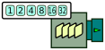
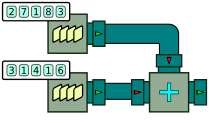
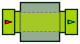

Basic Concepts
==============

In this chapter, you will learn about the the fundamental principles for using BeepBeep through simple examples. In particular, you'll be shown the basic usage of two types of objects: processors and functions.

## Processors

The first fundamental building block of BeepBeep is an object called a **processor**. This object that takes one or more *event streams* as its input, and and returns one or more *event streams* as its output. A processor is a stateful device: for a given input, its output may depend on events received in the past. Virtually all the processing of event traces is done through the action of a processor, or a combination of multiple processors chained together to achieve the desired functionality. In terms of Java, all processors are descendents of the generic [Processor](http://liflab.github.io/beepbeep-3/javadoc/ca/uqac/lif/cep/Processor.html) class.

An easy way to understand processors is to think of them as "boxes" having one or more "pipes". Some of these pipes are used to feed events to the processor (input pipes), while others are used to collect events produced by the processor (output pipes). Throughout this book, we will often represent processors graphically exactly in this way, as the following figure shows. A processor object is represented by a square box, with a pictogram giving an idea of the type of computation it executes on events. On the sides of this box are one or more "pipes" representing its inputs and outputs. Input pipes are indicated with a red, inward-pointing triangle, while output pipes are represented by a green, outward-pointing triangle. 


The color of the pipes themselves will be used to denote the type of events passing through them. According to the convention in this book, a blue-green pipe represents a stream of numbers, a grey pipe contains a stream of Boolean values, etc.

The number of input and output pipes is called the (input and output) **arity** of a processor; these two numbers vary depending on the actual type of processor we are talking about. For example, the previous picture represents a processor with an input arity of 1, and an output arity of 1. Events come in by one end, while events (maybe of a different kind) come out by the other end.

A processor produces its output in a *streaming* fashion: this means that output events are made available progressively while the input events are consumed. In other words, a processor does not wait to read its entire input trace before starting to produce output events. However, a processor can require more than one input event to create an output event, and hence may not always output something right away.

## Pulling events

There are two ways to interact with a processor. The first is by getting a hold of the processor's output pipe, and by repeatedly asking for new events. The action of requesting a new output event is called **pulling**, and this mode of operation is called *pull mode*.

Let us instantiate a simple processor and pull events from it. The following code snippet shows such a thing, using a processor called [QueueSource](http://liflab.github.io/beepbeep-3/javadoc/ca/uqac/lif/cep/QueueSource.html).

``` java
QueueSource source = new QueueSource();
source.setEvents(1, 2, 4, 8, 16, 32);
Pullable p = source.getPullableOutput();
for (int i = 0; i < 8; i++)
{
    int x = (Integer) p.pull();
    System.out.println("The event is: " + x);
}
```
[⚓](https://github.com/liflab/beepbeep-3-examples/blob/master/Source/src/basic/QueueSourceUsage.java#L39)


`QueueSource` is a simple processor that does only one thing. When it is created, it is given a list of events; from that point on, it will endlessly output these events, one by one, looping back at the beginning of the list when it reaches the end. The first two lines of the previous snippet create a new instance of `QueueSource`, and then give the list of events it is instructed to repeat (in this case, the events are integers). Graphically, this can be represented as follows:



As one can see, the `QueueSource` object is a special type of processor that has an output pipe, but no input pipe (that is, its input arity is zero). This means that it does not produce events based on the output produced by other processors; in other words, it is impossible to connect another processor into a `QueueSource` (or into any other processor of input arity zero, for that matter). Rather, output events are produced "out of thin air" --or more accurately, from a list of values that is given to the source when it instantiated. In the schema, this list is shown in the white rectangle that overlaps with the source's box.

To collect events from a processor's output, one uses a special object called a [Pullable](http://liflab.github.io/beepbeep-3/javadoc/ca/uqac/lif/cep/Pullable.html). The third instruction takes care of obtaining an instance of `Pullable` corresponding to `QueueSource`'s output.

A `Pullable` can be seen as a form of iterator over an output trace. It provides a method, called [pull()](http://liflab.github.io/beepbeep-3/javadoc/ca/uqac/lif/cep/Pullable.html#pull()); each call to `pull()` asks the corresponding processor to produce one more output event. The loop in the previous code snippet amounts to calling `pull()` eight times. Since events handled by processors can be anything (Booleans, numbers, strings, sets, etc.), the method returns an object of the most generic type, i.e. `Object`. It is up to the user of a processor to know what precise type of event this return value can be cast into. In our case, we know that the `QueueSource` we created returns integers, and so we manually cast the output of `pull()` into objects of this type.

Since the queue source loops through its array of events, after reaching the last (32), it will restart from the beginning of its list. The expected output of this program is:

    The event is: 1
    The event is: 2
    The event is: 4
    The event is: 8
    The event is: 16
    The event is: 32
    The event is: 1
    The event is: 2

Note that `source` springs into action only upon a call to `pull()` on its `Pullable` object. That is, it computes and returns a new output event only upon request. In other words, we can see it as some kind of gearbox that does something only when we turn the crank: each turn of the "crank" triggers the production of a new output event.
    
This simple example shows the basic concepts around the use of a processor:

- An instance of a processor is first created
- To read events from its output, we must obtain an instance of a `Pullable` object from this processor
- Events can be queried by calling `pull()` on this `Pullable` object

## Piping processors {#piping}

BeepBeep provides dozens of processors, but each of them in isolation performs a simple operation. To perform more complex computations, processors can be composed (or "piped") together, by letting the output of one processor be the input of another. This piping is possible as long as the type of the first processor's output matches the type expected by the second processor's input.

Let us create a simple example of piping by building upon the previous example, as follows:

``` java
QueueSource source = new QueueSource();
source.setEvents(1, 2, 3, 4, 5, 6);
Doubler doubler = new Doubler();
Connector.connect(source, doubler);
Pullable p = doubler.getPullableOutput();
for (int i = 0; i < 8; i++)
{
    int x = (Integer) p.pull();
    System.out.println("The event is: " + x);
    UtilityMethods.pause(1000);
}
```
[⚓](https://github.com/liflab/beepbeep-3-examples/blob/master/Source/src/basic/PipingUnary.java#L43)


First, a `QueueSource` is created as before; then, an instance of another processor called `Doubler` is also created. For the sake of the example, let us simply assume that `Doubler` takes arbitrary integers as its input, multiples them by two, and returns the result as its output.

The next instruction uses the [Connector](http://liflab.github.io/beepbeep-3/javadoc/ca/uqac/lif/cep/Connector.html) object to pipe the two processors together. The call to method [connect()](http://liflab.github.io/beepbeep-3/javadoc/ca/uqac/lif/cep/Connector.html#connect(Processor ...)) sets up the processors so that the output of `source` is sent directly to the input of `doubler`. Graphically, this can be represented as follows:


Notice how the schema now contains two boxes: one for the source, and one for the doubler. The call to `connect` is represented by the "pipe" that links the output of the source to the input of the doubler.

We can then obtain `doubler`'s `Pullable` object, and fetch its output events like before. The output of this program will be:

    The event is: 2
    The event is: 4
    The event is: 6
    The event is: 8
    ...

As expected, each event of the output stream is the double of the one at matching position in the source's input stream.

Notice how we obtained a hold of `doubler`'s output Pullable, and made our `pull` calls on *that* object --not on `source`'s. It is up to the downstream processor to call `pull` on any upstream processors it is connected to, if needed. Concretely, this is what happens:

1. A call to `pull` is made on `doubler`'s `Pullable` object
2. In order to produce an output event, `doubler` needs a new input event. It calls `pull` on `source`'s `Pullable` object
3. Processor `source` produces a new event, and emits it as the return value to its call on `pull`
4. Processor `doubler` now has a new input event; it multiplies it by two, and emits it as the return value to its own call on `pull`

## Two common mistakes {#mistakes}

This simple example of processor piping brings us to talk about two common mistakes one can make when creating processors and connecting them.

The first mistake is to **forget to connect two processors**. Suppose that in the original `Doubler` example, we omit the call to `connect`, resulting in a schema that looks like this:


Notice how the pipe between the source and the Doubler processor is missing. Attempting to call `pull` on `doubler` will throw an exception. The expected output of the program should look like this:

    Exception in thread "main" ca.uqac.lif.cep.Pullable$PullableException:
    Input 0 of this processor is connected to nothing
	  at ca.uqac.lif.cep.SingleProcessor$OutputPullable.hasNext...

What happens concretely is that, when a call to `doubler`'s `Pullable` object is made, it turns around to ask for an input event from upstream, and realizes that it has never been told whom to ask (this is what the call to `connect` does). Consequently, it throws a `PullableException` alerting the user of that issue. Notice that this is a *runtime* error; the program still compiles perfectly.

The second mistake is to **call `pull` on an intermediate processor**. In our original example, it would be an error for the user to perform their own pulls on `source`, instead of or in addition to the pulls on `doubler`. Consider the same chain of processors as above, but with the loop replaced by the following instructions:

``` java
Pullable p = doubler.getPullableOutput();
System.out.println("The event is: " + p.pull());
System.out.println("The event is: " + p.pull());
Pullable p2 = source.getPullableOutput();
System.out.println("The event is: " + p2.pull());
System.out.println("The event is: " + p.pull());
```
[⚓](https://github.com/liflab/beepbeep-3-examples/blob/master/Source/src/basic/PipingUnaryIncorrect.java#L62)


Notice how, after performing two pulls on `doubler`'s `Pullable`, we perform one call to `source`'s `Pullable`, and then resume pulling on `doubler`. The output of this program is this:

    The event is: 2
    The event is: 4
    The event is: 3
    The event is: 8

The first two outputs are identical to our original program. As we just explained, the first two pulls on `doubler` resulted in the background in two pulls on `source` as well. The third line corresponds to the pull on `source` directly; it outputs the third event of its list, which is 3. However, since we pulled on `source` directly, that event never reaches the input of `doubler`. As far as `source` is concerned, its third event has duly been sent, and it moves on to the next. Therefore, when calling `pull` again on `doubler`, `source` sends it its *fourth* event (the integer 4), and hence the next line of the output is 8.

As one can see, it generally does not make much sense to pull on processors that are not at the very end of the chain. To prevent the possibility of mistakes, it is possible to encapsulate a group of processors into a "box" that only gives access to the very last `Pullable`s of a chain --more on that later.

## Processors with more than one input {#binary}

We mentioned earlier that processors can have more than one input "pipe", or one or more output "pipe". The following example shows it:

``` java
QueueSource source1 = new QueueSource();
source1.setEvents(2, 7, 1, 8, 3);
QueueSource source2 = new QueueSource();
source2.setEvents(3, 1, 4, 1, 6);
Adder add = new Adder();
Connector.connect(source1, 0, add, 0);
Connector.connect(source2, 0, add, 1);
Pullable p = add.getPullableOutput();
for (int i = 0; i < 5; i++)
{
    float x = (Float) p.pull();
    System.out.println("The event is: " + x);
}
```
[⚓](https://github.com/liflab/beepbeep-3-examples/blob/master/Source/src/basic/PipingBinary.java#L42)


This time, we create *two* sources of numbers. We intend to connect these two sources of numbers to a processor called `add`, which, incidentally, has two input pipes. The interesting bit comes in the calls to [connect()](http://liflab.github.io/beepbeep-3/javadoc/ca/uqac/lif/cep/Connector.html#connect(ca.uqac.lif.cep.Processor, int, ca.uqac.lif.cep.Processor, int)), which now includes a few more arguments. The first call connects the output of `source1` to the *first* input of a processor called `add`. The second call connects the output of `source2` to the *second* input of `add`. Graphically, this is represented as follows:



In a program, the two input pipes of `add` can be easily accessed through their number (0 or 1). However, in a drawing, it may be hard to decide which is which. In this book, we will follow the convention that the topmost input pipe is that with the lowest number. Hence, in the previous schema, input pipe 0 is the one connected to the queue 2-7-1-8-3. For some schemas, this may still not be clear enough; in such cases, we will explicitly write numbers next to the pipes to tell them apart.

The rest of our program is done as usual: a `Pullable` is obtained from `add`, and its first few output events are printed:

	The event is: 5.0
	The event is: 8.0
	The event is: 5.0
	The event is: 9.0
	...

The previous example shows that the output of `add` seems to be the pairwise sum of events from `source1` and `source2`. Indeed, 2+3=5, 7+1=8, 1+4=5, and so on. This is indeed exactly the case. When a processor has an input arity of 2 or more, it processes its inputs in batches we call **fronts**. A *front* is a set of events in identical positions in each input trace. Hence, the pair of events 2 and 3 corresponds to the front at position 0; the pair 7 and 1 corresponds to the front at position 1, and so on.

When a processor has an arity of 2 or more, the processing of its input is done *synchronously*. This means that a computation step will be performed if and only if a new event can be consumed from each input stream. It this is not the case, the processor **waits** (and the call to `pull` blocks) until a complete front is ready to be processed. This can be exemplified in the following code example:

``` java
SlowQueueSource source1 = new SlowQueueSource();
source1.setEvents(2, 7, 1, 8, 3);
QueueSource source2 = new QueueSource();
source2.setEvents(3, 1, 4, 1, 6);
Adder add = new Adder();
Connector.connect(source1, 0, add, 0);
Connector.connect(source2, 0, add, 1);
Pullable p = add.getPullableOutput();
for (int i = 0; i < 5; i++)
{
    float x = (Float) p.pull();
    System.out.println("The event is: " + x);
}
```
[⚓](https://github.com/liflab/beepbeep-3-examples/blob/master/Source/src/basic/PipingBinaryWait.java#L46)


The chain of processors in this example is almost identical to the previous example, and can be represented graphically as:


The difference is that the first queue source has been replaced by a "slow" queue source, that waits 5 seconds before outputting each event. This is represented by the little "clock" in the topmost source box. The output of this program is identical:

	The event is: 5.0
	The event is: 8.0
	...

However, a new line is only printed every five seconds. This can be explained as follows: when a call to `pull` is made on `add`'s `Pullable` object, the processor checks whether a complete front can be consumed. It asks both `source1` and `source2` for a new event; `source2` answers immediately, but `source1` takes five seconds before producing an event. In the meantime, `add` can do nothing but wait. The whole process repeats upon every subsequent call to `pull`. Note that `add` only asks for *one* new event at a time from each source; that is, it does not keep on pulling on `source2` while it waits for an answer from `source1`.

Synchronous processing is a strong assumption; many other stream processing engines allow events to be processed asynchronously, meaning that the output of a query may depend on what input stream produced an event first. One can easily imagine situations where synchronous processing is not appropriate. However, in use cases where it is suitable, assuming synchronous processing greatly simplifies the definition and implementation of processors. The output result is no longer sensitive to the order in which events arrive at each input, or to the time it takes for an upstream processor to compute an output (the order of arrival of events from the same input trace, obviously, is preserved). Since the timing of arrival of events is irrelevant to the result of a computation, this means that one can perform a "pen and paper" calculation of a chain of processors, and arrive at the same output as the real one, given knolwedge of the contents of each input stream.

We shall discuss synchronous processing in more detail in a later chapter.

## When types do not match {#mismatch}

We said earlier that any processor can be piped to any other, *provided that they have matching types*. The following code example shows what happens when types do not match:

``` java
QueueSource source = new QueueSource();
source.setEvents(3);
Processor av = new ApplyFunction(Numbers.absoluteValue);
Connector.connect(source, av);
Processor neg = new ApplyFunction(Booleans.not);
Connector.connect(av, neg);
System.out.println("This line will not be reached");
```
[⚓](https://github.com/liflab/beepbeep-3-examples/blob/master/Source/src/basic/IncorrectPiping.java#L58)


The culprit lies in the next-to-last line of the program; this is due to the fact that processor `av` sends out events of type `Number` as its output, while processor `neg` expects events of type `Boolean` as its input. This can be illustrated as follows:


This is the first of our examples that uses color coding to represent the type of each stream. Note how number streams and pipes are shown in turquoise, while Booleans are represented using a greyish shade of blue. Using such a graphical representation, the problem can easily be spotted: the call to `connect` attempts to link a turquoise output pipe to a grey-blue input pipe.

Since numbers cannot be converted into Booleans, the call to `connect()` will throw an exception similar to this one:

	Exception in thread "main"
	ca.uqac.lif.cep.Connector$IncompatibleTypesException:
	Cannot connect output 0 of ABS to input 0 of !: incompatible types
		at ca.uqac.lif.cep.Connector.checkForException(Connector.java:268)
		...

Here "ABS" and "!" are the symbols defined for `av` and `neg`, respectively. As with the `PullableException` discussed earlier, this is a *runtime* error. Processor inputs and outputs are not statically typed, so the above program compiles without problem. The error is only spotted when the program is being executed, and the `Connector` object realizes that it is being asked to link processors of incorrect types.

A processor can be queried for the types it accepts for input number *n* by using the method [getInputType()](http://liflab.github.io/beepbeep-3/javadoc/ca/uqac/lif/cep/Processor.html#getInputType(int)); ditto for the type produced at output number *n* with [getOutputType()](http://liflab.github.io/beepbeep-3/javadoc/ca/uqac/lif/cep/Processor.html#getOutputType(int)).

## Pushing events {#pushing}

Earlier we mentioned there were two ways to interact with a processor. The first, which we have used so far, is called *pulling*. The second, as you may guess, is called **pushing**, and works more or less in reverse. In so-called *push mode*, rather than querying events form a processor's output, we give events to a processor's input. This has for effect of triggering the processor's computation and "pushing" events (if any) to the processor's output.

Let us instantiate a simple processor and push events to it. The following code snippet shows such a thing, using a processor called [QueueSink](http://liflab.github.io/beepbeep-3/javadoc/ca/uqac/lif/cep/QueueSink.html).

``` java
QueueSink sink = new QueueSink();
Pushable p = sink.getPushableInput();
p.push("foo");
p.push("bar");
Queue<Object> queue = sink.getQueue();
System.out.println("Events in the sink: " + queue);
queue.remove();
p.push("baz");
System.out.println("Events in the sink: " + queue);
```
[⚓](https://github.com/liflab/beepbeep-3-examples/blob/master/Source/src/basic/QueueSinkUsage.java#L45)


`QueueSink` is a simple processor that merely accumulates into a queue all the events we push to it. The first line of the previous snippet creates a new instance of `QueueSink`. Graphically, this can be represented as follows:


In order to push events to this processor, we need to get a reference to its input pipe; this is done with method [getPushableInput()](http://liflab.github.io/beepbeep-3/javadoc/ca/uqac/lif/cep/Processor.html#getPushableInput()), which gives us an instance of a [Pushable](http://liflab.github.io/beepbeep-3/javadoc/ca/uqac/lif/cep/Pushable.html) object. A `Pushable` defines one important method, called `push()`, which allows us to give events to its associated processor. In the previous code snippet, we see two calls to method `push`, sending the strings "foo" and "bar".

As we said, `QueueSink` simply accumulates the pushed events into a queue. It is possible to access that queue by calling a method called `getQueue()` on the processor, as is done on line 5. The contents of that queue are then printed; at this point in the program, the queue contains the strings "foo" and "bar", resulting in the first line printed at the console:

    Events in the sink: [foo, bar]

We then pop the first event of that queue, and then push a new string ("baz") to the sink. The second line the program prints shows the content of the sink at that moment, namely:

    Events in the sink: [bar, baz]

In the same way that calls to `pull` on a processor may result in calls to `pull` on upstream processors, in push mode, calls to `push` may result in calls to `push` on downstream processors. In the following code snippet, we connect a `Doubler` processor to a special type of sink, called `Print`, that simply prints to the console every event it receives.

``` java
Doubler doubler = new Doubler();
Print print = new Print();
Connector.connect(doubler, print);
Pushable p = doubler.getPushableInput();
for (int i = 0; i < 8; i++)
{
    p.push(i);
    UtilityMethods.pause(1000);
}
```
[⚓](https://github.com/liflab/beepbeep-3-examples/blob/master/Source/src/basic/PipingUnaryPush.java#L48)


The `for` loop pushes the integers 0 to 7 into the input pipe of `doubler`; the `pause` method causes the loop to wait one second (1,000 milliseconds) between each call to 
`push`. The output of this program, unsurprisingly, is the following:

    0,2,4,6,8,10,12,14,

Notice the one-second interval between each number. This shows that, in pull mode, nothing happens until an upstream call to `push` triggers the chain of computation.

## Pushing on binary processors {#pushbinary}

Push mode exhibits a special behaviour in the case where a processor has an input arity of 2 or more. Consider the following piece of code:

``` java
Adder add = new Adder();
Print print = new Print().setSeparator("\n");
Connector.connect(add, print);
Pushable p0 = add.getPushableInput(0);
Pushable p1 = add.getPushableInput(1);
```
[⚓](https://github.com/liflab/beepbeep-3-examples/blob/master/Source/src/basic/BinaryPush.java#L44)


This sets up an `Adder` processor, whose output is connected to a `Print` processor, as illustrated below:


Since `add` is of input arity 2, it has two `Pushable` objects, numbered 0 and 1. We use a different version of method `getPushableInput()`, which takes an integer as an argument. By convention in our drawings, the first Pullable object is generally located at the top (or the left) of the box, and the second at the bottom (or the right). We shall put little numbers next to the pipes when the context is not clear.

Let us see what happens when pushing numbers into `p0` and `p1`.

``` java
p0.push(3);
System.out.println("This is the first printed line");
p1.push(1);
p1.push(4);
p1.push(1);
System.out.println("This is the third printed line");
p0.push(5);
p0.push(9);
```
[⚓](https://github.com/liflab/beepbeep-3-examples/blob/master/Source/src/basic/BinaryPush.java#L62)


The first line pushes the number 3 into `p0`. However, since nothing has yet been pushed into `p1`, the first front of events is not complete; `add` is not ready to compute an addition, and nothing is pushed to the printer. This means that the next statement, which prints "This is the first printed line", is indeed the first line to be printed at the console. We then push the number 1 into `p1`; now a complete front is ready to be processed, and `add` pushes the number 4 (3+1) to its output pipe. This event is received by the printer, which prints it at the console.

The next two instructions push two numbers into `p1`. Again, nothing is printed, since no new events have been received from `p0`. Hence the next instruction, "This is the third printed line", does produce the third line of the output. We then push the number 5 into `p0`. An event was already pushed into `p1`, so `add` is ready to compute a new addition, and outputs 9 (4+5).

Here, an important remark must be made. The `add` processor computed the addition of number 5 pushed into `p0` with the number **4** that was pushed earlier into `p1`. That is, a processor consumes events from the same pullable **in the order they arrive**. Number 4 is the second event pushed into `p1`; hence it is matched with the second event pushed into `p0`.

The last instruction pushes the number 9 into `p0`. The third event pushed into `p0` is matched with the third event pushed into `p1`, and `add` pushes 10 (1+9) to its output pipe. The end result of this program should be this:

    This is the first printed line
    4
    This is the third printed line
    9
    10

The remark on the order of arrival is important. It means that each processor has **input queues** to buffer events pushed from upstream until they can be consumed. Here, the numbers 4 and 5 were put into an event queue associated to `p1`, until events were pushed into `p0` and made a computation possible. The nice thing about BeepBeep is that you don't have to worry about these buffers: the system takes care of them by itself in a completely transparent manner.

Note that the order in which events at the same position in two different streams are pushed still does not matter, though. That is, assuming that we are at the start of the program, writing this:

``` java
p0.push(3);
p1.push(2);
```

will produce the same output as writing this:

``` java
p1.push(2);
p0.push(3);
```

The next question that generally comes to one's mind is this: what happens if we keep pushing events on only one of the pullables, and nothing on the other? Since no computation can be made, won't this fill the first Pullable's queue forever? The simple answer to this question is: yes. If we keep pushing events on only one pullable (or more likely, if one of the upstream sources pushes events much faster than the other), we may end up filling one of the event queues and run out of memory.

Although people are very quick to imagine such a catastrophe scenario, they are much slower at identifying a *realistic* use case where this could actually happen. Notice also that this is not a limitation on BeepBeep's side: if your goal is to add numbers from two input streams, and the first generates them at twice the speed of the second, you *have* to store those excess numbers somewhere, and that storage *has* to increase linearly with time. There is no escaping it, whether you use BeepBeep or not!

## Closing processor chains {#closing}

We mentioned earlier that a common mistake is to forget to connect two processors. A variant of this mistake is to forget to attach sources or sinks to the endpoints of a processor chain. Take the very simple example of the `Passthrough` processor, which simply takes input events and returns them as is to its output pipe. It can be drawn as follows:



Let us create a `Passthrough`, and call `pull` on it, as in the following code example.

``` java
Passthrough passthrough = new Passthrough();
Pullable p = passthrough.getPullableOutput();
p.pull();
```
[⚓](https://github.com/liflab/beepbeep-3-examples/blob/master/Source/src/basic/PullWithoutSource.java#L57)


This program will throw a `ConnectorException` for the same reasons as before: `passthrough` is asked for a new output event, but it is not connected to anything upstream. That makes sense. What is more surprising is that the reverse mistake also exists in push mode. Consider the following example:

``` java
Passthrough passthrough = new Passthrough();
Pushable p = passthrough.getPushableInput();
p.push("foo");
```
[⚓](https://github.com/liflab/beepbeep-3-examples/blob/master/Source/src/basic/PushWithoutSink.java#L55)


This time, we attempt to push a string ("foo") into `passthrough` --but this, too, will throw a `ConnectorException`. Indeed: passthrough is asked to relay an event downstream, but nothing is connected to its output pipe. In the same way events cannot be created out of thin air (in pull mode), they cannot vanish into thin air either (in push mode). In other words, a chain of processors must always be **closed**:

- In pull mode, all upstream endpoints must be connected to a source
- In push mode, all downstream endpoints must be connected to a sink

If, for whatever reason, you want to discard events from a downstream processor, you still must connect it to a sink. However, there is a special sink, called [BlackHole](http://liflab.github.io/beepbeep-3/javadoc/ca/uqac/lif/cep/tmp/BlackHole.html), that does exactly that.

- - -

With these code examples, you know pretty much everything there is about processors in BeepBeep. We have seen how a few simple processor objects can be instantiated and piped together by means of the `Connector` object. We have also explored the two modes by which events can be passed around: *pull* mode where output events are queried by the user, and *push* mode where input events are produced by the user. We also delved on the principles of synchronous processing, and the fact that processors manage internal queues to make sure they always process events at matching positions in their input streams.

The rest of this book is, more or less, simply playing around with these basic concepts.

## Exercises {#ex-basic}

1. Using the `QueueSource` and `Doubler` processors shown in this chapter, create a chain of processors that outputs the quadruple of the first five odd numbers. That is, the first five output events should be 4, 12, 20, 28, 36.

2. Using the `QueueSource` and `Add` processors shown in this chapter, create a chain of processors that outputs the sum of each two consecutive prime numbers. The first six prime numbers are 2, 3, 5, 7, 11 and 13. That is, the first five output events should be 5, 8, 12, 18, 24. (Hint: you will need two `QueueSource`s.)


<!-- :wrap=soft: -->