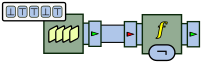
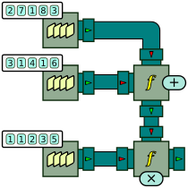
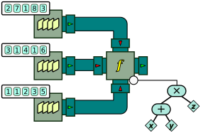
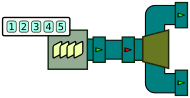
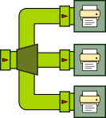
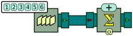
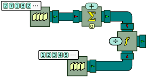
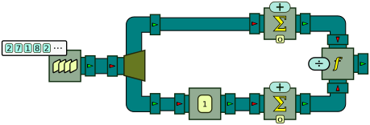
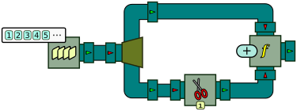

Fundamental Processors and Functions
====================================

BeepBeep is organized along a modular architecture. The main part of BeepBeep is called the *engine*, which provides the basic classes for creating processors and functions, and contains a handful of general-purpose processors for manipulating traces. The rest of BeepBeep's functionalities is dispersed across a number of *palettes*. In this chapter, we describe the basic processors and functions provided by BeepBeep's engine.

## Function objects {#functions}

A <!--\index{function} \textbf{function}-->**function**<!--/i--> is something that accepts *arguments* and produces a return *value*. In BeepBeep, functions are "first-class citizens"; this means that every function that is to be applied on an event is itself an object, which inherits from a generic class called [`Function`](http://liflab.github.io/beepbeep-3/javadoc/ca/uqac/lif/cep/functions/Function.html). For example, the negation of a Boolean value is a function object called [`Negation`](http://liflab.github.io/beepbeep-3/javadoc/ca/uqac/lif/cep/util/Booleans/Negation.html); the sum of two numbers is also a function object called [`Addition`](http://liflab.github.io/beepbeep-3/javadoc/ca/uqac/lif/cep/util/Numbers/Addition.html).

Function objects can be instantiated and manipulated directly. The BeepBeep classes [`Booleans`](http://liflab.github.io/beepbeep-3/javadoc/ca/uqac/lif/cep/util/Booleans.html), [`Numbers`](http://liflab.github.io/beepbeep-3/javadoc/ca/uqac/lif/cep/util/Numbers.html) and [`Sets`](http://liflab.github.io/beepbeep-3/javadoc/ca/uqac/lif/cep/util/Sets.html) define multiple function objects to manipulate <!--\index{Booleans (class)} Boolean-->Boolean<!--/i--> values, <!--\index{Numbers (class)} numbers-->numbers<!--/i--> and <!--\index{Sets (class)} sets-->sets<!--/i-->. These functions can be accessed through static member fields of these respective classes. Consider for example the following code snippet:

``` java
       Function negation = Booleans.not;
       Object[] out = new Object[1];
       negation.evaluate(new Object[]{true}, out);
       System.out.println("The return value of the function is: " + out[0]);
```
[⚓](https://github.com/liflab/beepbeep-3-examples/blob/master/Source/src/functions/FunctionUsage.java#L37)


The first instruction gets a reference to a `Function` object, corresponding to the static member field `not` of class `Booleans`. This field refers to an instance of a function called [`Negation`](http://liflab.github.io/beepbeep-3/javadoc/ca/uqac/lif/cep/util/Booleans/Negation.html). As a matter of fact, this is the only way to get an instance of <!--\index{Negation@\texttt{Negation}} \texttt{Negation}-->`negation`<!--/i-->: its constructor is declared as `private`, which makes it impossible to create a new instance of the object using `new`. This is done on purpose, so that only one instance of `Negation` ever exists in a program --effectively making `Negation` a <!--\index{singleton} \emph{singleton}-->*singleton*<!--/i--> object. We shall see that the vast majority of `Function` objects are singletons, and are referred to using a static member field of some other object.

In order to perform a computation, every function defines a method called [`evaluate()`](http://liflab.github.io/beepbeep-3/javadoc/ca/uqac/lif/cep/functions/Function.html#evaluate(Object[], Object[])). This method takes two arguments; the first is an array of objects, corresponding to the input values of the function. The second is another array of objects, intended to receive the output values of the function. Hence, like for a processor, a function also has an input arity and an output arity.

For function `Negation`, both are equal to one: the negation takes one Boolean value as its argument, and returns the negation of that value. The second line of the example creates an array of size 1 to hold the return value of the function. Line 3 calls `evaluate`, with the Boolean value `true` used as the argument of the function. Finally, line 4 prints the result:

    The return value of the function is: false

Functions with an input arity of size greater than 1 work in the same way. In the following example, we get an instance of the [`Addition`](http://liflab.github.io/beepbeep-3/javadoc/ca/uqac/lif/cep/util/Numbers/Addition.html) function, and make a call on `evaluate` to get the value of 2+3.

``` java
       Function addition = Numbers.addition;
       addition.evaluate(new Object[]{2, 3}, out);
       System.out.println("The return value of the function is: " + out[0]);
```
[⚓](https://github.com/liflab/beepbeep-3-examples/blob/master/Source/src/functions/FunctionUsage.java#L52)


As expected, the program prints:

    The return value of the function is: 5.0

While the use of input/output arrays may appear cumbersome at first, it is mitigated by two things. First, you will seldom have to call `evaluate` on functions directly. Second, this mechanism makes it possible for functions to have arbitrary input and output arity; in particular, a function can have an output arity of 2 or more. Consider this last code example:

``` java
Function int_division = IntegerDivision.instance;
Object[] outs = new Object[2];
int_division.evaluate(new Object[]{14, 3}, outs);
System.out.println("14 divided by 3 equals " +
        outs[0] + " remainder " + outs[1]);
```
[⚓](https://github.com/liflab/beepbeep-3-examples/blob/master/Source/src/functions/FunctionUsage.java#L64)


The first instruction creates a new instance of another `Function` object, this time called <!--\index{IntegerDivision@\texttt{IntegerDivision}} \texttt{IntegerDivision}-->`IntegerDivision`<!--/i-->.  From two numbers *x* and *y*, it outputs **two** numbers: the quotient and the remainder of the division of x by y. Note that contrary to the previous examples, this function was created by accessing the `instance` static field on class `IntegerDivision`. Most `Function` objects outside of utility classes such as `Booleans` or `Numbers` provide a reference to their singleton instance in this way. The remaining lines are again a call to `evaluate`: however, this time, the array receiving the output from the function is of size 2. The first element of the array is the quotient, the second is the remainder. Hence the last line of the program prints this:

    14 divided by 3 equals 4 remainder 2

## Applying a function on a stream {#applyfunction}

A function is a "static" object: a call to `evaluate` receives a single set of arguments, computes a return value, and ends. In many cases, it may be desirable to apply a function to each event of a stream. In other words, we would like to "turn" a function into a processor that applies this function. The processor responsible for this is called [`ApplyFunction`](http://liflab.github.io/beepbeep-3/javadoc/ca/uqac/lif/cep/functions/ApplyFunction.html). When instantiated, <!--\index{ApplyFunction@\texttt{ApplyFunction}} \texttt{ApplyFunction}-->`ApplyFunction`<!--/i--> must be given a `Function` object; it calls this function's `evaluate` on each input event, and returns the result on its output pipe.

In the following bit of code, an `ApplyFunction` is created by applying the Boolean negation function to an input trace of Boolean values:

``` java
QueueSource source = new QueueSource();
source.setEvents(false, true, true, false, true);
ApplyFunction not = new ApplyFunction(Booleans.not);
Connector.connect(source, not);
Pullable p = not.getPullableOutput();
for (int i = 0; i < 5; i++)
{
    boolean x = (Boolean) p.pull();
    System.out.println("The event is: " + x);
}
```
[⚓](https://github.com/liflab/beepbeep-3-examples/blob/master/Source/src/basic/SimpleFunction.java#L53)


The first lines should be familiar to you at this point: they create a `QueueSource`, and give it a list of events to be fed upon request. In this case, we give the source a list of five Boolean values. In line 3, we create a new `ApplyFunction` processor, and give to its constructor the instance of the `Negation` function referred to by the static member field `Booleans.not`. Graphically, we can represent this as follows:



The `ApplyFunction` processor is represented by a box with a yellow *f* as its pictogram. This processor has an argument, which is the actual function it is asked to apply. By convention, function objects are represented by small rounded rectangles; the rectangle placed on the bottom side of the box represents the `Negation` function. Following the colour coding we introduced in the previous chapter, the stream we are manipulating is made of Boolean values; hence all pipes are painted in the blue-gray shade representing Booleans.

Calling `pull` on the `not` processor will return, as expected, the negation of the events given to the source. The program will print:

    The event is: true
    The event is: false
    The event is: false
    The event is: true
    The event is: false

The input and output arity of the `ApplyFunction` matches that of the `Function` object given as its argument. Hence, a binary function will result in a binary processor. For example, the following code example computes the pairwise addition of numbers from two streams:

``` java
QueueSource source1 = new QueueSource();
source1.setEvents(2, 7, 1, 8, 3);
QueueSource source2 = new QueueSource();
source2.setEvents(3, 1, 4, 1, 6);
ApplyFunction add = new ApplyFunction(Numbers.addition);
Connector.connect(source1, 0, add, 0);
Connector.connect(source2, 0, add, 1);
Pullable p = add.getPullableOutput();
for (int i = 0; i < 5; i++)
{
    float x = (Float) p.pull();
    System.out.println("The event is: " + x);
}
```
[⚓](https://github.com/liflab/beepbeep-3-examples/blob/master/Source/src/functions/FunctionBinary.java#L40)


The reader may notice that this example is very similar to one we saw in the previous chapter. The difference lies in the fact that the original example used a special processor called `Adder` to perform the addition. Here, we use a generic `ApplyFunction` processor, to which the addition function is passed as a parameter. This difference is important: in the original case, there was no easy way to replace the addition by some other operation --apart from finding another purpose-built processor to do it. In the present case, changing the operation to some other binary function on numbers simply amounts to changing the function object given to `ApplyFunction`.

Function processors can be chained to perform more complex calculations, as is illustrated by the following code fragment:

``` java
QueueSource source1 = new QueueSource().setEvents(2, 7, 1, 8, 3);
QueueSource source2 = new QueueSource().setEvents(3, 1, 4, 1, 6);
QueueSource source3 = new QueueSource().setEvents(1, 1, 2, 3, 5);
ApplyFunction add = new ApplyFunction(Numbers.addition);
Connector.connect(source1, 0, add, 0);
Connector.connect(source2, 0, add, 1);
ApplyFunction mul = new ApplyFunction(Numbers.multiplication);
Connector.connect(source3, 0, mul, 0);
Connector.connect(add, 0, mul, 1);
Pullable p = mul.getPullableOutput();
for (int i = 0; i < 5; i++)
{
    float x = (Float) p.pull();
    System.out.println("The event is: " + x);
}
```
[⚓](https://github.com/liflab/beepbeep-3-examples/blob/master/Source/src/functions/FunctionChain.java#L41)


Here, we create three sources of numbers; events from the first two are added, and the result is multiplied by the event at the corresponding position in the third stream. The schema of such a program becomes more interesting:



The expected output of the program should look like this:

    The event is: 5.0
    The event is: 8.0
    The event is: 10.0
    The event is: 27.0
    The event is: 45.0

Indeed, (2+3)×1=5, (7+1)×1=8, (1+4)×2=10, and so on.

## Function trees {#trees}

In the previous example, if we name the three input streams *x*, *y* and *z*, the processor chain we created corresponds informally to the expression (*x*+*y*)×*z*. However, having to write each arithmetical operator as an individual processor can become tedious. After all, (*x*+*y*)×*z* is itself a function *f*(*x*,*y*,*z*) of three variables; isn't there a way to create a `Function` object corresponding to this expression, and to give *that* to a single `ApplyFunction` processor?

Fortunately, the answer is yes. It is possible to create complex functions by composing simpler ones, through the use of a special `Function` object called the [`FunctionTree`](http://liflab.github.io/beepbeep-3/javadoc/ca/uqac/lif/cep/functions/FunctionTree.html). As its name implies, a <!--\index{FunctionTree@\texttt{FunctionTree}} \texttt{FunctionTree}-->`FunctionTree`<!--/i--> is exactly that: a tree structure whose nodes can either be:

- a `Function` object;
- another `FunctionTree`;
- or a special type of variable, called a `StreamVariable`.

By nesting function trees within each other, it is possible to create complex expressions from simpler functions. As an example, let us revisit the previous program, and simplify the chain of `ApplyFunction` processors:

``` java
QueueSource source1 = new QueueSource().setEvents(2, 7, 1, 8, 3);
QueueSource source2 = new QueueSource().setEvents(3, 1, 4, 1, 6);
QueueSource source3 = new QueueSource().setEvents(1, 1, 2, 3, 5);
FunctionTree tree = new FunctionTree(Numbers.multiplication,
        new FunctionTree(Numbers.addition,
                StreamVariable.X, StreamVariable.Y),
        StreamVariable.Z);
ApplyFunction exp = new ApplyFunction(tree);
Connector.connect(source1, 0, exp, 0);
Connector.connect(source2, 0, exp, 1);
Connector.connect(source3, 0, exp, 2);
```
[⚓](https://github.com/liflab/beepbeep-3-examples/blob/master/Source/src/functions/FunctionTreeUsage.java#L42)


After creating the three sources, we instantiate a new `FunctionTree` object. The first argument is the function at the root of the tree; in an expression using parentheses, this corresponds to the operator that is to be evaluated *last* (here, the multiplication). The number of arguments that follow is variable: it corresponds to the expressions that are the arguments of the operator. In our example, the left-hand side of the multiplication is itself a `FunctionTree`. The operator of this inner tree is the addition, followed by its two arguments. Since we want to add the events coming from the first and second streams, these arguments are two <!--\index{StreamVariable@\texttt{StreamVariable}} \texttt{StreamVariable}-->`PullableException`<!--/i--> objects. By convention, `StreamVariable.X` corresponds to input stream number 0, while `StreamVariable.Y` corresponds to input stream number 1. Finally, the right-hand side of the multiplication is `StreamVariable.Z`, which by convention corresponds to input stream number 2.

This single-line instruction effectively created a new `Function` object with three arguments, which is then given to an `ApplyFunction` processor like any other function. Processor `exp` has an input arity of 3; we can connect all three sources directly into it: `source1` into input stream 0, `source2` into input stream 1, and `source3` into input stream 2. Graphically, this can be illustrated as follows:



As one can see, the single `ApplyFunction` processor is attached to a tree of functions, which corresponds to the object built by line 4. By convention, stream variables are represented by diamonds, with either the name of a stream variable (*x*, *y* or *z*), or equivalently with a number designating the input stream. Again, the color of the nodes depicts the type of objects being manipulated. For the sake of clarity, in the remainder of the book, we will sometimes forego the representation of a function as a tree, and use an inline notation such as (*x*+*y*)×*z* to simplify the drawing.

Pulling events from `exp` will result in the same result as before:

    The event is: 5.0
    The event is: 8.0
    The event is: 10.0
    The event is: 27.0
    The event is: 45.0

Note that a stream variable may appear more than once in a function tree. Hence an expression like (*x*+*y*)×(*x*+*z*) is perfectly fine.

## Forking a stream {#fork}

Sometimes, it may be useful to perform multiple separate computations over the same stream. In order to do so, one must be able to <!--\index{Fork@\texttt{Fork}} ``split''-->"split"<!--/i--> the original stream into multiple identical copies. This is the purpose of the [`Fork`](http://liflab.github.io/beepbeep-3/javadoc/ca/uqac/lif/cep/tmf/Fork.html) processor.

As a first example, let us connect a queue source to create a fork processor that will replicate each input event in two output streams. The "2" passed as an argument to the fork's constructor signifies this.

``` java
QueueSource source = new QueueSource().setEvents(1, 2, 3, 4, 5);
Fork fork = new Fork(2);
Connector.connect(source, fork);
Pullable p0 = fork.getPullableOutput(0);
Pullable p1 = fork.getPullableOutput(1);
System.out.println("Output from p0: " + p0.pull());
System.out.println("Output from p1: " + p1.pull());
```
[⚓](https://github.com/liflab/beepbeep-3-examples/blob/master/Source/src/basic/ForkPull.java#L48)




We get Pullables on both outputs of the fork (`p0` and `p1`), and then pull a first event from `p0`. As expected, `p1` returns the first event of the source, which is the number 1:

    Output from p0: 1

We then pull an event from `p1`. Surprisingly (perhaps), the output is:

    Output from p1: 1

...and not 2 as we might have expected. This can be explained by the fact that each input event in the fork is replicated to all its output pipes. The fact that we pulled an event from `p0` has no effect on `p1`, and vice versa. The independence between the fork's two outputs is further illustrated by this sequence of calls:

``` java
System.out.println("Output from p0: " + p0.pull());
System.out.println("Output from p0: " + p0.pull());
System.out.println("Output from p1: " + p1.pull());
System.out.println("Output from p0: " + p0.pull());
System.out.println("Output from p1: " + p1.pull());
```
[⚓](https://github.com/liflab/beepbeep-3-examples/blob/master/Source/src/basic/ForkPull.java#L76)


which produces the output:

    Output from p0: 2
    Output from p0: 3
    Output from p1: 2
    Output from p0: 4
    Output from p1: 3

Notice how each pullable moves through the input stream independently of calls to the other pullable.

Forks also exhibit a special behaviour in push mode. Consider the following example:

``` java
Fork fork = new Fork(3);
Print p0 = new Print().setSeparator("\n").setPrefix("P0 ");
Print p1 = new Print().setSeparator("\n").setPrefix("P1 ");
Print p2 = new Print().setSeparator("\n").setPrefix("P2 ");
Connector.connect(fork, 0, p0, INPUT);
Connector.connect(fork, 1, p1, INPUT);
Connector.connect(fork, 2, p2, INPUT);
Pushable p = fork.getPushableInput();
p.push("foo");
```
[⚓](https://github.com/liflab/beepbeep-3-examples/blob/master/Source/src/basic/ForkPush.java#L54)


We create a fork processor that will replicate each input event in three output streams. We now create three "print" processors. Each simply prints to the console whatever event they receive. We ask each of them to append their printed line with a different prefix ("Px") so we can know who is printing what. Finally, we connect each of the three outputs streams of the fork (numbered 0, 1 and 2) to the input of each print processor. This corresponds to the following schema:



Let's now push an event to the input of the fork and see what happens. We should see on the console:

    P0 foo
    P1 foo
    P2 foo

The three lines should be printed almost instantaneously. This shows that all three print processors received their input event at the "same" time. This is not exactly true: the fork processor pushes the event to each of its outputs in sequence; however, since the time it takes to do so is so short, we can consider this to be instantaneous.

## Cumulate values {#cumulate}

A variant of the function processor is the [`Cumulate`](http://liflab.github.io/beepbeep-3/javadoc/ca/uqac/lif/cep/functions/Cumulate.html) processor. Contrary to all the processors we have seen so far, which are stateless, <!--\index{Cumulate@\texttt{Cumulate}} \texttt{Cumulate}-->`Cumulate`<!--/i--> is our first example of a <!--\index{stateful processor} \textbf{stateful}-->**stateful**<!--/i--> processor: this means that the output it returns for a given event depends on what it has output in the past. In other words, a stateful processor has a "memory", and the same input event may produce different outputs. 

A `Cumulate` is given a function *f* of two arguments. Intuitively, if *x* is the previous value returned by the processor, its output on the next event *y* will be *f(x,y)*. Upon receiving the first event, since no previous value was ever set, the processor requires an initial value *t* to use in place of *x*.

As its name implies, `Cumulate` is intended to compute a cumulative "sum" of all the values received so far. The simplest example is when *f* is addition, and 0 is used as the start value *t*.

``` java
QueueSource source = new QueueSource().setEvents(1, 2, 3, 4, 5, 6);
Cumulate sum = new Cumulate(
        new CumulativeFunction<Number>(Numbers.addition));
Connector.connect(source, sum);
Pullable p = sum.getPullableOutput();
for (int i = 0; i < 5; i++)
{
    System.out.println("The event is: " + p.pull());
}
```
[⚓](https://github.com/liflab/beepbeep-3-examples/blob/master/Source/src/basic/CumulativeSum.java#L41)


We first wrap the `Addition` function into a [`CumulativeFunction`](http://liflab.github.io/beepbeep-3/javadoc/ca/uqac/lif/cep/functions/CumulativeFunction.html). This object extends addition by defining a start value *t*. It is then given to the `Cumulate` processor. Graphically, this can be drawn as follows:



The `Cumulate` processor is represented by a box with the Greek letter sigma. On one side of the box is the function used for the cumulation (here addition), and on the other side is the start value *t* used when receiving the first event (here 0).

Upon receiving the first event *y*=1, the cumulate processor computes *f*(*x*,1). Since no previous value *x* has yet been output, the processor uses the start value *t*=0 instead. Hence, the processor computes *f*(0,1), that is, 0+1=1, and returns 1 as its first output event.

Upon receiving the second event *y*=2, the cumulate processor computes *f*(*x*,2), with *x* being the event output at the previous step --that is, *x*=1. This amounts to computing *f*(1,2), that is 1+2=3. Upon receiving the third event *y*=3, the processor computes *f*(3,3) = 3+3 = 6. As we can see, the processor outputs the cumulative sum of all values received so far:

    The event is: 1.0
    The event is: 3.0
    The event is: 6.0
    The event is: 10.0
    ...

Cumulative processors and function processors can be put toghether into a common pattern, illustrated by the following schema:



We first create a source of arbitrary numbers. We pipe the output of this processor to a cumulative processor. Then, we create a source of 1s and sum it; this is done with the same process as above, but on a stream that output the value 1 all the time. This effectively creates a counter outputting 1, 2, 3, etc. We finally divide one stream by the other.

Consider for example the stream of numbers 2, 7, 1, 8, etc. After reading the first event, the cumulative average is 2÷1 = 2. After reading the second event, the average is (2+7)÷(1+1), and after reading the third, the average is (2+7+1)÷(1+1+1) = 3.33 --and so on. The output is the average of all numbers seen so far. This is called the <!--\index{runnning average} \textbf{running average}-->**running average**<!--/i-->, and occurs very often in stream processing. In code, this corresponds to the following instructions:

``` java
       QueueSource numbers = new QueueSource(1);
       numbers.setEvents(new Object[]{2, 7, 1, 8, 2, 8, 1, 8, 2, 8,
               4, 5, 9, 0, 4, 5, 2, 3, 5, 3, 6, 0, 2, 8, 7});
       Cumulate sum_proc = new Cumulate(
               new CumulativeFunction<Number>(Numbers.addition));
       Connector.connect(numbers, OUTPUT, sum_proc, INPUT);
       QueueSource counter = new QueueSource().setEvents(1, 2, 3, 4, 5, 6, 7);
       ApplyFunction division = new ApplyFunction(Numbers.division);
       Connector.connect(sum_proc, OUTPUT, division, LEFT);
       Connector.connect(counter, OUTPUT, division, RIGHT);
```
[⚓](https://github.com/liflab/beepbeep-3-examples/blob/master/Source/src/basic/Average.java#L73)


This example, however, requires a second queue just to count events received. Our chain of processors can be refined by creating a counter out of the original stream of values, as follows:



We first fork the original stream of values in two copies. The topmost copy is used for the cumulative sum of values, as before. The bottom copy is sent into a processor called [`TurnInto`](http://liflab.github.io/beepbeep-3/javadoc/ca/uqac/lif/cep/functions/TurnInto.html); this processor replaces whatever input event it receives by the same predefined object. Here, it is instructed to <!--\index{TurnInto@\texttt{TurnInto}} turn-->turn<!--/i--> every event into the number 1. This stream of 1s is then summed, effectively creating a counter 1, 2, 3, etc. The two streams are then divided as in the original example.

It shall be noted that, `Cumulate` does not have to work only with addition, and not even with numbers. Depending on the function *f*, cumulative processors can represent many other things. For example, in the next code snippet, we create a stream of Boolean values, and pipe it into a `Cumulate` processor, using <!--\index{conjunction (logical operator)} logical conjunction-->logical conjunction<!--/i--> ("and") as the function, and `true` as the start value:

``` java
QueueSource source = new QueueSource().setEvents(true, true, false, true, true);
Cumulate and = new Cumulate(
        new CumulativeFunction<Boolean>(Booleans.and));
Connector.connect(source, and);
Pullable p = and.getPullableOutput();
for (int i = 0; i < 5; i++)
{
    System.out.println("The event is: " + p.pull());
}
```
[⚓](https://github.com/liflab/beepbeep-3-examples/blob/master/Source/src/functions/CumulateAnd.java#L41)


When receiving the first event (`true`), the processor computes its conjunction with the start value (also `true`), resulting in the first output event (`true`). The same thing happens for the second input event, resulting in the output event `true`. The third input event is `false`; its conjunction with the previous output event (`true`) results in `false`. From then on, the processor will return `false`, no matter the input events that arrive. This is because the conjunction of `false` (the previous output event) with anything always returns `false`. Hence, the expected output of the program is this:

    The event is: true
    The event is: true
    The event is: false
    The event is: false
    The event is: false

Intuitively, this processor performs the logical conjunction of all events received so far. This conjunction becomes false forever, as soon as a `false` event is received.

## Trimming events {#trim}

So far, all the processors we have studied are <!--\index{uniform processor} \textbf{uniform}-->**uniform**<!--/i-->: for each input event, they emit exactly one output event (or more precisely, for each input *front*, they emit exactly one output *front*). Not all processors need to be uniform; as a first example, let us have a look at the [`Trim`](http://liflab.github.io/beepbeep-3/javadoc/ca/uqac/lif/cep/tmf/Trim.html) processor.

The purpose of <!--\index{Trim@\texttt{Trim}} \texttt{Trim}-->`Trim`<!--/i--> is simple: it discards a fixed number of events from the beginning of a stream. This number is specified by passing it to the processor's constructor. Consider for example the following code:

``` java
QueueSource source = new QueueSource().setEvents(1, 2, 3, 4, 5, 6);
Trim trim = new Trim(3);
Connector.connect(source, trim);
Pullable p = trim.getPullableOutput();
for (int i = 0; i < 6; i++)
{
    int x = (Integer) p.pull();
    System.out.println("The event is: " + x);
}
```
[⚓](https://github.com/liflab/beepbeep-3-examples/blob/master/Source/src/basic/TrimPull.java#L40)


The `Trim` processor is connected to a source, and is instructed to trim 3 events from the beginning of the stream. Graphically, this is represented as follows:


As one can see, the `Trim` processor is depicted as a box with a pair of scissors; the number of events to be trimmed is shown in a small box on one of the sides of the processor. Let us see what happens when we call `pull` on `Trim` six times. The first call to `pull` produces the following line:

    The event is: 4

This indeed corresponds to the *fourth* event in `source`'s list of events; the first three seem to have been cut off. But how can `trim` instruct `source` to start sending events at the fourth? Then answer is: it does not. There is no way for a processor upstream or downstream to "talk" to another and give it instructions to behave in a special way. What `trim` does is much easier: upon its first call to `pull`, it simply calls `pull` on its upstream processor four times, and discards the events returned by the first three calls.

At this point, `pull` behaves like `Passthrough`: it lets all events out without modification. The rest of the program goes as follows:

    The event is: 5
    The event is: 6
    The event is: 1
    The event is: 2
    The event is: 3

Do not forget that a `QueueSource` loops through its list of events; this is why after reaching 6, it goes back to the beginning and outputs 1, 2 and 3.

The `Trim` processor behaves in a similar way in push mode, such as in this example:

``` java
       Trim trim = new Trim(3);
       Print print = new Print();
       Connector.connect(trim, print);
       Pushable p = trim.getPushableInput();
       for (int i = 0; i < 6; i++)
       {
           p.push(i);
       }
```
[⚓](https://github.com/liflab/beepbeep-3-examples/blob/master/Source/src/basic/TrimPush.java#L40)


Here, we connect a `Trim` to a `Print` processor. The `for` loop pushes integers 0 to 5 into `trim`; however, the first three events are discarded, and do not reach `print`. It is only at the fourth event that a push on `trim` will result in a downstream push on `print`. Hence the output of the program is:

    3,4,5,

The `Trim` processor introduces an important point: from now on, the number of calls to `pull` or `push` is not necessarily equal across all processors of a chain. For example, in the last piece of code, we performed six `push` calls on `trim`, but `print` was pushed events only three times.

Coupled with `Fork`, the `Trim` processor can be useful to create two copies of a stream, offset by a fixed number of events. This allows us to output events whose value depends on multiple input events of the same stream. The following example shows how a source of numbers is forked in two; one one of the copies, the first event is discarded. Both streams are then sent to a processor that performs an addition.



[⚓](https://github.com/liflab/beepbeep-3-examples/blob/master/Source/src/basic/SumTwo.java)


On the first call on `pull`, the addition processor first calls `pull` on its first (top) input pipe, and receives from the source the number 1. The procesor then calls `pull` on its second (bottom) input pipe. Upon being pulled, the `Trim` processor calls `pull` on its input pipe *twice*: it discards the first event it receives from the fork (1), and returns the second (2). The first addition that is computed is hence 1+2=3, resulting in the output 3.

From this point on, the top and the bottom pipe of the addition processor are always offset by one event. When the top pipe receives 2, the bottom pipe receives 3, and so on. The end result is that the output stream is made of the sum of each successive pair of events: 1+2, 2+3, 3+4, etc. This type of computation is called a <!--\index{sliding window} \textbf{sliding window}-->**sliding window**<!--/i-->. Indeed, we repeat the same operation (here, addition) to a list of two events that progressively moves down the stream.

## Exercises {#ex-core}

1. Using only the `Fork`, `Trim` and `ApplyFunction` processors, write a processor chain that computes the sum of all three successive events. (Hint: you will need two `Trim`s.)
    
<!-- :wrap=soft: -->