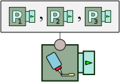
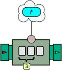

Glossary
========

This book has introduced many concepts revolving around the concept of event streams. In particular, the BeepBeep library provides a little "zoo" of dozens of `Processor` and `Function` objects. In this appendix, you will find a list of the various objects and notions that have been discussed. For entries referring to Java objects (such as processors and functions), a note next to the entry indicates whether these objects are part of BeepBeep's core, or can be found in one of its auxiliary palettes.

For more technical information about each of these objects, the reader is referred to the online API documentation, which provides in-depth and up-to-date information.

#### `AbsoluteValue`

 <!--\index{Numbers@\texttt{Numbers}!AbsoluteValue@\texttt{AbsoluteValue}|textsl} An-->An<!--/i--> `UnaryFunction` provided by the `Numbers` utility class. It computes the absolute value of a number. It is represented as:

#### `Addition`

 <!--\index{Numbers@\texttt{Numbers}!Addition@\texttt{Addition}|textsl} A-->A<!--/i--> `BinaryFunction` provided by the `Numbers` utility class. It adds two numbers. It is represented as:

#### `And`

 <!--\index{Booleans@\texttt{Booleans}!And@\texttt{And}|textsl} A-->A<!--/i--> `BinaryFunction` provided by the `Booleans` utility class. It computes the logical conjunction of its two Boolean arguments, and is represented graphically as:

#### `AnyElement`

 <!--\index{Bags@\texttt{Bags}!AnyElement@\texttt{AnyElement}|textsl} A-->A<!--/i--> 1:1 `Function` provided by the `Bags` utility class. This function takes as input a Java `Collection` *c*, and returns as its output an arbitrary element of *c*. It is represented graphically as:

#### `ApplyFunction`

 <!--\index{ApplyFunction@\texttt{ApplyFunction}|textsl} A-->A<!--/i--> `Processor` that applies a specific function *f* to every event *front* it receives, and returns the output of that function. The input and output *arity* of this processor are equal to the input and output arity of the underlying function. It is represented graphically as:

#### `ApplyFunctionPartial`

 <!--\index{ApplyFunctionPartial@\texttt{ApplyFunctionPartial}|textsl} A-->A<!--/i--> variant of `ApplyFunction` that attempts to evaluate a function on incomplete input event fronts. It is represented graphically as:

#### `ApplyToAll`

 <!--\index{Bags@\texttt{Bags}!ApplyToAll@\texttt{ApplyToAll}|textsl} A-->A<!--/i--> 1:1 `Function` provided by the `Bags` utility class. This function takes as input a Java `Collection` *c* and returns as its output the collection that is the result of applying a predefined 1:1 `Function` *f* to each element of *c*. It is represented graphically as:

#### Arity

For <!--\index{arity|textsl} a-->a<!--/i--> `Processor` object, refers to the number of pipes it has. The *input arity* is the number of input streams accepted by the processor, and the *output arity* is the number of output streams it produces.

For a `Function` object, refers to the number of arguments it accepts or the number of values it produces.

#### `ArrayPutInto`

 <!--\index{Maps@\texttt{Maps}!ArrayPutInto@\texttt{ArrayPutInto}|textsl} A-->A<!--/i--> `Processor` provided by the `Maps` utility class. Updates a map by putting key-value pairs into it. The processor takes a single input stream, whose events are *arrays* of size 2, and repeatedly outputs a reference to the same internal `Map` object. The first element of the array contains the key, and the second contains the value that will be put into the array. Upon each input array, the processor outputs the map, updated accordingly. The processor is represented graphically as:

See also `PutInto`.

#### `Bags`

 <!--\index{Bags@\texttt{Bags}|textsl} A-->A<!--/i--> container class for functions and processors applying to generic collections, i.e. "bags" of objects. Among the processors and functions provided by `Bags` are: `AnyElement`, `ApplyToAll`, `Contains`, `Explode`, `FilterElements`, `GetSize`, `Product`, `RunOn`, `ToArray`, `ToCollection`, `ToList`, and `ToSet`.

#### `BinaryFunction`

 <!--\index{BinaryFunction@\texttt{BinaryFunction}|textsl} A-->A<!--/i--> `Function` object having exactly two input arguments, and producing exactly one output value.

#### `BlackHole`

 <!--\index{BlackHole@\texttt{BlackHole}|textsl} A-->A<!--/i--> special type of `Sink` that discards everything it receives. It is represented graphically as follows:

#### `Booleans`

 <!--\index{Booleans@\texttt{Booleans}|textsl} A-->A<!--/i--> container class for `Function` objects related to Boolean values. For example, the static reference `Boolean.and` refers to the `Function` computing the logical conjunction of two Booleans. Among the functions provided by `Booleans` are: `And`, `Implies`, `Not` and `Or`.

#### `Call`

 <!--\index{Call@\texttt{Call}|textsl} A-->A<!--/i--> `Processor` object calling an external command upon receiving an event, and returning the output of that command as its output stream.

#### `CallbackSink`

 <!--\index{CallbackSink@\texttt{CallbackSink}|textsl} A-->A<!--/i--> `Sink` that calls a method when a new front of events is pushed to it. Users can override that method to do some processing on these events.

#### Closed (chain)

A <!--\index{closed (chain)|textsl} property-->property<!--/i--> of a chain of processors, when either all its downstream processors are `Sink`s, or all its upstream processors are `Source`s. A chain of processors that is not closed will generally throw Java exceptions when events pass through it.

#### `Concat`

 <!--\index{Strings@\texttt{Strings}!Concat@\texttt{Concat}|textsl} A-->A<!--/i--> `BinaryFunction` provided by the `Strings` utility class. It receives two strings as arguments, and returns the concatenation of both strings as its output value. It is represented as:

#### `Connector`

 <!--\index{Connector@\texttt{Connector}|textsl} A-->A<!--/i--> utility class that provides a number of convenient methods for connecting the outputs of processors to the inputs of other processors. Methods provided by the `Connector` class are called `connect()` and have various signatures. When called with exactly two `Processor` arguments, `connect` assigns each output pipe of the first processor to the input pipe at the same position on the second processor.

#### `Constant`

 <!--\index{Constant@\texttt{Constant}|textsl} A-->A<!--/i--> `Function` object that takes no input argument, and returns a single output value. Constants are used in `FunctionTree`s to refer to fixed values. A `Constant` instance can be created out of any Java object, and returns this object as its value. When depicted in a `FunctionTree`, they are generally represented as values inside a rounded rectangle, as follows:

#### `Contains` (`Bags`)

 <!--\index{Bags@\texttt{Bags}!Contains@\texttt{Contains}|textsl} A-->A<!--/i--> 2:1 `Function` provided by the `Bags` utility class. This function takes as input a Java `Collection` *c* and an object *o*, and returns the Boolean value `true` as its output if and only if *o* is an element of *c*. It is represented graphically as:

#### `Contains` (`Strings`)

 <!--\index{Strings@\texttt{Strings}!Contains@\texttt{Contains}|textsl} A-->A<!--/i--> `BinaryFunction` provided by the `Strings` utility class. It receives two strings as input, and returns the Boolean value `true` if the first contains the second. It is represented as:

#### `Context`

 <!--\index{processor!context|textsl} An-->An<!--/i--> associative (key-value) map used by `Processor` objects to store persistent data. Each processor has its own `Context` object. When a processor is cloned, the context of the original is copied into the clone. In addition, all operations on a `Context` object are synchronized.

#### `ContextAssignment`

 <!--\index{ContextAssignment@\texttt{ContextAssignment}|textsl} An-->An<!--/i--> object that defines the value associated to a key in a `Processor`'s `Context` object. It is represented graphically as:

#### `ContextVariable`

 <!--\index{ContextVariable@\texttt{ContextVariable}|textsl} A-->A<!--/i--> `Function` object that acts as a placeholder for the value associated to a key in a the `Context` of a `Processor`. When a `ContextVariable` occurs inside the `FunctionTree` assigned to an `ApplyFunction` processor, it queries that processor's `Context` object to get the current value associated to the key. It is represented graphically as:

By convention, context variables are prefixed with a dollar sign in diagrams, to differentiate them from constants.

#### `CountDecimate`

 <!--\index{CountDecimate@\texttt{CountDecimate}|textsl} A-->A<!--/i--> `Processor` that returns every *n*-th input event (starting with the first). The value *n* is called the **decimation interval**. However, a mode can be specified in order to output the *n*-th input event if it is the last event of the trace and it has not been output already. It is represented graphically as:

#### `Cumulate`

 <!--\index{Cumulate@\texttt{Cumulate}|textsl} A-->A<!--/i--> `Processor` that creates a cumulative processor out of a cumulative function. This is simply an instance of `ApplyFunction` whose function is of a specific type (a
`CumulativeFunction`). It is represented graphically as:

#### `CumulativeFunction`

 <!--\index{CumulativeFunction@\texttt{CumulativeFunction}|textsl} A-->A<!--/i--> special type of `Function` with memory.

#### `Deserialize`

 <!--\index{Deserialize@\texttt{Deserialize}|textsl} A-->A<!--/i--> `Processor` that takes structured character strings as its inputs, and turns each of them into Java objects with the corresponding content. It is represented graphically as follows:

*Deserialization* can be used to restore the state of objects previously saved on a persistent medium, or to receive non-primitive data types over a communication medium such as a network. The opposite operation is called *serialization*.

#### `Division`

 <!--\index{Numbers@\texttt{Numbers}!Division@\texttt{Division}|textsl} A-->A<!--/i--> `BinaryFunction` provided by the `Numbers` utility class. It computes the quotient of two numbers. It is represented as:

#### `EndsWith`

 <!--\index{Strings@\texttt{Strings}!EndsWith@\texttt{EndsWith}|textsl} A-->A<!--/i--> `BinaryFunction` provided by the `Strings` utility class. It receives two strings as arguments, and returns `true` if the former ends with the latter.

#### `Equals`

 <!--\index{Equals@\texttt{Equals}|textsl} A-->A<!--/i--> `Function` that checks for the equality between two objects. It is represented graphically as follows:

#### `Eventually`

 <!--\index{Eventually@\texttt{Eventually}|textsl} A-->A<!--/i--> `Processor` that implements the "eventually" or **F** operator of Linear Temporal Logic. If *p* is an LTL expression, **F** *p* stipulates that *p* should evaluate to `true` on at least one suffix of the current trace. It is represented graphically as:

#### `Exists`

 <!--\index{Exists@\texttt{Exists}|textsl} A-->A<!--/i--> `Function` that acts as an existential quantifier in first-order logic. It is represented as:

There is also a variant that uses an auxiliary function to compute the set of values to quantify over. It is represented as:

#### `ExpandAsColumns`

 <!--\index{ExpandAsColumns@\texttt{ExpandAsColumns}|textsl} A-->A<!--/i--> `Function` that transforms a tuple by replacing two key-value pairs by a single new key-value pair. The new pair is created by taking the value of a column as the key, and the value of another column as the value. It is represented as:

#### `Explode`

 <!--\index{Bags@\texttt{Bags}!Explode@\texttt{Explode}|textsl} A-->A<!--/i--> 1:*m* `Function` provided by the `Bags` utility class. Given a collection of size *m*, it returns as its *m* outputs the elements of the collection. It can be seen as the opposite of `ToArray`, `ToList` and `ToSet`. The ordering of the arguments is ensured when the input collection is itself ordered. The pictogram used to represent the function depends on the type of collection used for the input, in order to match the pictograph of the inverse function.

#### `Filter`

 <!--\index{Filter@\texttt{Filter}|textsl} A-->A<!--/i--> `Processor` that discards events from an input trace based on a selection criterion. The processor takes as input two events simultaneously; it outputs the first if the second is true. Graphically, this processor is represented as:

#### `FilterElements`

 <!--\index{Bags@\texttt{Bags}!FilterElements@\texttt{FilterElements}|textsl} A-->A<!--/i--> 1:1 `Function` provided by the `Bags` utility class. This function is parameterized by a 1:1 `Function` *f* that must return a Boolean. The `FilterElements` function takes as input a Java `Collection` *c* and returns as its output the collection consisting of only the elements of *c* for which *f*(*c*) returns `true`. It is represented graphically as:

#### `FindPattern`

A `Processor` <!--\index{FindPattern@\texttt{FindPattern}|textsl} that-->that<!--/i--> extracts chunks of an input stream based on a regular expression. It is represented graphically as:

#### `FindRegex`

 <!--\index{Strings@\texttt{Strings}!FindRegex@\texttt{FindRegex}|textsl} An-->An<!--/i--> `UnaryFunction` provided by the `Strings` utility class. It receives a string *s* as its argument, and returns an *array* of strings, corresponding to all the matches of a given regular expression *exp* on *s*. It is represented as:

#### `ForAll`

 <!--\index{ForAll@\texttt{ForAll}|textsl} A-->A<!--/i--> `Function` that acts as a universal quantifier in first-order logic. It is represented as:

There is a variant of `ForAll` that uses an auxiliary function to compute the set of values to quantify over. It is represented as:

#### `Fork`

 <!--\index{Fork@\texttt{Fork}|textsl} A-->A<!--/i--> `Processor` that duplicates a single input stream into two or more output streams. A `Fork` is used when the contents of the same stream must be processed by multiple processors in parallel. It is represented graphically as:

#### `Freeze`

 <!--\index{Freeze@\texttt{Freeze}|textsl} A-->A<!--/i--> `Processor` that repeatedly outputs the first event it has received. It is represented graphically as:

#### Front

Given *n* streams, the <!--\index{front|textsl} front-->front<!--/i--> at position *k* is the tuple made of the event at the *k*-th position in every stream. BeepBeep `Processor`s that have an input *arity* greater than 1 handle events one front at a time; this is called *synchronous processing*.

#### `Function`

 <!--\index{Function@\texttt{Function}|textsl} A-->A<!--/i--> computation unit that receives one or more *arguments*, and produces one or more output *values*. Along with `Processor`, this is one of BeepBeep's fundamental classes. Contrary to processors, functions are *stateless* (or history-independent): the same inputs must always produce the same outputs.

Functions are represented graphically as rounded rectangles, with a pictogram describing the computation they perform, such as this:

A function with an input arity of *m* and an output arity of *n* is often referred to as an *m*:*n* function.

#### `FunctionTransition`

 <!--\index{FunctionTransition@\texttt{FunctionTransition}|textsl} A-->A<!--/i--> `Transition` of a `MooreMachine` whose firing conditions is determined by evaluating a function *f* on the incoming event front. It is represented as:

#### `FunctionTree`

 <!--\index{FunctionTree@\texttt{FunctionTree}|textsl} A-->A<!--/i--> `Function` object representing the composition of multiple functions together to form a "compound" function. A function tree has a *root*, which consists of an *m*:*n* function. This function is connected to *n* children, which can be functions or function trees themselves. The diagram below depicts a function tree that composes multiplication and addition to form a more complex function of two arguments.

#### `Get`

 <!--\index{Maps@\texttt{Maps}!Get@\texttt{Get}|textsl} A-->A<!--/i--> `UnaryFunction` provided by the `Maps` utility class; it is parameterized by a key *k*. Given a `Map` *m* as its input, it retrieves the value associated to *k* in *m*. It is represented graphically as:

#### `GetSize`

 <!--\index{Bags@\texttt{Bags}!GetSize@\texttt{GetSize}|textsl} A-->A<!--/i--> 1:1 `Function` provided by the `Bags` utility class. This function takes as input a Java `Collection` *c* and returns as its output the number of elements in that collection. It is represented graphically as:

#### `GetWidgetValue`

 <!--\index{GetWidgetValue@\texttt{GetWidgetValue}|textsl} A-->A<!--/i--> `Function` that takes a Swing component as input, and returns the current "value" of this component. It is represented graphically as:

#### `Globally`

 <!--\index{Globally@\texttt{Globally}|textsl} A-->A<!--/i--> `Processor` that implements the "globally" or **G** operator of Linear Temporal Logic. If *p* is an LTL expression, **G** *p* stipulates that *p* should evaluate to `true` on every suffix of the current trace. It is represented graphically as:

#### `GroupProcessor`

 <!--\index{GroupProcessor@\texttt{GroupProcessor}|textsl} A-->A<!--/i--> `Processor` that encapsulates a chain of processors as if it were a single object. It is represented as follows:

To create a `GroupProcessor`, one must first instantiate and connect the processors to be encapsulated. Each processor must then be added to the group through a method called `add`. Finally, the endpoints of the chain must be associated to the inputs and outputs of the group. From then on, the processor can be moved around, connected and duplicated as if it were a single processor.

In a graphical representation of a `GroupProcessor`, the processor chain inside the group can also be drawn.

#### HttpGet

 <!--\index{HttpGet@\texttt{HttpGet}|textsl} A-->A<!--/i--> `Source` that reads chunks of data from an URL, using an HTTP request. These chunks are returned as events in the form of strings. It is represented as:

#### `IdentityFunction`

 <!--\index{IdentityFunction@\texttt{IdentityFunction}|textsl} A-->A<!--/i--> `Function` that returns its input for its output. It is represented as follows:

The actual colour of the oval depends on the type of events that the function relays.

#### `IfThenElse`

 <!--\index{IfThenElse@\texttt{IfThenElse}|textsl} A-->A<!--/i--> 3:1 `Function` that acts as an if-then-else. If its first input is true, it returns its second input; otherwise it returns its third input. It is represented as follows:

#### `Implies`

 <!--\index{Booleans@\texttt{Booleans}!Implies@\texttt{Implies}|textsl} A-->A<!--/i--> `BinaryFunction` provided by the `Booleans` utility class. It computes the logical implication of its two Boolean arguments, and is represented graphically as:

#### `Insert`

 <!--\index{Insert@\texttt{Insert}|textsl} A-->A<!--/i--> `Processor` that inserts an event a certain number of times before letting the input events through. This processor can be used to shift events of an input trace forward, by padding the beginning of the trace with some dummy element. It is represented graphically as:

#### `IsEven`

 <!--\index{Numbers@\texttt{Numbers}!IsEven@\texttt{IsEven}|textsl} An-->An<!--/i--> `UnaryFunction` provided by the `Numbers` utility class. It returns the Boolean value `true` if and only if its argument is an even number. It is represented as:

#### `IsGreaterOrEqual`, `IsGreaterThan`

 <!--\index{Numbers@\texttt{Numbers}!IsGreaterThan@\texttt{IsGreaterThan}|textsl} Two-->Two<!--/i--> `BinaryFunction`s provided by the `Numbers` utility class. They return the Boolean value `true` if their first argument is greater than (or equal to) the second argument. They are represented as:

#### `IsLessOrEqual`, `IsLessThan`

 <!--\index{Numbers@\texttt{Numbers}!IsGreaterThan@\texttt{IsGreaterThan}|textsl} Two-->Two<!--/i--> `BinaryFunction`s provided by the `Numbers` utility class. They return the Boolean value `true` if their first argument is less than (or equal to) the second argument. They are represented as:

#### `IsSubsetOrEqual`

 <!--\index{Sets@\texttt{Sets}!IsSubsetOrEqual@\texttt{IsSubsetOrEqual}|textsl} A-->A<!--/i--> `BinaryFunction` that receives two sets as arguments, and returns `true` if the first is a subset of the second. It is represented as:

#### `JdbcSource`

 <!--\index{JdbcSource@\texttt{JdbcSource}|textsl} A-->A<!--/i--> `Source` object that executes an SQL query on a JDBC connection, and returns the result as a sequence of tuples. It is represented graphically as:

#### `JPathFunction`

 <!--\index{JPathFunction@\texttt{JPathFunction}|textsl} A-->A<!--/i--> 1:1 `Function` that receives a `JsonElement` as input, and returns a portion of this element as its output. The portion to extract is called a *path expression*, and corresponds to a specific traversal in the input object. The function is represented graphically as:

#### `JsonElement`

 <!--\index{JsonElement@\texttt{JsonElement}|textsl} An-->An<!--/i--> object representing a part of a JSON document. Specific types of JSON elements are `JsonBoolean`, `JsonList`, `JsonMap`, `JsonNull`, `JsonNumber`, and `JsonString`.

#### `KeepLast`

 <!--\index{KeepLast@\texttt{KeepLast}|textsl} A-->A<!--/i--> `Processor` that returns only the very last event of its input stream, and discards all the previous ones. It is represented graphically as:

#### `Limit`

 <!--\index{Limit@\texttt{Limit}|textsl} A-->A<!--/i--> 1:1 `Processor` that receives a stream of numerical values; if the processor receives a non-zero value, it outputs this value, but will turn the *k* following ones into 0, whether they are null or not. Graphically, this processor is represented as:

#### `ListenerSource`

 <!--\index{ListenerSource@\texttt{ListenerSource}|textsl} A-->A<!--/i--> `Source` processor that wraps around a Swing component, and pushes `ActionEvent`s or `ChangeEvent`s when user actions are performed on the component. It is represented as a box illustrating the widget that is being wrapped, such as follows:

#### `Lists`

 A container class for functions and processors applying to ordered collections (`List`s) and arrays. Among the processors and functions provided by `Lists` are: `Explode`, `Pack`, `TimePack`, and `Unpack`.

#### `Maps`

 A container class for functions and processors applying to Java `Map`s, i.e. associative key-value arrays. Among the processors and functions provided by `Maps` are: `ArrayPutInto`, `Get`, `PutInto`, and `Values`.

#### `Matches`

 <!--\index{Strings@\texttt{Strings}!Matches@\texttt{Matches}|textsl} A-->A<!--/i--> `BinaryFunction` provided by the `Strings` utility class. It receives two strings as its arguments, and returns the Boolean value `true` if the first matches the regular expression defined in the second. It is represented as:

#### `Maximum`

 <!--\index{Numbers@\texttt{Numbers}!Maximum@\texttt{Maximum}|textsl} A-->A<!--/i--> `BinaryFunction` provided by the `Numbers` utility class. It returns the maximum of its two arguments. It is represented as:

#### `Minimum`

 <!--\index{Numbers@\texttt{Numbers}!Minimum@\texttt{Minimum}|textsl} A-->A<!--/i--> `BinaryFunction` provided by the `Numbers` utility class. It returns the minimum of its two arguments. It is represented as:

#### `MooreMachine`

 <!--\index{MooreMachine@\texttt{MooreMachine}|textsl} A-->A<!--/i--> `Processor` that receives an event stream and which, upon each input event, updates its internal state according to a deterministic finite state machine. Each state can be associated with an event to output, corresponding to the formal definition of a Moore machine in theoretical computer science. The `MooreMachine` is depicted by the graph of the FSM it implements; if the graph is too cumbersome, a generic box can be used instead:

#### `Multiplex`

 <!--\index{Multiplex@\texttt{Multiplex}|textsl} A-->A<!--/i--> `Processor` that merges the contents of multiple streams into a single stream. It is an *m*:1 processor that outputs an event as soon as one is available on one of its input pipes. It is represented graphically as:

#### `Multiplication`

 <!--\index{Numbers@\texttt{Numbers}!Multiplication@\texttt{Multiplication}|textsl} A-->A<!--/i--> `BinaryFunction` provided by the `Numbers` utility class. It computes the product of two numbers. It is represented as:

#### `Multiset`

 <!--\index{Multiset@\texttt{Multiset}|textsl} A-->A<!--/i--> `Set` that preserves the multiplicity of its elements.

#### `Next`

 <!--\index{Next@\texttt{Next}|textsl} A-->A<!--/i--> `Processor` that implements the "next" or **X** operator of Linear Temporal Logic. If *p* is an LTL expression, **X** *p* stipulates that *p* should evaluate to `true` on the suffix of the current trace starting at the next event. It is represented graphically as:

#### `Not`

 <!--\index{Booleans@\texttt{Booleans}!Not@\texttt{Not}|textsl} An-->An<!--/i--> `UnaryFunction` provided by the `Booleans` utility class. It computes the logical negation of its Boolean argument, and is represented graphically as:

#### `NumberCast`

 <!--\index{Numbers@\texttt{Numbers}!NumberCast@\texttt{NumberCast}|textsl} An-->An<!--/i--> `UnaryFunction` provided by the `Numbers` utility class. It attempts to convert an arbitrary Java `Object` into a number. It is represented as:

#### `Numbers`

 <!--\index{Numbers@\texttt{Numbers}|textsl} A-->A<!--/i--> container class for functions applying to Java `Number`s. Among the functions provided by `Numbers` are: `AbsoluteValue`, `Addition`, `Division`, `IsEven`, `IsGreaterOrEqual`, `IsGreaterThan`, `IsLessOrEqual`, `IsLessThan`, `Maximum`, `Minimum`, `Multiplication`, `NumberCast`, `Power`, `Signum`, `SquareRoot`, and `Subtraction`.

#### `NthElement`

 An `UnaryFunction` that returns the *n*-th element of an ordered collection (array or list). It is represented graphically as:

#### `Or`

 <!--\index{Booleans@\texttt{Booleans}!Or@\texttt{Or}|textsl} A-->A<!--/i--> `BinaryFunction` provided by the `Booleans` utility class. It computes the logical disjunction of its two Boolean arguments, and is represented graphically as:

#### `Pack`

 <!--\index{Lists@\texttt{Lists}!Pack@\texttt{Pack}|textsl} A-->A<!--/i--> `Processor` provided by the `Lists` utility class. It accumulates events from a first input pipe, and sends them in a burst into a list based on the Boolean value received on its second input pipe. A value of `true` triggers the output of a list, while a value of `false` accumulates the event into the existing list. This processor is represented graphically as follows:

The opposite of `Pack` in `Unpack`. See also `TimePack`.

#### `ParseJson`

 <!--\index{ParseJson@\texttt{ParseJson}|textsl} A-->A<!--/i--> `Function` that turns a character string into a structured object called a `JsonElement`. The function is represented graphically as:

#### `ParseXml`

 <!--\index{ParseXml@\texttt{ParseXml}|textsl} A-->A<!--/i--> `Function` that turns a character string into a structured object called an `XmlElement`. The function is represented graphically as:

#### `Passthrough`

 A `Processor` object that lets every input event through as its output. This processor can be used as a placeholder when a piece of code needs to be passed a `Processor` object, but that in some cases, no processing on the events is necessary. Graphically, this processor is represented as:

#### `PeakFinder`

 <!--\index{PeakFinder@\texttt{PeakFinder}|textsl} A-->A<!--/i--> 1:1 `Processor` object receives as input a stream of numerical values, and identifies the "peaks" (sudden increases) in that signal. It outputs the value 0 if no peak is detected at the current input position, and otherwise, the height of the detected peak. Graphically, this processor is represented as:

The *Signal* palette implements two variants of `PeakFinder` called <!--\index{PeakFinderLocalMaximum@\texttt{PeakFinderLocalMaximum}} \texttt{PeakFinderLocalMaximum}-->`PeakFinderLocalMaximum`<!--/i--> and <!--\index{PeakFinderTravelRise@\texttt{PeakFinderTravelRise}} \texttt{PeakFinderTravelRise}-->`PeakFinderTravelRise`<!--/i-->.

#### `Persist`

 <!--\index{Persist@\texttt{Persist}|textsl} A-->A<!--/i--> 1:1 `Processor` that receives a stream of numerical values; when a processor receives a non-zero value, it outputs it for the next *k* events, unless a subsequent input value is greater (in which case this new value is output for the next *k* events). Graphically, this processor is represented as:

#### `PlateauFinder`

 <!--\index{PlateauFinder@\texttt{PlateauFinder}|textsl} A-->A<!--/i--> 1:1 `Processor` object receives as input a stream of numerical values, and identifies the "plateaus" (successive events with similar values) in that signal. It outputs the value 0 if no plateau is detected at the current input position, and otherwise, the height of the detected plateau. Graphically, this processor is represented as:

#### `Power`

 <!--\index{Numbers@\texttt{Numbers}!Power@\texttt{Power}|textsl} A-->A<!--/i--> `BinaryFunction` provided by the `Numbers` utility class. It computes the first argument, elevated to the power of the second. It is represented as:

#### `Prefix`

 <!--\index{Prefix@\texttt{Prefix}|textsl} A-->A<!--/i--> `Processor` that returns the first <i>n</i> input events and discards the following ones. It is represented graphically as:

#### `Print`

 <!--\index{Print@\texttt{Print}|textsl} A-->A<!--/i--> `Processor` that sends its input events to a Java `PrintStream` (such as the standard output). This processor takes whatever event it receives (i.e. any Java `Object`), calls its {@link Object#toString() toString()} method, and pushes the resulting output to a print stream. Graphically, it is represented as:

#### `Processor`

 <!--\index{Processor@\texttt{Processor}|textsl} A-->A<!--/i--> processing unit that receives zero or more input streams, and produces zero or more output streams. The `Processor` is the fundamental class where all stream computation occurs. All of BeepBeep's processors are descendants of this class. A processor is depicted graphically as a "box", with "pipes" representing its
input and output streams.

This class itself is abstract; nevertheless, it provides important methods for handling input/output event queues, connecting processors together, etc. However, if you write your own processor, you will most likely want to inherit from its child, `SynchronousProcessor`, which does some additional work. The `Processor` class does not assume anything about the type of events
being input or output. All its input and output queues are therefore declared
as containing instances of `Object`, Java's most generic type.

#### `Product`

 <!--\index{Bags@\texttt{Bags}!Product@\texttt{Product}|textsl} A-->A<!--/i--> 2:1 `Function` provided by the `Bags` utility class. This function takes as input two Java `Collection`, *c1* and *c2*, and returns as its output a set of arrays of size 2, corresponding to the Cartesian product of *c1* and *c2*. It is represented graphically as:

#### `Pullable`

 <!--\index{Pullable@\texttt{Pullable}|textsl} An-->An<!--/i--> object that queries events on one of a processor's outputs. For a processor with an output arity *n*, there exists *n* distinct pullables, namely one for
each output trace. Every pullable works roughly like a classical `Iterator`:
it is possible to check whether new output events are available, and get one
new output event. However, contrarily to iterators, `Pullable`s have two versions of each method: a *soft* and a *hard* version. The opposite of `Pullable`s are `Pushable`s --objects that allow users to feed input events to processors. Graphically, a `Pullable` is represented by a pipe connected to a processor, with an outward pointing triangle:

#### Pull mode

One of the two operating modes of a chain of processors. In <!--\index{pull mode|textsl} pull mode-->pull mode<!--/i-->, a user or an application obtains references to the `Pullable` objects of the downstream processors of the chain, and calls their `pull()` method to ask for new output events. When using a chain of processors in pull mode, the chain must be closed at its inputs. The opposite mode is called *push mode*.

#### `Pump`

 <!--\index{Pump@\texttt{Pump}|textsl} A-->A<!--/i--> `Processor` that repeatedly pulls its input, and pushes the resulting events to its output. The `Pump` is a way to bridge an upstream part of a processor chain that works in *pull* mode, to a downstream part that operates in *push* mode.

Graphically, this processor is represented as:

The repeated pulling of events from its input is started by calling this
processor's `#start()` method. In the background, this will instantiate
a new thread, which will endlessly call <tt>pull()</tt> on whatever input is
connected to the pump, and then call <tt>push()</tt> on whatever input is
connected to it.

The opposite of the `Pump` is the `Tank`.

#### `Pushable`

 <!--\index{Pushable@\texttt{Pushable}|textsl} An-->An<!--/i--> object that gives events to some of a processor's input. Interface `Pushable` is the opposite of `Pullable`: rather than querying events form a processor's output (i.e. "pulling"), it gives events to a processor's input. This has for effect of triggering the processor's computation and "pushing" results (if any) to the processor's output. If a processor is of input arity *n*, there exist *n* distinct
`Pullable`s: one for each input pipe. Graphically, a `Pushable` is represented by a pipe connected to a processor, with an inward pointing triangle:

#### Push mode

One of the two operating modes of a chain of processors. In <!--\index{push mode|textsl} push mode-->push mode<!--/i-->, a user or an application obtains references to the `Pushable` objects of the upstream processors of the chain, and calls their `push()` method to feed new input events. When using a chain of processors in push mode, the chain must be closed at its outputs. The opposite mode is called *pull mode*.

#### `PutInto` (`Maps`)

 <!--\index{Maps@\texttt{Maps}!PutInto@\texttt{PutInto}|textsl} A-->A<!--/i--> `Processor` provided by the `Maps` utility class. It updates a map by putting key-value pairs into it. The processor takes two input streams; the first contains the key, and the second contains the value that will be put into the array.  Upon each input front, it repeatedly outputs a reference to the same internal `Map` object, updated accordingly. The processor is represented graphically as:

See also `ArrayPutInto`.

#### `PutInto` (`Sets`)

 <!--\index{Sets@\texttt{Sets}!PutInto@\texttt{PutInto}|textsl} A-->A<!--/i--> `Processor` provided by the `Sets` utility class. Updates a set by putting the elements it receives into it. Upon each input event, it repeatedly outputs a reference to the same internal `Set` object, updated accordingly. The processor is represented graphically as:

See also `PutIntoNew`.

#### `PutIntoNew` (`Sets`)

 <!--\index{Sets@\texttt{Sets}!PutIntoNew@\texttt{PutIntoNew}|textsl} A-->A<!--/i--> `Processor` provided by the `Sets` utility class. Updates a set by putting the elements it receives into it. Upon each input event, it creates a new instance of `Set` and adds to it all the events received so far; it then outputs a reference to this new set. The processor is represented graphically as:

See also `PutInto` (`Sets`).

#### `QueueSink`

 <!--\index{QueueSink@\texttt{QueueSink}|textsl} A-->A<!--/i--> `Sink` that accumulates events into queues, one for each input pipe. It is represented graphically as:

#### `QueueSource`

 <!--\index{QueueSource@\texttt{QueueSource}|textsl} A-->A<!--/i--> `Source` whose input is a queue of objects. One gives the `QueueSource` a list of events, and that source sends these events as its input one by one. When reaching the end of the list, the source returns to the beginning and keeps feeding events from the list endlessly. The `QueueSource` is represented graphically as:

#### `RaiseArity`

 <!--\index{RaiseArity@\texttt{RaiseArity}|textsl} A-->A<!--/i--> `Function` that raises the arity of another function. Given an *m*:*n* function *f*, an instance of *r* `RaiseArity` makes *f* behave like an *m'*:*n* function, with *m'* > *m*. The extra arguments given to *r* are simply ignored. It is represented as:

#### `Randomize`

 <!--\index{Randomize@\texttt{Randomize}|textsl} A-->A<!--/i--> *n*:*n* `Processor` that turns an arbitrary input event front into an output front made of randomly selected numerical values. The interval in which values are selected can be specified. It is represented graphically as:

#### `ReadInputStream`

 <!--\index{ReadInputStream@\texttt{ReadInputStream}|textsl} A-->A<!--/i--> `Source` that reads chunks of bytes from a Java `InputStream`.  It is represented graphically as follows:

#### `ReadLines`

 <!--\index{ReadLines@\texttt{ReadLines}|textsl} A-->A<!--/i--> Source that reads entire text lines from a Java `InputStream`. It is represented graphically as:

#### `ReadStringStream`

 <!--\index{ReadStringStream@\texttt{ReadStringStream}|textsl} A-->A<!--/i--> variant of `ReadInputStream` that converts the byte chunks into character strings.

#### `RunOn`

 <!--\index{Bags@\texttt{Bags}!RunOn@\texttt{RunOn}|textsl} A-->A<!--/i--> `Processor` provided by the `Bags` utility class. This processor is parameterized by another processor *P*. It receives as input a stream of collections. On each individual collection *c*, it resets *P*, feeds each element of *c* on *P*, and retrieves the last event output by *P* on that stream; this is the event is the event output by `RunOn` on *c*. It is represented graphically as:

If the collection *c* is unordered and *P* is sensitive to event ordering, the output of `RunOn` on this collection may not always be the same.

#### `Serialize`

 <!--\index{Serialize@\texttt{Serialize}|textsl} A-->A<!--/i--> `Processor` that takes arbitrary objects as its inputs, and turns each of them into a structured character string depicting their content. It is represented graphically as follows:

*Serialization* can be used to store the state of objects on a persistent medium, or to transmit non-primitive data types over a communication medium such as a network. The opposite operation is called *deserialization*.

#### `Sets`

 <!--\index{Sets@\texttt{Sets}|textsl} A-->A<!--/i--> container class for functions and processors applying to Java `Set`s and their descendents. Among the processors and functions provided by `Sets` are: `IsSubsetOrEqual`, `PutInto`, `PutIntoNew`, and `SetUpdateProcessor`.

#### `Signum`

 <!--\index{Numbers@\texttt{Numbers}!Signum@\texttt{Signum}|textsl} An-->An<!--/i--> `UnaryFunction` provided by the `Numbers` utility class. It returns -1 if the argument is negative, +1 if it is positive, and 0 if the argument is the number 0. It is represented as:

#### `SynchronousProcessor`

 <!--\index{SynchronousProcessor@\texttt{SynchronousProcessor}|textsl} A-->A<!--/i--> `Processor` that performs a computation on input events to produce output events. This is the direct descendant of `Processor`, and probably the one you'll want to inherit from when creating your own processors. While `Processor` takes care of input and output queues, `SynchronousProcessor` also implements `Pullable`s and `Pushable`s. These take care of collecting input events, waiting until one new event is received from all input traces before triggering the computation, pulling and buffering events from all outputs when either of the `Pullable`s is being called, etc. The only thing that is left undefined is what to do when new input events have been received from all input traces. This is the task of abstract method `compute()`, which descendants of this class must implement.

#### `Sink`

 <!--\index{Sink@\texttt{Sink}|textsl} A-->A<!--/i--> `Processor` with an output *arity* of zero. It is used to close processor chains in *push mode*.

#### `SinkLast`

 <!--\index{SinkLast@\texttt{SinkLast}|textsl} A-->A<!--/i--> variant of `QueueSink` with a queue of size 1. A `SinkLast` remembers only the last event sent to it.

#### `Slice`

  <!--\index{Slice@\texttt{Slice}|textsl} A-->A<!--/i--> `Processor` that separates the events from an input stream into multiple "sub-streams". A function *f*, called the *slicing function*, dispatches to a copy of *P* an input event *e* according to the value of *f*(*e*) (there is one copy of *P* for each possible output value of *f*). The `Slice` processor returns a Java `Map` containing as keys the value of *f*(*e*), and as value, the last event returned by the processor *P* associated to *f*(*e*). It is illustrated as:

#### `Smooth`

  <!--\index{Smooth@\texttt{Smooth}|textsl} A-->A<!--/i--> `Processor` that smoothes a stream of numbers by replacing a value by an average over a window of events. It is illustrated as:

#### `Source`

 <!--\index{Source@\texttt{Source}|textsl} A-->A<!--/i--> `Processor` with an input *arity* of zero. It is used to close processor chains in *pull mode*.

#### `Splice`

  <!--\index{Splice@\texttt{Splice}|textsl} A-->A<!--/i--> `Source` that joins multiple sources as a single one. The splice processor is given multiple sources. It pulls events from the first one until it does not yield any new event. It then starts pulling events from the second one, and so on. It is illustrated as:

#### `SplitString`

 <!--\index{Strings@\texttt{Strings}!SplitString@\texttt{SplitString}|textsl} A-->An<!--/i--> `UnaryFunction` provided by the `Strings` utility class. It receives as string as its input, and returns an *array* of strings, split according to a given character separator. It is represented as:

The comma in the figure is to be replaced by the actual character used to separate the input string.

#### `SquareRoot`

 <!--\index{Numbers@\texttt{Numbers}!SquareRoot@\texttt{SquareRoot}|textsl} An-->An<!--/i--> `UnaryFunction` provided by the `Numbers` utility class. It computes the square root of its argument. It is represented as:

#### `StartsWith`

 <!--\index{Strings@\texttt{Strings}!StartsWith@\texttt{StartsWith}|textsl} A-->A<!--/i--> `BinaryFunction` provided by the `Strings` utility class. It receives two strings as its arguments, and returns the Boolean value `true` if the first string starts with the second. It is represented as:

#### `StreamVariable`

 <!--\index{StreamVariable@\texttt{StreamVariable}|textsl} A-->A<!--/i--> `Function` standing for the *i*-th stream given as input to a processor. A `StreamVariable` can be given as an argument to a `FunctionTree`. It is represented as follows:

The number inside the diamond represents the stream number. By convention, stream numbers start at 1 in diagrams.

#### `Strings`

 <!--\index{Strings@\texttt{Strings}|textsl} A-->A<!--/i--> container class for functions and processors applying to Java `String`s. Among the processors and functions provided by `Sets` are: `Concat`, `Contains`, `EndsWith`, `FindRegex`, `Matches`, `SplitString`, `StartsWith` and `ToString`.

#### `Stutter`

 <!--\index{Stutter@\texttt{Stutter}|textsl} A-->A<!--/i--> `Processor` that repeats each input event in its output a fixed number of times (*k*; see also `VariableStutter`). It is represented graphically as:

#### `Subtraction`

 <!--\index{Numbers@\texttt{Numbers}!Subtraction@\texttt{Subtraction}|textsl} A-->A<!--/i--> `BinaryFunction` provided by the `Numbers` utility class. It computes the difference of two numbers. It is represented as:

#### `Tank`

 <!--\index{Tank@\texttt{Tank}|textsl} A-->A<!--/i--> `Processor` that accumulates pushed events into a queue until they are pulled. The Tank is a way to bridge an upstream part of a processor chain that works in *push* mode, to a downstream part that operates in *pull* mode.

Graphically, this processor is represented as:

The opposite of the tank is the `Pump`.

#### `TankLast`

 <!--\index{TankLast@\texttt{TankLast}|textsl} A-->A<!--/i--> variant of `Tank` which, when pulled, creates an output event based on the last event received.

#### `Threshold`

 <!--\index{Threshold@\texttt{Threshold}|textsl} A-->A<!--/i--> 1:1 `Processor` that receives a stream of numerical values; the processor outputs an event if its value is above some threshold value *k*; otherwise it replaces it by 0. Graphically, this processor is represented as:

#### `TimeDecimate`

 <!--\index{TimeDecimate@\texttt{TimeDecimate}|textsl} A-->A<!--/i--> `Processor` which, after returning an input event, discards all others for the next *n* seconds. This processor therefore acts as a rate limiter. It is represented as:

Note that this processor uses `System.currentTimeMillis()` as its clock. Moreover, a mode can be specified in order to output the last input event of the trace if it has not been output already.

#### `TimePack`

 <!--\index{Lists@\texttt{Lists}!TimePack@\texttt{TimePack}|textsl} A-->A<!--/i--> `Processor` provided by the `Lists` utility class. It accumulates events from a first input pipe, and sends them in a burst into a list at predefined time intervals. This processor is represented graphically as follows:

The opposite of `TimePack` in `Unpack`. See also `Pack`.

#### `ToArray`, `ToList`, `ToSet`

 <!--\index{Bags@\texttt{Bags}!ToArray@\texttt{ToArray}|textsl} \index{Bags@\texttt{Bags}!ToList@\texttt{ToList}|textsl} \index{Bags@\texttt{Bags}!ToSet@\texttt{ToSet}|textsl} Three-->Three<!--/i--> *m*:1 `Function`s provided by the `Bags` utility class. Their input arity is defined by parameter *m*. They turn their *m* arguments into a Java array, list or set of size *m*. In the case of arrays and lists, the ordering of the arguments is preserved: the *i*-th argument of the function is placed at the *i*-th position in the output collection. The following picture shows the graphical representation of each of these functions:

#### `ToImageIcon`

 <!--\index{ToImageIcon@\texttt{ToImageIcon}|textsl} An-->An<!--/i--> `UnaryFunction` that converts an array of bytes containing an image, into a Swing `ImageIcon`. It is represented as:

#### `ToString`

 <!--\index{Strings@\texttt{Strings}!ToString@\texttt{ToString}|textsl} An-->An<!--/i--> `UnaryFunction` provided by the `Strings` utility class. It attempts to convert an arbitrary Java `Object` into a `String`; this is done by calling the object's `toString` method. It is represented as:

#### `Transition`

 <!--\index{Transition@\texttt{Transition}|textsl} An-->An<!--/i--> object used by the `MooreMachine` processor that indicates how the machine can move between its states. It is represented as:

#### `TransitionOtherwise`

 <!--\index{TransitionOtherwise@\texttt{TransitionOtherwise}|textsl} A-->A<!--/i--> `Transition` object used by the `MooreMachine` processor that fires only if none of the other outgoing transitions from the same source state fires first.

#### `Trim`

 <!--\index{Trim@\texttt{Trim}|textsl} A-->A<!--/i--> `Processor` that discards the first *n* events of its input stream, and outputs the remaining ones as is. It is represented as:

#### `Tuple`

 <!--\index{Tuple@\texttt{Tuple}|textsl} A-->A<!--/i--> special type of event defined by BeepBeep's *Tuple* palette, which consists of an associative map between keys and values. Contrary to tuples in relational databases, where values must be scalar (i.e. strings or numbers), the tuples in BeepBeep can have arbitrary Java objects as values (including other tuples).

#### `TupleFeeder`

 <!--\index{TupleFeeder@\texttt{TupleFeeder}|textsl} A-->A<!--/i--> `Processor` that converts lines of text into `Tuple`s. It is represented as:

#### `TurnInto`

 <!--\index{TurnInto@\texttt{TurnInto}|textsl} A-->A<!--/i--> `Processor` that turns any input event into a predefined object. It is represented graphically as:

#### `UnaryFunction`

 <!--\index{UnaryFunction@\texttt{UnaryFunction}|textsl} A-->A<!--/i--> `Function` object that has an input and output *arity* of exactly 1.

#### Uniform (processor)

A `Processor` that produces the same number of output fronts for every input front it receives. Occasionally, the number of output fronts produced is explicitly mentioned: a *k*-uniform processor produces exactly *k* output fronts for every input front.

#### `Unpack`

 <!--\index{Lists@\texttt{Lists}!Unpack@\texttt{Unpack}|textsl} A-->A<!--/i--> `Processor` provided by the `Lists` utility class. It unpacks a list of objects by outputting its contents as separate events. This processor is represented graphically as follows: 

The opposite of `Unpack` is `Pack`.

#### `Until`

 <!--\index{Until@\texttt{Until}|textsl} A-->A<!--/i--> `Processor` that implements the "until" or **U** operator of Linear Temporal Logic. If *p* and *q* are two streams of Boolean value, *p* **U** *q* stipulates that *q* should evaluate to `true` on some future input front, and that until then, *p* should evaluates to `true` on every input front. It is represented graphically as:

#### `Values`

 <!--\index{Maps@\texttt{Maps}!Values@\texttt{Values}|textsl} A-->A<!--/i--> `UnaryFunction` provided by the `Maps` utility class. Given a `Map` *m* as its input, it returns a `Set` made of all the values present in *m*. It is represented graphically as:

#### `VariableStutter`

 <!--\index{VariableStutter@\texttt{VariableStutter}|textsl} A-->A<!--/i--> 2:1 `Processor` that repeats each input event coming in its first input pipe a number of times defined by the input event coming into its second input pipe. It is represented graphically as:

#### `Variant`

A <!--\index{Variant@\texttt{Variant}|textsl} special-->special<!--/i--> class that can be returned by a call to a processor's `getInputTypesFor` or `getOutputType` methods. The occurrence of such a type in an input or output pipe disables the type checking step that the `Connector` class normally performs before connecting two processors together.

#### `Window`

 <!--\index{Window@\texttt{Window}|textsl} A-->A<!--/i--> `Processor` that applies another processor on a "sliding window" of events. It takes as arguments another processor *P* and a window width *n*. It returns the result of P after processing events 0 to *n*-1... - Then the result of (a new instance of P) that processes events 1 to *n*, and so on. It is represented graphically as:

#### `WindowFunction`

 <!--\index{WindowFunction@\texttt{WindowFunction}|textsl} A-->A<!--/i--> `Processor` that applies a function on a "sliding window" of events. It takes a sliding window of *n* successive input events, passes them to the *n*-ary function *f* and outputs the result. It is represented graphically as:

#### `WriteOutputStream`

 <!--\index{WriteOutputStream@\texttt{WriteOutputStream}|textsl} A-->A<!--/i--> `Sink` that writes chunks of bytes to a Java `OutputStream`.  It is represented graphically as follows:

#### `XmlElement`

 <!--\index{XmlElement@\texttt{XmlElement}|textsl} An-->An<!--/i--> object representing an element of an XML document.

#### `XPathFunction`

 <!--\index{XPathFunction@\texttt{XPathFunction}|textsl} A-->A<!--/i--> 1:1 `Function` that receives an `XmlElement` as input, and returns a portion of this element as its output. The portion to extract is called a *path expression*, and corresponds to a specific traversal in the input object. The function is represented graphically as:

<!-- :wrap=soft: -->