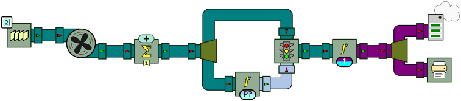

## Networking

``` java
ApplyFunction serialize = new ApplyFunction(new JsonSerializeString());
HttpUpstreamGateway up_gateway = new HttpUpstreamGateway("http:
HttpDownstreamGateway dn_gateway = new HttpDownstreamGateway(12144, "/push", Method.POST);
ApplyFunction deserialize = new ApplyFunction(new JsonDeserializeString<CompoundObject>(CompoundObject.class));
Print print = new Print();
Connector.connect(serialize, up_gateway);
Connector.connect(dn_gateway, deserialize);
Connector.connect(deserialize, print);
up_gateway.start();
dn_gateway.start();
Pushable p = serialize.getPushableInput();
p.push(new CompoundObject(0, "foo", null));
Thread.sleep(1000);
p.push(new CompoundObject(0, "foo", new CompoundObject(6, "z", null)));
up_gateway.stop();
dn_gateway.stop();
```
[⚓](https://github.com/liflab/beepbeep-3-examples/blob/master/Source/src/network/httppush/PushLocal.java#L47)


### An example: distributed twin primes

Compute twin primes by distributing the computation across two machines over a network. Twin primes are pairs of numbers *p* and *p*+2 such that both are prime. For example, (3,5), (11,13) and (17,19) are three such pairs. The [twin prime conjecture](https://en.wikipedia.org/wiki/Twin_prime) asserts that there exists an infinity of such pairs.

Our setup will be composed of two machines, called A and B. Machine A will be programmed to check if each odd number 3, 5, 7, etc. is prime. If so, it will send the number *n* to Machine B, which will then check if *n*+2 is prime. If this is the case, Machine B will print to the console the values of *n* and *n*+2. The interest of this setup is that checking if a number is prime is an operation that becomes very long for large integers (especially with the algorithm we use here). By having the verification for *n* and *n*+2 on two separate machines, the whole processor chain can actually run two primality checks at the same time.

Let us start with the code for Machine A.

``` java
String push_url = "http:
QueueSource source = new QueueSource();
source.addEvent(new BigInteger("2"));
Cumulate counter = new Cumulate(new CumulativeFunction<BigInteger>(BigIntegerAdd.instance));
Connector.connect(source, counter);
Fork fork1 = new Fork(2);
Connector.connect(counter, fork1);
ApplyFunction prime_check = new ApplyFunction(IsPrime.instance);
Connector.connect(fork1, LEFT, prime_check, INPUT);
Filter filter = new Filter();
Connector.connect(fork1, RIGHT, filter, LEFT);
Connector.connect(prime_check, OUTPUT, filter, RIGHT);
Fork fork2 = new Fork(2);
Connector.connect(filter, fork2);
Print print = new Print();
Connector.connect(fork2, LEFT, print, INPUT);
ApplyFunction int_to_string = new ApplyFunction(BigIntegerToString.instance);
HttpUpstreamGateway up_gateway = new HttpUpstreamGateway(push_url);
Connector.connect(fork2, RIGHT, int_to_string, INPUT);
Connector.connect(int_to_string, up_gateway);
System.out.println("This is Machine A. Press Enter to start pushing numbers to Machine B.");
UtilityMethods.readLine();
System.out.println("Let's go! Pushing prime numbers to " + push_url);
System.out.println("Press Ctrl+C to stop.");
up_gateway.start();
while (true)
{
    source.push();
    UtilityMethods.pause(500);
}
```
[⚓](https://github.com/liflab/beepbeep-3-examples/blob/master/Source/src/network/httppush/twinprimes/TwinPrimesA.java#L49)


We first specify the URL where prime numbers will be pushed downstream. The first processor is a source that will push the BigInteger "2" repeatedly.  The second processor is a simple counter. We feed it with the BigInteger "2" repeatedly, and it returns the cumulatve sum of those "2" as its output. Since the start value of BigIntegerAdd is one, the resulting sequence is made of all odd numbers. The events output from the counter are duplicated along two paths. Along the first path, the numbers are checked for primality. Along the second path, we feed a filter and use the primality verdict as the filtering condition. What comes out of the filter are only prime numbers. We then fork the output of the filter, just so that we can print what comes out of it. BigIntegers are converted to Strings, and pushed across the network to Machine B using the `HttpUpstreamGateway`.

Graphically, the chain of processors for Machine A can be represented as follows:



Note that this chain of processors is only meant to illustrate a possible use of the HTTP gateways. As such, it is not a very efficient way of finding twin primes: when *n* and *n*+2 are both prime, three primality checks will be done: Machine A will first discover that *n* is prime, which will trigger Machine B to check if *n*+2 also is. However, since Machine A checks all odd numbers, it will also check for *n*+2 in its next computation step. Could you think of a better way of using processors to make this more efficient?

A few things you might want to try:

- Machine B's program depends on the numbers sent by Machine A. Therefore, if you stop Machine A and restart it, you will see Machine B starting the the sequence of twin primes from the beginning.

<!-- :wrap=soft: -->