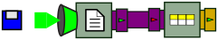
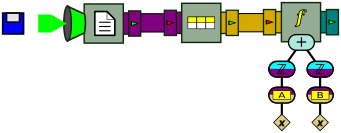
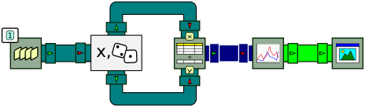
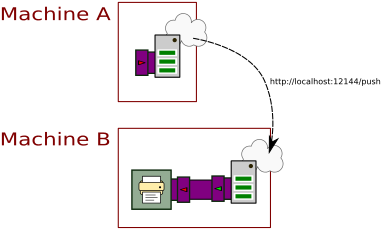
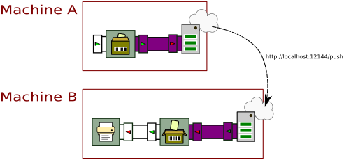
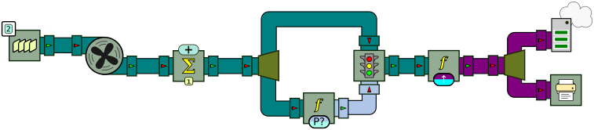
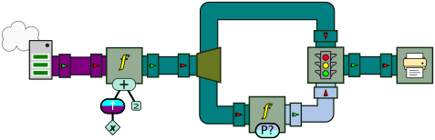

The standard palettes
=====================

A large part of BeepBeep's functionalities is dispersed across a number of *palettes*. These palettes are additional libraries (i.e. JAR files) that define new processors or functions for use along with BeepBeep's core elements. Each palette is optional, and has to be included in your project only if you need its contents.

There exist palettes for many things: reading special file types, producing plots, accessing a network, and so on. In this chapter, we explore a few "standard" palettes that are more frequently used than others.

## Tuples

Input files are seldom made of a single value per line of text. A more frequent file format is called **comma-separated values** (<!--\index{CSV@CSV (file format)}CSV-->CSV<!--/i-->). In such a format, each line contains the value of multiple **attributes**, separated by a comma. The following gives an example of such a file:

    # This is a simple file in CSV format
    
    A,B,C
    3,2,1
    1,7,1
    4,1,2
    1,8,3
    6,3,5

Blank lines and lines that begin with the hash symbol (`#`) are typically ignored (although the latter is not standard). The first non-ignored line in the file gives the *name* of each attribute. In the example above, the file defines three attributes named "A", "B" and "C". All the remaining lines of the file defines what are called <!--\index{tuple} \textbf{tuples}-->**tuples**<!--/i-->; a tuple is a data object that associates each attribute to a value. For example, the fourth line of the file defines a tuple that associates attribute A to value 3, attribute B to value 2, and attribute C to value 1. In other words, a CSV file is similar to a **table** in a relational database.

### Reading tuples

The following program reads a CSV file called `file1.csv`, and extracts tuples from this file one by one:

``` java
InputStream is = CsvReaderExample.class.getResourceAsStream("file1.csv");
ReadLines reader = new ReadLines(is);
TupleFeeder tuples = new TupleFeeder();
Connector.connect(reader, tuples);
Pullable p = tuples.getPullableOutput();
Tuple tup = null;
while (p.hasNext())
{
    tup = (Tuple) p.next();
    System.out.println(tup);
}
```
[⚓](https://github.com/liflab/beepbeep-3-examples/blob/master/Source/src/tuples/CsvReaderExample.java#L50)


The first two lines are now familiar: they consist of opening an `InputStream` on a file, and passing this stream to a `ReadLines` processor to read it line by line. The next instruction creates a new processor called a <!--\index{TupleFeeder@\texttt{TupleFeeder}} \texttt{TupleFeeder}-->`TupleFeeder`<!--/i-->. This processor receives lines of text, and returns on its output pipe `Tuple` objects. The rest of the program simply pulls and prints these tuples. The output of this program is:

```
((A,3),(B,2),(C,1))
((A,1),(B,7),(C,1))
((A,4),(B,1),(C,2))
((A,1),(B,8),(C,3))
((A,6),(B,3),(C,5))
```

As you can see from the format of the output, a tuple can also be seen as a set of attribute-value pairs. `Tuple` objects implement Java's <!--\index{Map@\texttt{Map} (interface)} \texttt{Map}-->`Map`<!--/i--> interface; therefore, their contents can be queried just like any other associative map:

``` java
Object o = tup.get("A");
System.out.println(o + "," + o.getClass().getSimpleName());
```
[⚓](https://github.com/liflab/beepbeep-3-examples/blob/master/Source/src/tuples/CsvReaderExample.java#L63)


If `tup` refers to the last `Tuple` pulled from `tuples`, the previous lines of code will print:

```
6,String
```

Note that **the values in tuples produced by `TupleFeeder` are always strings**. That is, `TupleFeeder` does not try to be smart and guess if a string is actually a number.

Graphically, this program can be represented as follows:



This drawing introduces the symbol for the `TupleFeeder`, whose pictogram on the box represents a tuple. It also shows the color we use to represent tuple feeds (brown/orange).

### Querying tuples

The previous example has shown us how to read tuples, but not how to manipulate them. The `tuples` palette defines a few handy `Function` objects that allow us, among other things, to fetch the value of an attribute and also to merge tuples. From the same input file as above, let us create an output stream made of the sum of attributes A and B in each line. The following piece of code performs exactly that:

``` java
InputStream is = SumAttributes.class.getResourceAsStream("file1.csv");
ReadLines reader = new ReadLines(is);
TupleFeeder tuples = new TupleFeeder();
Connector.connect(reader, tuples);
Fork fork = new Fork(2);
Connector.connect(tuples, fork);
ApplyFunction get_a = new ApplyFunction(new FetchAttribute("A"));
Connector.connect(fork, 0, get_a, 0);
ApplyFunction get_b = new ApplyFunction(new FetchAttribute("B"));
Connector.connect(fork, 1, get_b, 0);
ApplyFunction cast_a = new ApplyFunction(Numbers.numberCast);
Connector.connect(get_a, cast_a);
ApplyFunction cast_b = new ApplyFunction(Numbers.numberCast);
Connector.connect(get_b, cast_b);
ApplyFunction sum = new ApplyFunction(Numbers.addition);
Connector.connect(cast_a, 0, sum, 0);
Connector.connect(cast_b, 0, sum, 1);
Pullable p = sum.getPullableOutput();
while (p.hasNext())
{
    System.out.println(p.next());
}
```
[⚓](https://github.com/liflab/beepbeep-3-examples/blob/master/Source/src/tuples/SumAttributes.java#L57)


This program is probably better explained through its graphical representation, which goes as follows:


From a `ReadLines` processor, a `TupleFeeder` is instantiated. The stream of tuples is then forked along two branches. In the first branch, the value of attribute "A" for each tuple is extracted. This is done by using an `ApplyFunction` processor, and giving to this processor an instance of a new function called <!--\index{FetchAttribute@\texttt{FetchAttribute}} \texttt{FetchAttribute}-->`FetchAttribute`<!--/i-->. When instantiated, function `FetchAttribute` is given the name of the attribute to fetch in the tuple. This value (a String) is converted into a number and sent into an `ApplyFunction` processor that computes a sum. The same thing is done along the bottom branch for attribute "B". From the same input file as above, the output of this program is:

```
5.0
8.0
5.0
9.0
9.0
```

which indeed corresponds to the sum of A and B in each line. However, this processor chain is needlessly verbose. The successive application of all three functions can be collapsed into a single function tree, yielding this much simpler graph:



We leave as an exercise to the reader the task of writing this processor chain in code.

### Other tuple functions

The `tuples` palette provides a few other functions to manipulate tuples. We mention them briefly:

- The function `ScalarIntoToTuple` takes a scalar value *x* (for example, a number) and creates a tuple with a single attribute-value pair A=*x*. Here "A" is a name passed to the function when it is instantiated.

- The function `MergeTuples` merges the key-value pairs of multiple tuples into a single tuple. If two tuples have the same key, the value in the resulting tuple is that of <em>one</em> of these tuples; which one is left undefined. However, if the tuples have the same value for their common keys, the resuting tuple is equivalent to that of a elational JOIN operation.

- The function `BlowTuple` breaks a single tuple into multiple tuples, one for each key-value pair of the original tuple. The output of this function is a *set* of tuples, and not a single tuple.

- The function `ExpandAsColumns` transforms a tuple by replacing two key-value pairs by a single new key-value pair. The new pair is created by taking the value of a column as the key, and the value of another column as the value. For example, with the tuple: {(foo,1), (bar,2), (baz,3)}, using "foo" as the key column and "baz" as the value column, the resulting tuple would be: {(1,3), (bar,2)}. The value of foo is the new key, and the value of baz is the new value. If the value of the "key" pair is not a string, it is converted into a string by calling its `toString()` method (since the key of a tuple is always a string). The other key-value pairs are left unchanged.

## Plots

One interesting purpose of processing event streams is to produce visualizations of their content --that is, to derive <!--\index{plots} plots-->plots<!--/i--> from data extracted from events. BeepBeep's `plots` palette provides a few processors to easily generate dynamic plots.

Under the hood, the palette makes use of the [MTNP](https://github.com/liflab/mtnp) library (MTNP stands for "Manipulate Tables N'Plots"), which itself relies on either [GnuPlot](https://gnuplot.info) or [GRAL](http://trac.erichseifert.de/gral/) to generate the <!--\index{MTNP} plots-->plots<!--/i-->. The technique can be summarized as follows:

1. Event streams are used to update the contents of a structure called a **table**
2. The contents of this table can be processed by applying a series of **transformations**
3. The resulting table is given as the source for a **plot** object
4. The plot is asked to produce a picture from the contents of the table

Let us start with the table. This data structure is represented by the <!--\index{Table@\texttt{Table}} \texttt{Table}-->`Table`<!--/i--> class of the MTNP library. A table is simply a collection of *entries*, with each entry containing a fixed number of key-value pairs. An entry therefore corresponds to a "line" of a table, and each key corresponds to one of its "columns". 

A table can be created from the contents of event streams with the use of BeepBeep's <!--\index{UpdateTable@\texttt{UpdateTable}} \texttt{UpdateTable}-->`UpdateTable`<!--/i--> processor. This processor exists in two flavors: <!--\index{UpdateTableStream@\texttt{UpdateTableStream}} \texttt{UpdateTableStream}-->`UpdateTableStream`<!--/i--> takes multiple input streams, one for the value of each column; <!--\index{UpdateTableArray@\texttt{UpdateTableArray}} \texttt{UpdateTableArray}-->`UpdateTableArray`<!--/i--> takes a single stream, which must be made of arrays of values or `TableEntry` objects. Both processors perform the same action: they update an underlying `Table` object, adding one new entry to the table for each event front they receive.

The following code sample illustrates the operation of `UpdateTableStream`:

``` java
QueueSource src1 = new QueueSource().setEvents(1, 2, 3, 4, 5);
QueueSource src2 = new QueueSource().setEvents(2, 3, 5, 7, 4);
UpdateTable table = new UpdateTableStream("x", "y");
Connector.connect(src1, OUTPUT, table, TOP);
Connector.connect(src2, OUTPUT, table, BOTTOM);
Pump pump = new Pump();
Print print = new Print().setSeparator("\n");
Connector.connect(table, pump, print);
pump.turn(4);
```
[⚓](https://github.com/liflab/beepbeep-3-examples/blob/master/Source/src/plots/UpdateTableStreamExample.java#L42)


Two sources of numbers are created and are piped into an `UpdateTableStream` processor. This processor is instantiated by giving two strings to its constructor. These strings correspond to the names of the columns in the table, and also determine the input arity of the processor. The first input pipe will receive values for column "x", while the second input pipe will receive values for column "y". A pump and a print processor are connected to the output of the table updater.

After a single activation of the pump, the program should print:

```
x,y
---
1,2
```

Values 1 and 2 have been extracted from `src1` and `src2`, respectively. From this event front, the `UpdateTableStream` processor creates one table entry with x=1 and y=2, adds it to its table and outputs the table. This is relayed to the `Print` processor which displays its content. The output of the program shows that upon each new event front, one new entry in the table is added; therefore, after activating the pump four times, the last output is:

```
x,y
---
1,2
2,3
3,5
4,7
```

The next part of the process is to draw plots from the content of a table. This is the job of the <!--\index{DrawPlot@\texttt{DrawPlot}} \texttt{DrawPlot}-->`DrawPlot`<!--/i--> processor. This processor is instantiated by being given an empty `Plot` object from the MTNP library. When it receives a `Table` from its input pipe, it passes it to the plot, and calls the plot's `render` method to create an image out of it. Therefore, the output events of `DrawPlot` are *pictures* --or more precisely, arrays of bytes corresponding to a bitmap in some image format (PNG by default).

As a more elaborate example, take a look at the following program.

``` java
QueueSource one = new QueueSource().setEvents(1);
Pump pump = new Pump(1000);
RandomTwoD random = new RandomTwoD();
Connector.connect(one, pump, random);
UpdateTable table = new UpdateTableStream("x", "y");
Connector.connect(random, TOP, table, TOP);
Connector.connect(random, BOTTOM, table, BOTTOM);
DrawPlot draw = new DrawPlot(new Scatterplot());
Connector.connect(table, draw);
BitmapJFrame window = new BitmapJFrame();
Connector.connect(draw, window);
window.start();
System.out.println("Displaying plot. Press Ctrl+C or close the window to end.");
Thread th = new Thread(pump);
th.start();
```
[⚓](https://github.com/liflab/beepbeep-3-examples/blob/master/Source/src/plots/CumulativeScatterplot.java#L53)


A stream of (x,y) pairs is first created, with x an incrementing integer, and y a randomly selected number. This is done through a special-purpose processor that is called `RandomTwoD`. It actually is a `GroupProcessor` that internally forks an input of stream of numbers. The first fork is left as is and becomes the first output stream. The second fork is sent through a `RandomMutator` (which converts any input into a random integer) and becomes the second output stream. The resulting x-stream and y-streams are then pushed into an `UpdateTableStream` processor. This creates a processor with two input streams, one for the "x" values, and the other for the "y" values. Each pair of values from the x and y streams is used to append a new line to the (initially empty) table. We connect the two outputs of the random processor to these two inputs. 

The next step is to create a plot out of the table's content. The `DrawPlot` processor receives a Table and passes it to a `Plot` object from the MTNP library. In our case, we want to create a <!--\index{plots!scatterplot@scatterplot} scatterplot-->scatterplot<!--/i--> from the table's contents; therefore, we pass an empty `Scatterplot` object. As we said, each event that comes out of the `DrawPlot` processor is an array of bytes corresponding to a bitmap image. To display that image, we use yet another special processor called <!--\index{BitmapJFrame@\texttt{BitmapJFrame}} \texttt{BitmapJFrame}-->`BitmapJFrame`<!--/i-->. This processor is a sink that manages a `JFrame` window; when it receives an input event (i.e. an array of bytes), it turns that array into an image and displays it inside the window.

Graphically, this chain of processors can be illustrated as follows:



This drawing introduces a few new boxes. The one at the far right is the `BitmapJFrame`; its input pipe is colored in light green, which represents byte arrays. The box at its left is the `DrawPlot` processor. This processor is depicted with an icon indicating the type of plot that must be produced (here, a two-dimensional scatterplot). Yet to the left of this box is the `TableUpdateStream` processor. Next to each of its input pipes, a label indicates the name of the column that will be populated by values from that stream. The output pipe of this processor is colored in dark blue, which represents `Table` objects.

Running this program will pop a window containing a plot, whose contents are updated once every second (due to the action of an intermediate `Pump` object). The window should look like this one:


Each new table entry increments the value of *x* by one; the value of *y* is chosen at random. The end result is a dynamic plot created from event streams; the whole chain, from source to the actual bitmaps being displayed, amounts to only 12 lines of code. Obviously, sending the images into a bland JFrame is only done for the sake of giving an example. In a real-world situation, you will be more likely to divert the stream of byte arrays somewhere else, such as a file, or as a component of the user interface of some other software.

Besides scatterplots, any other plot type supported by the MTNP library can be passed to `DrawPlot`'s constructor. This includes histograms, pie charts, heatmaps, and so on. The only important point is that each plot type expects to receive tables structured in a particular way; for example, a heatmap requires a table with three columns, corresponding to the *x*-coordinate, *y*-coordinate, and "temperature" value, in this order. It is up to the upstream processor chain to produce a `Table` object with the appropriate structure.

Plots can also be customized by applying modifications to the `Plot` object passed to `DrawPlot`. For example, to set a custom title, one simply has to pass an instance of `Scatterplot` whose title has been changed using its `setTitle` method:

``` java
Scatterplot plot = new Scatterplot();
plot.setTitle("Some title");
DrawPlot dp = new DrawPlot(plot);
```

Since the `plots` palette is a simple wrapper around MTNP objects, the reader is referred to this library's online documentation for complete details about plots, tables, and table transformations.

## Networking

We have already seen in the previous chapter the `HttpGet` processor that allows you to fetch a character string remotely through an <!--\index{HTTP} HTTP-->HTTP<!--/i--> GET request. The `http` palette provides additional processors that make it possible to push and pull events across a network using HTTP. By splitting a processor chain on two machines and having both ends use HTTP to send and receive events, we are achieving what amounts to a rudimentary form of <!--\index{distributed computing} \textbf{distributed computing}-->**distributed computing**<!--/i-->.

In line with BeepBeep's general design principles, these functionalities are accessible through just a few lines of code. More precisely, send and receive operations are taken care of by two "gateway" processors, respectively called the `HttpUpstreamGateway` and the `HttpDownstreamGateway`.

The [`HttpUpstreamGateway`](http://liflab.github.io/beepbeep-3/javadoc/ca/uqac/lif/cep/http/HttpUpstreamGateway.html) is a sink processor that works in push mode only. It receives character strings, and is instructed to send the over the network through an HTTP request to a specific address. Thus, when instantiating the gateway, we must tell it the URL at which the request will be sent.

The [`HttpDownstreamGateway`](http://liflab.github.io/beepbeep-3/javadoc/ca/uqac/lif/cep/http/HttpDownstreamGateway.html) works in reverse. It continually listens for incoming HTTP requests on a specific TCP port; when a request matches the URL that was specified to its constructor, its contents are pushed to its output pipe in the form of a character string.

The following program shows a simple use of these two gateways.

``` java
HttpUpstreamGateway up_gateway = new HttpUpstreamGateway("http:
HttpDownstreamGateway dn_gateway = new HttpDownstreamGateway(12144, "/push", Method.POST);
Print print = new Print();
Connector.connect(dn_gateway, print);
up_gateway.start();
dn_gateway.start();
Pushable p = up_gateway.getPushableInput();
p.push("foo");
Thread.sleep(1000);
p.push("bar");
up_gateway.stop();
dn_gateway.stop();
```
[⚓](https://github.com/liflab/beepbeep-3-examples/blob/master/Source/src/network/httppush/PushLocalSimple.java#L43)


We first create an upstream gateway, and tell it to send requests at a specific URL on our local machine (`localhost`) on TCP port 12144 (we chose this number arbitrarily; any unused port number would work). Additionally, we specify a "page" the gateway should push to; in this case, its name is `push`, but this could be any character string. We do the same thing with a downstream gateway, which is instructed to listen to port 12144, watch for URLs with the string `/push` (this is the same page name we gave to the upstream gateway), and to answer only to HTTP requests that use method POST. This gateway is connected to a `Print` processor to show what it receives on the console.

Both upstream and downstream gateways must be started in order to work; method `start` takes care of initializing the objects required for the network connection. Ideally, the gateways should also be stopped at the end of the program. Other than that, they work like any normal source and sink. You can see that we push strings to `up_gateway`; after the call to push, the standard output should display the contents of that string.

So far, this looks like we have merely pushed events and printed them at the console. What happened is actually a bit more complex than this: note how the upstream and the downstream gateways have never been linked using a call to `connect`. Rather, they used an HTTP request to pass the strings around. Therefore, this program is structured as if there were two "machines" running in parallel; Machine A pushes strings through HTTP requests, and Machine B receives and prints them. This could be illustrated as follows:



It just happens that in this simple program, the HTTP requests are sent to `localhost`; therefore, they never leave your computer. However, the whole process would be identical if the character strings were sent over an actual network: we would simply replace `localhost` by the IP address of some other computer.

### Serialization

Sending character strings over a network is an arguably simple task. Very often, the events that are exchanged between processors are more complex: what if we want to transmit a set, a list, or some other complex object that has member fields and all? The HTTP gateways always expect character strings, both for sending and for receiving.

A first solution would be to create a custom `Function` object that takes care of converting the object we want to send into a character string, and another one to do the process in reverse, and transform a string back into an object with identical contents. This process is called <!--\index{serialization} \textbf{serialization}-->**serialization**<!--/i-->. However, doing so manually means that for every different type of object, we need to create a different pair of functions to convert them to and from strings. Moreover, this process can soon become complicated. Take the following class:

``` java
public class CompoundObject
{
	int a;
	String b;
	CompoundObject c;
}
```

This class has for member fields an integer, a string and yet another instance of `CompoundObject`. Converting such an object into a character string requires adding delimiters to separate the int and String fields, and yet more delimiters to represent the contents of the inner `CompoundObject` --and so on recursively.

Luckily, there exist what are called *serialization libraries* that can automate part of the serialization process. BeepBeep has a palette called `serialization` whose purpose is to provide a few functions to serialize generic objects; under the hood, it uses the <!--\index{Azrael (library)} Azrael-->Azrael<!--/i--> serialization library. The palette defines two main `Function` objects:

- The <!--\index{JsonSerializeString@\texttt{JsonSerializeString}} \texttt{JsonSerializeString}-->`JsonSerializeString`<!--/i--> function converts an object into a character string in the <!--\index{JSON} \textbf{JSON}-->**JSON**<!--/i--> format.
- The <!--\index{JsonDeserializeString@\texttt{JsonDeserializeString}} \texttt{JsonDeserializeString}-->`JsonDeserializeString`<!--/i--> function works in reverse: it takes a JSON string and recreates an object from its contents.

These two functions can be passed to an `ApplyFunction` processor, and be used as a pre-processing step before and after passing strings to the HTTP gateways.

Let us add a constructor and a `toString` method to our `CompoundObject` class:

``` java
public CompoundObject(int a, String b, CompoundObject c)
{
    super();
    this.a = a;
    this.b = b;
    this.c = c;
}
@Override
public String toString()
{
    return "a = " + a + ", b = " + b + ", c = (" + c + ")";
}
```
[⚓](https://github.com/liflab/beepbeep-3-examples/blob/master/Source/src/network/CompoundObject.java#L36)


Consider now the following code example, which is a slightly modified version of our first program:

``` java
ApplyFunction serialize = new ApplyFunction(new JsonSerializeString());
HttpUpstreamGateway up_gateway = new HttpUpstreamGateway("http:
HttpDownstreamGateway dn_gateway = new HttpDownstreamGateway(12144, "/push", Method.POST);
ApplyFunction deserialize = new ApplyFunction(
        new JsonDeserializeString<CompoundObject>(CompoundObject.class));
Print print = new Print();
Connector.connect(serialize, up_gateway);
Connector.connect(dn_gateway, deserialize);
Connector.connect(deserialize, print);
up_gateway.start();
dn_gateway.start();
```
[⚓](https://github.com/liflab/beepbeep-3-examples/blob/master/Source/src/network/httppush/PushLocalSerialize.java#L47)


The main difference is that a processor applying `JsonSerializeString` has been inserted before the upstream gateway, and another processor applying `JsonDeserializeString` has been inserted after the downstream gateway; the rest is identical. The serialization/deserialization functions must be passed the class of the objects to be manipulated. Here, we decide to use instances of `CompoundObject`s, as defined earlier. Graphically, our processor chain becomes:



Note the pictogram used to illustrate the serialization processor: the picture represents an event that is "packed" into a box with a barcode, representing its serialized form. The deserialization processor conversely represents an event that is "unpacked" from a box with a barcode. Although these processors are actually plain `ApplyFunction` processors, we represent them with these special pictograms to improve the legibility of the drawings.

We can now push `CompoundObject`s through the serializer, as is shown in the following instructions:

``` java
Pushable p = serialize.getPushableInput();
p.push(new CompoundObject(0, "foo", null));
Thread.sleep(1000);
p.push(new CompoundObject(0, "foo", new CompoundObject(6, "z", null)));
```
[⚓](https://github.com/liflab/beepbeep-3-examples/blob/master/Source/src/network/httppush/PushLocalSerialize.java#L118)


The expected output of the program should be:

```
a=0, b=foo, c=(null)
a=0, b=foo, c=(a=6, b=z, c=(null))
```

Not very surprising, but think about all the magic that happened in the background:

- The object was converted into a JSON string.
- The string was sent over the network through an HTTP request...
- converted back into a `CompoundObject` identical to the original...
- and pushed downstream to be handled by the rest of the processors as usual.

All this process requires only about 10 lines of code.

### All together now: distributed twin primes

As we mentioned earlier, the use of HTTP gateways can make for a simple way to distribute computation over multiple computers. As a matter of fact, any chain of processors can be "cut" into parts, with the loose ends attached to upstream and downstream gateways.

As a slightly more involved example, let us compute <!--\index{twin primes} twin primes-->twin primes<!--/i--> by splitting the process across two machines over a network. Twin primes are pairs of numbers *p* and *p*+2 such that both are prime. For example, (3,5), (11,13) and (17,19) are three such pairs. The [twin prime conjecture](https://en.wikipedia.org/wiki/Twin_prime) asserts that there exists an infinity of such pairs.

Our setup will be composed of two machines, called A and B. Machine A will be programmed to check if each odd number 3, 5, 7, etc. is prime. If so, it will send the number *n* to Machine B, which will then check if *n*+2 is prime. If this is the case, Machine B will print to the console the values of *n* and *n*+2. The interest of this setup is that checking if a number is prime is an operation that becomes very long for large integers (especially with the algorithm we use here). By having the verification for *n* and *n*+2 on two separate machines, the whole processor chain can actually run two primality checks at the same time.

Since we want to make computations over very large numbers, we shall use Java's <!--\index{BigInteger@\texttt{BigInteger}} \texttt{BigInteger}-->`BigInteger`<!--/i--> class instead of the usual `int`s or `long`s. Furthermore, we assume the existence of a function object called `IsPrime`, whose purpose is to check whether a big integer is a prime number. (The code for `IsPrime` can be viewed in BeepBeep's code example repository.) Let us start with the program for Machine A.

``` java
String push_url = "http:
QueueSource source = new QueueSource().addEvent(new BigInteger("2"));
Pump pump = new Pump(500);
Connector.connect(source, pump);
Cumulate counter = new Cumulate(new CumulativeFunction<BigInteger>(BigIntegerAdd.instance));
Connector.connect(pump, counter);
Fork fork1 = new Fork(2);
Connector.connect(counter, fork1);
ApplyFunction prime_check = new ApplyFunction(IsPrime.instance);
Connector.connect(fork1, LEFT, prime_check, INPUT);
Filter filter = new Filter();
Connector.connect(fork1, RIGHT, filter, LEFT);
Connector.connect(prime_check, OUTPUT, filter, RIGHT);
Fork fork2 = new Fork(2);
Connector.connect(filter, fork2);
Print print = new Print();
Connector.connect(fork2, LEFT, print, INPUT);
ApplyFunction int_to_string = new ApplyFunction(BigIntegerToString.instance);
HttpUpstreamGateway up_gateway = new HttpUpstreamGateway(push_url);
Connector.connect(fork2, RIGHT, int_to_string, INPUT);
Connector.connect(int_to_string, up_gateway);
```
[⚓](https://github.com/liflab/beepbeep-3-examples/blob/master/Source/src/network/httppush/twinprimes/TwinPrimesA.java#L50)


We first specify the URL where prime numbers will be pushed downstream. The first processor is a source that will push the BigInteger "2" repeatedly.  The second processor is a simple counter. We feed it with the BigInteger "2" repeatedly, and it returns the cumulatve sum of those "2" as its output. Since the start value of BigIntegerAdd is one, the resulting sequence is made of all odd numbers. The events output from the counter are duplicated along two paths. Along the first path, the numbers are checked for primality. Along the second path, we feed a filter and use the primality verdict as the filtering condition. What comes out of the filter are only prime numbers. We then fork the output of the filter, just so that we can print what comes out of it. BigIntegers are converted to Strings, and pushed across the network to Machine B using the `HttpUpstreamGateway`.

Graphically, the chain of processors for Machine A can be represented as follows:



Let us now move to Machine B. We will not show the code, but only the processor chain:



First, we create an HttpDownstreamGateway to receive strings from Machine A. The next step is to convert the string received from the gateway back into a BigInteger. We then increment this number by 2 using the addition function for BigIntegers. The rest of the chain is similar to Machine A: we use a filter to only let prime numbers through, and print them to the console.

All in all, in this example we have written less than 50 lines of code. For that price we got a distributed, streaming algorithm for finding twin prime numbers. Note that this chain of processors is only meant to illustrate a possible use of the HTTP gateways. As such, it is not a very efficient way of finding twin primes: when *n* and *n*+2 are both prime, three primality checks will be done: Machine A will first discover that *n* is prime, which will trigger Machine B to check if *n*+2 also is. However, since Machine A checks all odd numbers, it will also check for *n*+2 in its next computation step. Could you think of a better way of using processors to make this more efficient?

A few things you might want to try:

- Machine B's program depends on the numbers sent by Machine A. Therefore, if you stop Machine A and restart it, you will see Machine B starting the the sequence of twin primes from the beginning.

## Exercises

1. Create a processor chain that takes as input a stream of numbers. Create a scatterplot that shows two lines:
  - A first line of (x,y) points where x is a counter that increments by 1 on each new point, and y is the value of the input stream at position x
  - A second line of (x,y) points which is the "smoothed" version of the original. You can achieve smoothing by taking the average of the values at position x-1, x and x+1.
As an extra, try to make your processor chain so that the amount of smoothing can be parameterized by a number *n*, indicating how many events behind and ahead of the current one are included in the average.

2. Modify the first example in the *Networking* section, so that the upstream and downstream gateways are in two separate programs. Run the program of Machine A on a computer, and the program of Machine B on a different one. What do you need to change for the communication to succeed?

3. Modify the twin primes example: instead of Machine A pushing numbers to Machine B, make it so that Machine B pulls numbers from Machine A.

<!-- :wrap=soft: -->