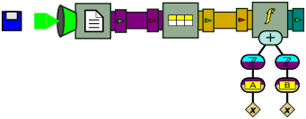

## Tuples

Input files are seldom made of a single value per line of text. A more frequent file format is called **comma-separated values** (<!--\index{CSV@CSV (file format)}CSV-->CSV<!--/i-->). In such a format, each line contains the value of multiple **attributes**, separated by a comma. The following gives an example of such a file:

    # This is a simple file in CSV format
    
    A,B,C
    3,2,1
    1,7,1
    4,1,2
    1,8,3
    6,3,5

Blank lines and lines that begin with the hash symbol (`#`) are typically ignored (although the latter is not standard). The first non-ignored line in the file gives the *name* of each attribute. In the example above, the file defines three attributes named "A", "B" and "C". All the remaining lines of the file defines what are called <!--\index{tuple} \textbf{tuples}-->**tuples**<!--/i-->; a tuple is a data object that associates each attribute to a value. For example, the fourth line of the file defines a tuple that associates attribute A to value 3, attribute B to value 2, and attribute C to value 1. In other words, a CSV file is similar to a **table** in a relational database.

### Reading tuples

The following program reads a CSV file called `file1.csv`, and extracts tuples from this file one by one:

``` java
InputStream is = CsvReaderExample.class.getResourceAsStream("file1.csv");
ReadLines reader = new ReadLines(is);
TupleFeeder tuples = new TupleFeeder();
Connector.connect(reader, tuples);
Pullable p = tuples.getPullableOutput();
Tuple tup = null;
while (p.hasNext())
{
    tup = (Tuple) p.next();
    System.out.println(tup);
}
```
[⚓](https://github.com/liflab/beepbeep-3-examples/blob/master/Source/src/tuples/CsvReaderExample.java#L50)


The first two lines are now familiar: they consist of opening an `InputStream` on a file, and passing this stream to a `ReadLines` processor to read it line by line. The next instruction creates a new processor called a <!--\index{TupleFeeder@\texttt{TupleFeeder}} \texttt{TupleFeeder}-->`TupleFeeder`<!--/i-->. This processor receives lines of text, and returns on its output pipe `Tuple` objects. The rest of the program simply pulls and prints these tuples. The output of this program is:

```
((A,3),(B,2),(C,1))
((A,1),(B,7),(C,1))
((A,4),(B,1),(C,2))
((A,1),(B,8),(C,3))
((A,6),(B,3),(C,5))
```

As you can see from the format of the output, a tuple can also be seen as a set of attribute-value pairs. `Tuple` objects implement Java's <!--\index{Map@\texttt{Map} (interface)} \texttt{Map}-->`Map`<!--/i--> interface; therefore, their contents can be queried just like any other associative map:

``` java
Object o = tup.get("A");
System.out.println(o + "," + o.getClass().getSimpleName());
```
[⚓](https://github.com/liflab/beepbeep-3-examples/blob/master/Source/src/tuples/CsvReaderExample.java#L63)


If `tup` refers to the last `Tuple` pulled from `tuples`, the previous lines of code will print:

```
6,String
```

Note that **the values in tuples produced by `TupleFeeder` are always strings**. That is, `TupleFeeder` does not try to be smart and guess if a string is actually a number.

Graphically, this program can be represented as follows:


This drawing introduces the symbol for the `TupleFeeder`, whose pictogram on the box represents a tuple. It also shows the color we use to represent tuple feeds (brown/orange).

### Querying tuples

The previous example has shown us how to read tuples, but not how to manipulate them. The `tuples` palette defines a few handy `Function` objects that allow us, among other things, to fetch the value of an attribute and also to merge tuples. From the same input file as above, let us create an output stream made of the sum of attributes A and B in each line. The following piece of code performs exactly that:

``` java
InputStream is = SumAttributes.class.getResourceAsStream("file1.csv");
ReadLines reader = new ReadLines(is);
TupleFeeder tuples = new TupleFeeder();
Connector.connect(reader, tuples);
Fork fork = new Fork(2);
Connector.connect(tuples, fork);
ApplyFunction get_a = new ApplyFunction(new FetchAttribute("A"));
Connector.connect(fork, 0, get_a, 0);
ApplyFunction get_b = new ApplyFunction(new FetchAttribute("B"));
Connector.connect(fork, 1, get_b, 0);
ApplyFunction cast_a = new ApplyFunction(Numbers.numberCast);
Connector.connect(get_a, cast_a);
ApplyFunction cast_b = new ApplyFunction(Numbers.numberCast);
Connector.connect(get_b, cast_b);
ApplyFunction sum = new ApplyFunction(Numbers.addition);
Connector.connect(cast_a, 0, sum, 0);
Connector.connect(cast_b, 0, sum, 1);
Pullable p = sum.getPullableOutput();
while (p.hasNext())
{
    System.out.println(p.next());
}
```
[⚓](https://github.com/liflab/beepbeep-3-examples/blob/master/Source/src/tuples/SumAttributes.java#L57)


This program is probably better explained through its graphical representation, which goes as follows:


From a `ReadLines` processor, a `TupleFeeder` is instantiated. The stream of tuples is then forked along two branches. In the first branch, the value of attribute "A" for each tuple is extracted. This is done by using an `ApplyFunction` processor, and giving to this processor an instance of a new function called <!--\index{FetchAttribute@\texttt{FetchAttribute}} \texttt{FetchAttribute}-->`FetchAttribute`<!--/i-->. When instantiated, function `FetchAttribute` is given the name of the attribute to fetch in the tuple. This value (a String) is converted into a number and sent into an `ApplyFunction` processor that computes a sum. The same thing is done along the bottom branch for attribute "B". From the same input file as above, the output of this program is:

```
5.0
8.0
5.0
9.0
9.0
```

which indeed corresponds to the sum of A and B in each line. However, this processor chain is needlessly verbose. The successive application of all three functions can be collapsed into a single function tree, yielding this much simpler graph:



We leave as an exercise to the reader the task of writing this processor chain in code.

### Other tuple functions

The `tuples` palette provides a few other functions to manipulate tuples. We mention them briefly:

- The function `ScalarIntoToTuple` takes a scalar value *x* (for example, a number) and creates a tuple with a single attribute-value pair A=*x*. Here "A" is a name passed to the function when it is instantiated.

- The function `MergeTuples` merges the key-value pairs of multiple tuples into a single tuple. If two tuples have the same key, the value in the resulting tuple is that of <em>one</em> of these tuples; which one is left undefined. However, if the tuples have the same value for their common keys, the resuting tuple is equivalent to that of a elational JOIN operation.

- The function `BlowTuple` breaks a single tuple into multiple tuples, one for each key-value pair of the original tuple. The output of this function is a *set* of tuples, and not a single tuple.

- The function `ExpandAsColumns` transforms a tuple by replacing two key-value pairs by a single new key-value pair. The new pair is created by taking the value of a column as the key, and the value of another column as the value. For example, with the tuple: {(foo,1), (bar,2), (baz,3)}, using "foo" as the key column and "baz" as the value column, the resulting tuple would be: {(1,3), (bar,2)}. The value of foo is the new key, and the value of baz is the new value. If the value of the "key" pair is not a string, it is converted into a string by calling its `toString()` method (since the key of a tuple is always a string). The other key-value pairs are left unchanged.

<!-- :wrap=soft: -->