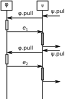
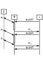

Using multiple threads
======================

In this section, we now present a set of *patterns* that can be applied to processors to make use of multiple threads. Special care has been given to make these multi-threading capabilities transparent. For the developer, this means that new processors can be created in a completely sequential manner; multi-threading can be applied at a later stage by simply wrapping them into special constructs that make use of threads. For the user, this means that queries are constructed in the same way, whether multi-threading is used or not: multi-threaded elements have the same interface as regular ones, and both types of elements can be freely mixed in a single query.

## Thread Management Model

A first feature is the global thread management model. In BeepBeep, the instantiation of all threads is controlled by one or more instances of the `ThreadManager` class. Each thread manager is responsible for the allocation of a pool of threads of bounded size. A processor wishing to obtain a new thread instance asks permission from its designated thread manager. If the maximum number of live threads reserved to this manager is not exceeded, the manager provides a new thread instance to the processor. The processor can then associate any task to this thread and start it.

So far, this scheme is identical to traditional thread pooling found in various systems, or, in an equivalent manner, to the `Executor` pattern found in recent versions of Java. The main difference resides in the actions taken when the manager refuses to provide a new thread to the caller. Typically, the call for a new thread would become blocking until a thread finally becomes available. In BeepBeep, on the contrary, the call simply returns `null`; this indicates that whatever actions the processor wished to execute in parallel in a new thread should instead be executed sequentially within the *current* thread.

In the extreme case, when given a thread manager that systematically refuses all thread creation, the processor's operation is completely sequential; no separate thread instance is ever created. (Note that this is different from a thread manager that would dispense only one thread at a time. In such a case, *two* threads are active: the calling thread and the one executing the task.) Moreover, various parts of a query can be assigned to different thread manager instances with their own thread pool, giving flexible control over how much parallelism is allowed, and to what fragments of the computation. Hence the amount of threading can be easily modulated, or even completely turned off quite literally at the flick of a switch, by changing the value of a single parameter. Since thread instances are requested dynamically and are generally short-lived, this means that changes in the threading strategy can also be made during the processing of an event stream.

The upper cap on the number of threads imposed by each thread manager only applies to *running* threads. Hence if a set of 10 tasks T_1, ..., T_{10} it to be started in parallel using a thread manager with a limit of 3, the first three tasks will each be started in a new thread. However, if any of these threads finishes before requesting a thread for T4, then T4 will also be granted a new thread; the same applies for the remaining tasks. Finished threads are kept by the thread manager until their `dispose()` method is called, indicating they can be safely destroyed.

Note that while this technique can be compared to thread scheduling, it is an arguably simpler form of scheduling. A thread is either created or not, depending solely on whether the maximum number of live threads assigned to the manager has been reached at the moment of the request. The balancing of threads across various parts of a query graph is achieved by assigning these different parts to a different manager.

## Non-Blocking Push/Pull

In a classical, single-thread computation, a call to any of a processor's Pullable or Pushable methods is *blocking*. For example, calling  `pull()` on one of a processor's Pushables involves a call to the processor's input pullables `pull()` in order to retrieve input events, followed by the computation of the processor's output event. The original call returns only when this chain of operations is finished. The same is true of all other operations.

The Pushable and Pullable interfaces also provide a non-blocking version of the push and pull operations, respectively called `pushFast()` and `pullFast()`. These methods perform the same task as their blocking counterparts, but *may* return control to the caller before the operation is finished. In order to "catch up" with the end of the operation, the caller must, at a later time, call method `waitFor` on the same instance. This time, this method blocks until the push or pull operation that was started is indeed finished.

Following the spirit of transparency explained earlier, `pushFast()` and `pullFast()` are not required to be non-blocking. As a matter of fact, the default behaviour of these two methods is to act as a proxy to their blocking equivalents; similarly, the default behaviour of `waitFor` is to return immediately. Thus, for a processor that does not wish to implement non-blocking operations, calling e.g. `pushFast()` followed by `waitFor` falls back to standard, blocking processing. Only when a processor wishes to implement special non-blocking operations does it need to override these defaults.

Rather than implementing non-blocking operations separately for each type of processor, an easier way consists of enclosing an existing processor within an instance of the `Non\-Blocking\-Processor` class. When `push()` or `pull()` is called on this processor, a new thread is asked to its designated thread manager. The actual call to `push()` (resp. `pull()`) on the underlying processor is started in that thread and the control is immediately returned to the caller. Using a simple Boolean semaphore, a call to method `waitFor` of the `Non\-Blocking\-Processor` sleep-loops until that thread stops, indicating that the operation is finished. We remind the reader that the thread manager may not provide a new thread; in such a case, the call to the underlying processor is made within the current thread, and the processor falls back to a blocking mode.

Non-blocking push/pull does not provide increased performance in itself. As a matter of fact, calling `pushFast()` immediately followed by `waitFor` may end up being slower than simply calling `push()`, due to the overhead of creating a thread and watching its termination. However, it can prove useful in situations where one calls `push()` or `pull()` on a processor, performs some other task *T*, and retrieves the result of that `push()` (resp. `pull()`) at a later time. If the call is done in a non-blocking manner, the computation of that operation can be done in parallel with the execution of *T* in the current thread.

It turns out that a couple of commonly used processors in BeepBeep's palettes operate in this fashion, and can hence benefit from the presence of non blocking push/pull methods. We describe a few.

### Sliding window

Given a processor *P* and a window width *n*, the sliding window processor returns the output of a copy of *P* on events e0 e1 ... en-1, followed by the output of a fresh copy of *P* on events e1 e2 ... en, and so on. One possible implementation of this mechanism is to keep in memory up to *n*-1 copies of *P*, such that copy *Pi* has been fed the last *i* events received. Upon processing a new input event, the window pushes this event to each of the *Pi*, and retrieves the output of *Pn-1*. This processor copy is then destroyed, the index of the remaining copies is incremented by 1, and a new copy *P0* is created.

Figure \ref{subfig:window-sequential} shows a sequence diagram of these operations when performed in a blocking way. Figure \ref{subfig:window-parallel} shows the same operations, this time using non-blocking calls. The window processor first calls `push()` on each copy in rapid-fire succession. Each copy of *P* can update its state in a separate thread, thus exhibiting parallel processing. The processor then waits for each of these calls to be finished, by calling `waitFor` on each copy of *P*. The remaining operations are then performed identically.

This figure provides graphical evidence that, under the assumption that each call to `push()` occurs truly in parallel, the total time spent on the window's `push()` call is shorter than its sequential version. If *TP* is the time for each call to *P* and *TC* is the time taken for the remaining tasks, then the call to this method goes down from *nTP* + *TC* to *TP* + *TC*. If fewer than *n* threads are available, the value is situated somewhere between these two bounds.

### Trace slicing

As we have already seen, the `Slice` is a 1:1 processor that separates an input trace into different "slices". It takes as input a processor *P* and a function *f*, called the *slicing function*. There exists potentially one instance of *P* for each value in the image of *f*. We know that the function *f* may return a special value `#`, indicating that no new slice must be created, but that the incoming event must be dispatched to *all* slices. In this latter case, a task similar to the `Window` processor can be done: each slice is put in a separate thread, so that it can process the input event in parallel with the others.

<!--
### Logical Connectives

BeepBeep comes with a palette providing processors for evaluating all operators of Linear Temporal Logic (LTL), in addition to the first-order quantification defined in LTL-FO$^+$ (and present in previous versions of BeepBeep. Boolean processors are called `Globally`, `Eventually`, `Until`, `Next`, `ForAll` and `Exists`, and carry their usual meaning. For example, if $a_0 a_1 a_2 ...$ is an input trace, the processor `Globally` produces an output trace $b_0 b_1 b_2 ...$ such that $b_i = \bot$ if and only there exists $j \geq i$ such that $b_j = \bot$. In other words, the *i*-th output event is the two-valued verdict of evaluating $\mbox{\bf G}\,\varphi$ on the input trace, starting at the *i*-th event.

Concretely, this is implemented by creating one copy of the *P* processor upon each new input event. This event is then pushed into all the current copies, and their resulting output event (if any) is collected. If any of them is $\bot$ (false), the processor returns $\bot$; if any of them is $\top$ (true), the corresponding copy of *P* is destroyed. This is another example where the processing of multiple copies of *P* can be done in a separate thread, in a way similar to the principles described earlier. The same can be done with first-order quantifiers; hence for the expression $\forall x \in \pi : \varphi(x)$, the evaluation of *P* for each value of $x$ can be done in parallel.
-->

## Pre-emptive Pulling

A second strategy consists of continuously pulling for new outputs on a processor *P*, and storing these events in a queue. When a downstream processor *P'* calls *P*'s `pull()` method, the next event is simply popped from that queue, rather than being computed on-the-fly. If *P'* is running in a different thread from the process that polls *P*, each can compute a new event at the same time.

Figure \ref{subfig:pull-sequential} shows the processing of an event when done in a sequential manner. A call to `pull()` on *Q* results in a pull on *P*, which produces some output event *e*. This event is then processed by *Q*, which produces some other output *e'*. If *TP* and *TQ* correspond to the computation times of *P* and *Q*, respectively, then the total time to fetch each event from *Q* is their sum, *TP* + *TQ*.

On the contrary, the following figure shows the same process, with pre-emptive pulling on *P* occurring in a separate thread. One can see that in this case, *P* produces a new output event while *Q* is busy doing its computation on the previous one. The first output event still takes *TP* + *TQ* time units to be produced, but later ones can be retrieved in max{*TP*, *TQ*}.

In a manner similar to the `NonBlockingProcessor`, pre-emptive pulling is enabled by enclosing a group of processors inside a `PullGroup`. This processor behaves like a `GroupProcessor`: a set of connected processors can be added to the group, and this group can then be manipulated, piped and copied as if it were a single "black box". The difference is that a call to the `start()` method of a `PullGroup` creates a new thread where the repeated polling of its outputs occurs. To avoid needlessly producing too many events that are not retrieved by downstream calls to `pull()`, the polling stops when the queue reaches a predefined size; polling resumes when some events of that queue are finally pulled. As with the other constructs presented in this paper, the `PullGroup` takes into account the possibility that no thread is available; in such a case, output events are computed only upon request, like the regular `GroupProcessor`.

In our analysis of computing time, we can see that the speed gain is maximized when *TP* = *TQ*; otherwise, either *P* produces events faster than *Q* can consume them (*TP* < *TQ*), or *Q* wastes time waiting for the output of *P* (*TQ* > *TP*). Therefore, an important part of using this strategy involves breaking a processor graph into connected regions of roughly equal computing load.

## Pipelining

Pipelining is the process of reading *n* input events e1 e2 ... en, creating *n* copies of a given processor, and launching each of them on one of the input events. A pipeline then waits until the processor assigned to e1 produces output events; these events are made available at the output of the pipeline as they are collected. Once the e1 processor has no more output events to produce, it is discarded, the collection resumes on the processor for e2, and so on.

Note that, once the e1 processor is discarded, there is now room for creating a new processor copy and assign it to the next input event, en+1. This rolling process goes on until no input event is available. In such a scheme, the order of the output events is preserved: in sequential processing, the batch of output of events produced by reading event e1 comes before any output event resulting from processing e2 is output.

Although pipelining borrows features from both pre-emptive pulling and non-blocking pull, it is actually distinct from these two techniques. As in non-blocking pull, it sends input events in parallel to multiple copies of a processor; however, rather than sending the same event to multiple, independent instances of *P*, it sends events that should be processed in sequence by a single processor instance each to a distinct copy of *P* and collects their result. In the sequence e1 e2 ..., this means that one copy of *P* processes the subtrace e1, while another one processes (in parallel) the subtrace e2, and so on.

Obviously, this "trick" does not guarantee the correct result on all processors, as some of them have an output that depends on the complete trace. 
As a simple example, one can consider the processor that computes the cumulative sum of all input events; it is clear that pipelining this processor will return an incorrect result, as each copy of the processor will receive (and hence add) a unique event of the input trace.
However, there do exist processors for which pipelining can be applied; this is the case of all `FunctionProcessor`s, which by definition apply a stateless function to each of their input events. While this might seem limiting, it turns out that, in the sample of queries evaluated experimentally later in this paper, a large part of the computing load comes from the application of a few such functions, and that pipelining proves very effective in these situations.

We also remark that the process could be generalized in at least two ways. First, a stateful processor may become stateless after reading a trace prefix; for example, a processor that computes the sum of input events until it reaches 10, or a Moore machine that reaches a sink state. Therefore, an "adaptive" pipeline could query a processor for such a condition, and start pipelining once the processor becomes stateless. Second, some processors may be stateful, but only with respect to a bounded number *n* of past events. If this bound is known, pipelining can be applied by sending to each copy of the processor the window of the last *n* events; the pipeline presented here is the simple case where *n*=1.

<!-- :wrap=soft: -->