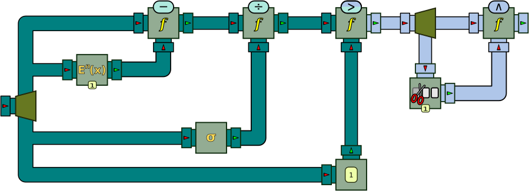
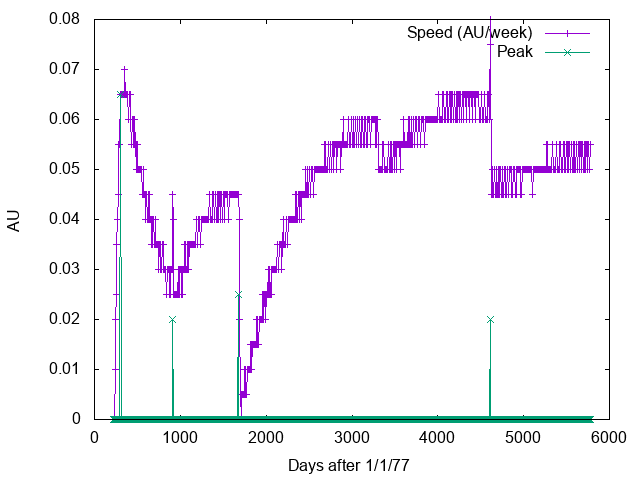

A Few Use Cases
===============

The previous chapters have introduced a large set of functions and processors, often with very simple code examples illustrating how each of these objects work in isolation. In this chapter, we take a step back and show a "bigger picture". We shall present more complex examples of what can be done when one starts to mix all these objects together. Some of these examples are taken from actual research and development projects where BeepBeep was used, while others have been crafted especially for this book.

Readers who wish to get more information about these use cases can have a look at some of the research papers on BeepBeep, whose references are listed at the end of this book.

## Stock Ticker

A recurring scenario used in event stream processing to illustrate the performance of various tools is taken from the stock market. One considers a stream of stock quotes, where each event contains attributes such as a stock symbol, the price of the stock at various moments (such as its minimum price and closing price), as well as a timestamp. A typical stream of events of this nature could be the following:

```
1  APPL  1208.4
1  MSFT   800.3
1  GOGL  2001.0
2  APPL  1209.3
2  MSFT   799.7
2  GOGL  2001.1
...
```

Events are structured as tuples, with a fixed set of attributes, each of which taking a scalar value. This simple example can be used to illustrate various queries that typically arise in an event stream processing scenario. A first, simple type of query one can compute over such a trace is called a **snapshot query**, such as the following:

- Get the closing price of MSFT for the first five trading days.

The result of that query is itself a trace of tuples, much in the same way the relational `SELECT` statement on a table returns another table.

To illustrate how this query can be executed, 


Blabla

``` java
TickerFeed feed = new TickerFeed();
Fork fork = new Fork(2);
Connector.connect(feed, fork);
Filter filter = new Filter();
Connector.connect(fork, 0, filter, 0);
ApplyFunction is_msft = new ApplyFunction(
    new FunctionTree(Equals.instance,
        new Constant("MSFT"),
        new NthElement(1)));
Connector.connect(fork, 1, is_msft, 0);
Connector.connect(is_msft, 0, filter, 1);
Prefix pref = new Prefix(5);
Connector.connect(filter, pref);
```
[⚓](https://github.com/liflab/beepbeep-3-examples/blob/master/Source/src/stockticker/SnapshotQuery.java#L19)


A refinement of the snapshot query is the landmark query, which returns only events that satisfy some criterion, such as:

- Select all the days after the tenth trading day, on which the closing price of MSFT has been greater than $50.

This simple query highlights the fact that, in online processing, outputting a tuple may require waiting until more of the input trace is made available —and that waiting time is not necessarily bounded. In the worst case, MSFT may be the last stock symbol for which the price is known on a given day, and all events of that day must somehow be retained before knowing if they must be output in the result or discarded.


Blabla

``` java
TickerFeed feed = new TickerFeed(10, 20);
Fork fork1 = new Fork(2);
Connector.connect(feed, fork1);
Filter filter = new Filter();
Connector.connect(fork1, 0, filter, 0);
ApplyFunction gt_100 = new ApplyFunction(
    new FunctionTree(Numbers.isGreaterThan,
        new FunctionTree(
            Numbers.numberCast, new NthElement(0)),
        new Constant(10)));
Connector.connect(fork1, 1, gt_100, 0);
Connector.connect(gt_100, 0, filter, 1);
Fork fork2 = new Fork(3);
Connector.connect(filter, fork2);
Lists.Pack pack = new Lists.Pack();
Connector.connect(fork2, 0, pack, 0);
Trim trim = new Trim(1);
Connector.connect(fork2, 1, trim, 0);
ApplyFunction eq = new ApplyFunction(new FunctionTree(Booleans.not,
    new FunctionTree(Equals.instance,
        new FunctionTree(new NthElement(0), StreamVariable.X),
        new FunctionTree(new NthElement(0), StreamVariable.Y))));
Connector.connect(trim, 0, eq, 0);
Connector.connect(fork2, 2, eq, 1);
Insert insert = new Insert(1, false);
Connector.connect(eq, insert);
Connector.connect(insert, 0, pack, 1);
```
[⚓](https://github.com/liflab/beepbeep-3-examples/blob/master/Source/src/stockticker/LandmarkQuery.java#L28)


Blabla


Blabla

``` java
GroupProcessor gp = new GroupProcessor(1, 1);
ApplyFunction ms_50 = new ApplyFunction(
    new FunctionTree(Booleans.implies,
        new FunctionTree(
            Equals.instance,
            new Constant("MSFT"),
            new FunctionTree(
                new NthElement(1), StreamVariable.X)),
        new FunctionTree(Numbers.isGreaterThan,
            new FunctionTree(
                new NthElement(2), StreamVariable.X),
            new Constant(250))));
gp.addProcessor(ms_50);
gp.associateInput(0, ms_50, 0);
Cumulate c_50 = new Cumulate(
    new CumulativeFunction<Boolean>(Booleans.and));
Connector.connect(ms_50, c_50);
gp.addProcessor(c_50);
gp.associateOutput(0, c_50, 0);
Bags.RunOn ro = new Bags.RunOn(gp);
Fork fork3 = new Fork(2);
Connector.connect(pack, fork3);
Filter f_ms_50 = new Filter();
Connector.connect(fork3, 0, f_ms_50, 0);
Connector.connect(fork3, 1, ro, 0);
Connector.connect(ro, 0, f_ms_50, 1);
Lists.Unpack up = new Lists.Unpack();
Connector.connect(f_ms_50, up);
```
[⚓](https://github.com/liflab/beepbeep-3-examples/blob/master/Source/src/stockticker/LandmarkQuery.java#L58)


Query 3. On every fifth trading day starting today, calculate the average closing price of msft for the five most recent trading days.

Other windows include the latch, which maintains an internal state between window calculations. This is useful for calculations that are cumulative from the beginning of the stream.

A join query involves the comparison of multiple events together. In the stock ticker example, a possible join query could be:

Query 4. For the five most recent trading days starting today, select all stocks that closed higher than msft on a given day.

When computing the result of such a query, a tuple is added to the output result depending on its relationship with respect to the price of msft for the same day. In most CEP systems, this is done by an operation similar to the JOIN operator in relational databases: the input stream is joined with itself, producing pairs of tuples (t<sub>1</sub>, t<sub>2</sub>) where t<sub>1</sub> belongs to the first "copy" of the stream, and t<sub>2</sub>belongs to the second. The join condition, in our example, is that the timestamps of t<sub>1</sub> and t<sub>2</sub> must be equal. Since traces are potentially infinite, join operations require bounds of some kind to be usable in practice; for example, the join operation may only be done on events of the last minute, or on a window of n successive events.

### Implementing the Queries

We show how the tumble window of Query 3 can be written by combining BeepBeep processors. The result is shown below.


In this figure, events flow from the left to the right. First, we calculate the statistical moment of order n of a set of values, noted E n (x). As Figure 15a shows, the input trace is duplicated into two paths. Along the first (top) path, the sequence of numerical values is sent to the FunctionProcessor computing the n-th power of each value; these values are then sent to a CumulativeProcessor that calculates the sum of these values. Along the second (bottom) path, values are sent to a Mutator processor that transforms them into the constant 1; these values are then summed into another CumulativeProcessor. The corresponding values are divided by each other, which corresponds to the statistical moment of order n of all numerical values received so far. The average is the case where n = 1.


The previous figure shows the chain that computes the average of stock symbol MSFT over a window of 5 events. The first part should now be familiar, and filters events based on their stock symbol. The events that get through this filtering are then converted into a stream of numbers by fetching the value of their closing price. The statistical moment of order 1 is then computed over successive windows of width 5, and one out of every five such windows is then allowed to proceed through the last processor, producing the desired hopping window query. The Java code corresponding to this example is the following:

TODO

## Medical Records Management

We now move to the field of medical record management, where events are messages expressed in a structured format called <!--\index{HL7} HL7-->HL7<!--/i-->. An HL7 message is a text string composed of one or more segments, each containing a number of fields separated by the pipe character (|). The possible contents and meaning of each field and each segment is defined in the HL7 specification. The following snippet shows an example of an HL7 message; despite its cryptic syntax, this messages has a well-defined, machine-readable structure. However, it slightly deviates from the fixed tuple structure of our first example: although all messages of the same type have the same fixed structure, a single HL7 stream contains events of multiple types.

```
1234567890^DOCLAST^DOCFIRST^M^
^^^^NPI|OBR|1|||80061^LIPID
PROFILE^CPT-4||20070911||||||||||OBX|1|
NM|13457-7^LDL (CALCULATED)^LOINC|
49.000|MG/DL| 0.000 - 100.000|N|||F|
OBX|2|NM|
2093-3^CHOLESTEROL^LOINC|138.000|
MG/DL|100.000 - 200.000|N|||F|OBX|3|
NM|2086-7^HDL^LOINC|24.000|MG/DL|
45.000 - 150.000|L|||F|OBX|4|NM|
2571-8^TRIGLYCERIDES^LOINC|324.000|
```

HL7 messages can be produced from various sources: medical equipment producing test results, patient man- agement software where individual medical acts and pro- cedures are recorded, drug databases, etc. For a given patient, the merging of all these various sources produces a long sequence of HL7 messages that can be likened to an event stream. The analysis of HL7 event traces produced by health information systems can be used, among other things, to detect significant unexpected changes in data values that could compromise patient safety.

In this context, a general rule, which can apply to any numerical field, identifies whenever a data value starts to deviate from its current trend:

Query 5. Notify the user when an observed data field is three standard deviations above or below its mean.

We call such computations trend queries, as they relate a field in the current event to an aggregation function applied on the past values of that field. Trend queries can be made more complex, and correlate values found in multiple events, such as the following:

Query 6. Notify the user when two out of three successive data points lie more than two standard deviations from the mean on the same side of the mean line.

Although our example query does not specify it, this aggregation can be computed over a window as defined in our previous use case, such as the past 100 events, or events of the past hour.

A *slice* query is the application of the same computation over multiple subsets (slices) of the input stream. In the present use case, assuming that the HL7 stream contains interleaved messages about multiple patients, a possible slice query could be to perform the outlier analysis mentioned above for each patient.

Let us show how Query 6 can be computed using chains of function processors. We can reuse the statistical moment processor En(x) defined above, and use it for the average (n = 1) and standard deviation (n = 2). Equipped with such processors, the desired property can be evaluated by the graph shown in the next figure.



The input trace is divided into four copies. The first copy is subtracted by the statistical moment of order 1 of the second copy, corresponding to the distance of a data point to the mean of all data points that have been read so far. This distance is then divided by the standard deviation (computed form the third copy of the trace). An `ApplyFunction` processor then evaluates whether this value is greater than the constant trace with value 1.

The result is a trace of Boolean values. This trace is itself forked into two copies. One of these copies is sent into a Trim processor, that removes the first event of the input trace; both paths are sent to a processor computing their logical conjunction. Hence, an output event will have the value > whenever an input value and the next one are both more than two standard deviations from the mean.

Note how this chain of processors involves events of two different types: turquoise pipes carry events consisting of a single numerical value, while grey pipes contain Boolean events.

## Online Auction System

Our next use case moves away from traditional CEP scenarios, and considers a log of events generated by an online auction system [17]. In such a system, when an item is being sold, an auction is created and logged using the start(i, m, p) event, where m is the minimum price the item named i can be sold for and *p*<sub>*i*</sub>s the number of days the auction will last. The passing of days is recorded by a propositional *endOfDay* event; the period of an auction is considered over when there have been p number of *endOfDay* events.

The auction system generates a log of events similar to the following:

```
start(vase,3,15).
bid(vase,15).
start(ring,5,30).
endOfDay.
bid(ring,32).
bid(ring,33).
bid(vase,18).
sell(vase).
```


Although the syntax differs, events of this scenario are similar to the HL7 format: multiple event types (defined by their name) each define a fixed set of attributes.

One could imagine various queries involving the windows and aggregation functions mentioned earlier. However, this scenario introduces special types of queries of its own. For example:

Query 7. Check that every bid of an item is higher than the previous one, and report to the user otherwise.

This query expresses a pattern that correlates values in pairs of successive bid events: namely, the price value in any two bid events for the same item i must increase monotonically. Some form of slicing, as shown earlier, is obviously involved, as the constraint applies separately for each item; however, the condition to evaluate does not correspond to any of the query types seen so far. A possible workaround would be to add artificial timestamps to each event, and then to perform a join of the stream with itself on i: for any pair of bid events, one must then check that an increasing timestamp entails an increasing price.

Unfortunately, in addition to being costly to evaluate in practice, stream joins are flatly impossible if the interval between two bid events is unbounded. A much simpler —and more practical— solution would be to simply "freeze" the last Price value of each item, and to compare it to the next value. For this reason, queries of that type are called freeze queries.

The previous query involved a simple sequential pattern of two successive bid events. However, the auction scenario warrants the expression of more intricate patterns involving multiple events and multiple possible orderings:

Query 8. List the items that receive bids outside of the period of their auction.

As one can see, this query refers to the detection of a pattern that takes into account the relative positioning of multiple events in the stream: an alarm should be raised if, for example, a bid for some item i is seen before the start event for that same item i. Simiarly, an occurrence of a bid event for i is also invalid if it takes place n *endOfDay* events after its opening, with n being the Duration attribute of the corresponding start event. We call such query a lifecycle query, as the pattern it describes corresponds to a set of event sequences, akin to what a finite-state machine or a regular expression can express.

Rather than simply checking that the sequencing of events for each item is followed, we will take advantage of BeepBeep’s flexibility to compute a non-Boolean query: the average number of days since the start of the auction, for all items whose auction is still open and in a valid state. The processor graph is shown below.


The flow of events starts at the bottom left, with a `Slice` processor that takes as input tuples of values. The slicing function is defined in the oval: if the event is *endOfDay*, it must be sent to all slices; otherwise, the slice is identified by the element at position 1 in the tuple (this corresponds to the name of the item in all other events). For each slice, an instance of a <!--\index{MooreMachine@\texttt{MooreMachine}} \texttt{MooreMachine}-->`MooreMachine`<!--/i--> will be created, as shown in the top part of the graph.

Each transition in this Moore machine contains two parts: the top part is a function to evaluate on the input event, to decide whether the transition should fire. The bottom part contains instructions on how to modify the Context object of the processor. For example, the top left transition fires if the first element of the event is the string "Create Auction". If so, the transition is taken, and the processor’s context is updated with the associations Last Price 7→ 0, Days 7→ 0. The values of Min. Price and Max. Days are set with the content of the third and fourth element of the tuple, respectively. The remaining transitions take care of updating the minimum price and the number of days elapsed according to the events received.

Each state of the Moore machine is associated with an output value. For three of these states, the value to output is the empty event, meaning that no output should be produced. For the remaining two states, the value to output is the current content of Days, as defined in the processor’s context.

According to the semantics of the `Slice` procsesor, each output event will consist of a set, formed by the last output of every instance of the Moore machine. Thus, this set will contain the number of elapsed days of all items whose auction is currently open (the Moore machine for the other items outputs no number). This set is then passed to a function processor, which computes the average of its values (sum divided by cardinality).

As a bonus, we show how to plot a graph of the evolution of this average over time. We fork the previous output; one branch of this fork goes into a Mutator, which turns the set into the value 1; this stream o*f*<sub>1</sub>s is then sent to a `Cumulate` processor that computes their sum. Both this and the second branch of the fork are fed into a function processor, that creates a named tuple where x is set to the value of the first input, and y is set to the value of the second input. The result is a tuple where x is the number of input events, and y is the average computed earlier. These tuples are then accumulated into a set with the means of another cumulative function processor, this time performing the set addition operation. The end result is a stream of sets of (x, y) pairs, which could then be sent to a Scatterplot processor to be plotted with the help of the MTNP palette.

## Voyager Telemetry

In this section, we study the data produced by the *Voyager 2* space probe. This automatic probe was launched by NASA in 1977 on a trajectory that allowed it to fly close to four planets of the solar system: Jupiter, Saturn, Uranus and Neptune. On this "Grand Tour" of the solar system, Voyager 2 (along with its twin, Voyager 1) collected scientific data and snapped pictures that greatly expanded our knowledge of the gas giants and their moons.

At the time of this writing, both Voyagers are still operational, and currently explore the outer edge of the solar system. The telemetry sent back by these probes, going all the way back to 1977, is publicly available in the form of various text files on a NASA FTP archive. In our example, we shall use a simple, collated dataset that can be downloaded from the following URL:

    ftp://spdf.gsfc.nasa.gov/pub/data/voyager/voyager2/merged/ 

The files contained in that repository are named `vy2_YYYY.asc`, where `YYYY` corresponds to a year. These files provide averaged hourly readings of various instruments in the spacecraft. One line of such a file looks like this:

```
1977 365 22   1.91    0.6    1.2   ...
```

A file that accompanies the repository describes the meaning of each column. For the purpose of this example, we are only interested in the first four columns, which respectively represent the year, decimal day, hour (0-23) and spacecraft's distance to the Sun expressed in Astronomical Units (AU). From this data, let us see if we can detect the <!--\index{planetary encounter} \textbf{planetary encounters}-->**planetary encounters**<!--/i--> of Voyager 2, by looking at how its speed changes over time.

Our long processor chain can be broken into three parts: pre-processing, processing, and visualization.

### Pre-processing

Pre-processing is the part where we start from the raw data, and format it so that the actual computations are then possible. In a nutshell, the pre-processing step amounts to the following processor chain:


Since the data is split into multiple CSV files, we shall first create one instance of the <!--\index{ReadLines@\texttt{ReadLines}} \texttt{ReadLines}-->`ReadLines`<!--/i--> processor for each file, and put these `Source`s into an array. We can then pass this to a processor called <!--\index{Splice@\texttt{Splice}} \texttt{Splice}-->`Splice`<!--/i-->, which is the first processor box shown in the previous picture. The splice pulls events from the first source it is given, until that source does not yield any new event. It then starts pulling events from the second one, and so on. This way, the contents of the multiple text files we have can be used as an uninterrupted stream of events. This is why the pictogram for `Splice` is a small bottle of glue.

We then perform a drastic reduction of the data stream. The input files have hourly readings, which is a degree of precision that is not necessary for our purpose. We keep only one reading per week, by applying a `CountDecimate` that keeps one event every 168 (there are 168 hours in a week). Moreover, the file corresponding to year 1977 has no meaningful data before week 31 or so (the launch date); we ignore the first 31 events of the resulting stream by using a `Trim`. Finally, as a last pre-processing step, we convert plain text events into arrays by splitting each string on spaces. This is done by applying the <!--\index{Strings@\texttt{Strings}!SplitString@\texttt{SplitString}} \texttt{SplitString}-->`SplitString`<!--/i--> function. The Java code of this first pre-processing step looks like this:

``` java
int start_year = 1977, end_year = 1992;
ReadLines[] readers = new ReadLines[end_year - start_year + 1];
for (int y = start_year; y <= end_year; y++) {
  readers[y - start_year] = new ReadLines(
      PlotSpeed.class.getResourceAsStream(
          "data/vy2_" + y + ".asc"));
}
Splice spl = new Splice(readers);
CountDecimate cd = new CountDecimate(24 * 7);
Connector.connect(spl, cd);
Trim ignore_beginning = new Trim(31);
Connector.connect(cd, ignore_beginning);
ApplyFunction to_array = new ApplyFunction(
    new Strings.SplitString("\\s+"));
Connector.connect(ignore_beginning, to_array);
```
[⚓](https://github.com/liflab/beepbeep-3-examples/blob/master/Source/src/voyager/PlotSpeed.java#L70)


### Processing

The next step is to perform computations on this stream of arrays. The goal is to detect rapid variations in the spacecraft's speed, and to visualize these variations in a plot. To this end, the input stream will be forked in three parts, as shown in the following diagram:


In the first copy of the stream, we apply a `FunctionTree` which extracts the first element of the input array (a year), the second element of the array (the number of a day in the year), and passes these two values to a custom function called `ToDate`, which turns them into a single number. This number corresponds to the number of days elapsed since January 1st, 1977 (the first day in the input files). Converting the date in such a format will make it easier to plot afterwards. This date is then fed into an <!--\index{UpdateTableStream@\texttt{UpdateTableStream}} \texttt{UpdateTableStream}-->`UpdateTableStream`<!--/i--> processor, and will provides values for the first column of a three-column table.

In the second copy of the stream, we extract the fourth component of the input array and convert it into a number. This number corresponds to the spacecraft's distance. The third copy of the stream is trimmed from its first event, and the distance to the Sun is also extracted. The two values are then subtracted. The end result is a stream of numbers, representing the difference in distance between two successive events. Since events are spaced by exactly one week, this value makes a crude approximation of the spacecraft's weekly speed.

However, since the weekly distance is very close to the measurement's precision, we "smoothen" those values by replacing them by the average of each two successive points. This is the task of the <!--\index{Smoothen@\texttt{Smoothen}} \texttt{Smoothen}-->`Smoothen`<!--/i--> processor, represented in the diagram by a piece of sandpaper.

This stream is again separated in two. The first copy goes directly into the table, and provides the values for its second column. The second copy goes first into a `PeakFinder` processor from the *Signal* palette, before being sent into the table as its third column. The end result is a processor chain that populates a table containing:

- The number of days since 1/1/1977
- The smoothened weekly speed
- The peaks extracted from the weekly speed

In code, this chain of processor looks as follows:

``` java
Fork fork = new Fork(3);
Connector.connect(to_array, fork);
ApplyFunction format_date = new ApplyFunction(new FunctionTree(
    FormatDate.instance, new FunctionTree(
        new NthElement(0), StreamVariable.X),
    new FunctionTree(new NthElement(1), StreamVariable.X)));
Connector.connect(fork, 0, format_date, INPUT);
ApplyFunction get_au1 = new ApplyFunction(new FunctionTree(
    Numbers.numberCast, new FunctionTree(
        new NthElement(3), StreamVariable.X)));
Connector.connect(fork, 1, get_au1, INPUT);
Trim cd_delay = new Trim(1);
Connector.connect(fork, 2, cd_delay, INPUT);
ApplyFunction get_au2 = new ApplyFunction(new FunctionTree(
    Numbers.numberCast, new FunctionTree(
        new NthElement(3), StreamVariable.X)));
Connector.connect(cd_delay, get_au2);
ApplyFunction distance = new ApplyFunction(new FunctionTree(
    Numbers.maximum, Constant.ZERO, new FunctionTree(
        Numbers.subtraction,
        StreamVariable.X, StreamVariable.Y)));
Connector.connect(get_au2, OUTPUT, distance, TOP);
Connector.connect(get_au1, OUTPUT, distance, BOTTOM);
Smoothen smooth = new Smoothen(2);
Connector.connect(distance, smooth);
Fork f2 = new Fork(2);
Connector.connect(smooth, f2);
PeakFinderLocalMaximum peak = new PeakFinderLocalMaximum(5);
Connector.connect(f2, BOTTOM, peak, INPUT);
Threshold th = new Threshold(0.0125f);
Connector.connect(peak, th);
Limit li = new Limit(5);
Connector.connect(th, li);
UpdateTableStream table = new UpdateTableStream("Date",
    "Speed (AU/week)", "Peak");
Connector.connect(format_date, OUTPUT, table, 0);
Connector.connect(f2, OUTPUT, table, 1);
Connector.connect(li, OUTPUT, table, 2);
```
[⚓](https://github.com/liflab/beepbeep-3-examples/blob/master/Source/src/voyager/PlotSpeed.java#L102)


### Visualization

The last step is to display the contents of this table graphically. This can be done using the *Widgets* palette, in the following processor chain:


A `Pump` is asked to repeatedly pull on the `UpdateTableStream`; its output is pushed into a `KeepLast` processor; this processor discards all its input events, except when it receives the last one from its upstream source. In this case, this corresponds to a reference the `Table` object once it is fully populated. This table is then passed to a `DrawPlot` processor, and then to a `WidgetSink` in order to be displayed in a `JFrame`. The code producing this chain of processor is as follows:

``` java
Pump pump = new Pump();
Connector.connect(table, pump);
KeepLast last = new KeepLast(1);
Connector.connect(pump, last);
Scatterplot plot = new Scatterplot();
plot.setCaption(Axis.X, "Days after 1/1/77")
.setCaption(Axis.Y, "AU");
DrawPlot draw = new DrawPlot(plot);
Connector.connect(last, draw);
BitmapJFrame window = new BitmapJFrame();
Connector.connect(draw, window);
window.start();
pump.start();
```
[⚓](https://github.com/liflab/beepbeep-3-examples/blob/master/Source/src/voyager/PlotSpeed.java#L160)


The end result of this program produces a graph, which should look like in the following figure. The blue line shows the craft's average speed, in AU/week, while the green line shows the signal produced by the peak detector. As one can see, the speed fluctuates relatively smoothly, and the line is interspersed with a few abrupt variations. We can observe that these abrupt changes are picked up by the peak detector, which otherwise outputs a stream of zeros.



A fun fact about this plot: the last three peaks correspond precisely to the dates of Voyager's flybys of Jupiter, Saturn, and Neptune: 

+----------------+-----------------+-----------------------+
| **Planet**     | **Date**        | **Days after 1/1/77** |
+================+=================+=======================+
| Jupiter        | July 9, 1979    | 918                   |
+----------------+-----------------+-----------------------+
| Saturn         | August 25, 1981 | 1,696                 |
+----------------+-----------------+-----------------------+
| Neptune        | August 25, 1989 | 4,618                 |
+----------------+-----------------+-----------------------+

The flyby of Uranus (January 24, 1986, or Day 3310) does not produce a speed variation large enough to be detected through this method.

Creating This whole chain of processors, from the raw text files to the plot, has required exactly 100 lines of code.

## Electric Load Monitoring

The next scenario touches on the concept of <!--\index{ambient intelligence} \emph{ambient intelligence}-->*ambient intelligence*<!--/i-->, which is a multidisciplinary approach that consists of enhancing an environment (room, building, car, etc.) with technology (e.g. infrared sensors, pressure mats, etc.), in order to build a system that makes decisions based on real-time information and historical data to benefit the users within this environment. A main challenge of ambient intelligence is activity recognition, which consists in raw data from sensors, filter it, and then transform that into relevant information that can be associated with a patient’s activities of daily living using Non-Intrusive Appliance Load Monitoring (<!--\index{NIALM} NIALM-->NIALM<!--/i-->). Typically, the parameters considered are the voltage, the electric current and the power (active and reactive). This produces a stream similar to the next figure. An event consists of a timestamp, and numerical readings of each of the aforementioned electrical components.


The NIALM approach attempts to associate a device with a load signature extracted from a single power meter installed at the main electrical panel. This signature is made of abrupt variations in one or more components of the electrical signal, whose amplitude can be used to determine which appliance is being turned on or off [3]. An example of query in this context could be:

Query 9. Produce a "Toaster On" event when- ever a spike of 1,000±200 W is observed on Phase 1 and the toaster is currently off.

Again, this scenario brings its own peculiarities. Here, events are simple tuples of numerical values, and slicing is applied in order to evaluate each signal component sepa- rately; however, the complex, higher-level events to produce depend on the application of a peak detection algorithm over a window of successive time points. Moreover, ele- ments of a lifecycle query can also be found: the current state of each appliance has to be maintained, as the same peak or drop may be interpreted differently depending on whether a device is currently operating or not.

While this scenario certainly is a case of event stream processing in the strictest sense of the term, it hardly qualifies as a typical CEP scenario, as per the available tools and their associated literature.

The next figure describes the chain of basic event processors that are used to discover the peaks on the electrical signal. The signal from the electrical box is sent to a first processor, which transforms raw readings into name-value tuples, one for each time point. Each tuple contains numerical values for various components of the electrical signal; for example, parameter WL1 measures the current active power of Phase 1.


The second processor picks one such parameter from the tuple, extracts its value, and discards the rest. The output trace from this processor is therefore a sequence of numbers. This sequence is then fed to the third processor, which detects sudden increases or decreases in a numerical signal. For each input event, the processor outputs the height of the peak, or the value 0 if this event is not a peak. Since an event needs to be out of the window to determine that it is a peak, the emission of output events is delayed with respect to the consumption of input events.

The next step in the processing takes care of removing some of the noise in the signal. Typical appliances consume at least 100 W and generate a starting peak much higher than that. Therefore, to avoid false positives due to noise, any peak lower than 100 W should be flattened to zero.

In order to do so, the output from the peak detector is replicated in two traces. The first one (top) is sent to a simple comparator, which compares the input value with the constant trace 100, and returns either true or false. This result is the first input of the dispatcher processor, represented in Figure 17 by traffic lights. The second input of the dispatcher is the output of the peak detector itself, while its third input, in this case, is the constant trace 0. The dispatcher’s task is simple: given a triplet of events (*e*<sub>1</sub>, *e*<sub>2</sub>, *e*<sub>3</sub>), (one from each of its inputs), output *e*<sub>2</sub> if *e*<sub>1</sub> is true, and output *e*<sub>3</sub> otherwise. In the present case, this has indeed for effect of replacing all events of the peak detector lower than 100 W to 0.

The resulting trace requires one further cleanup task. Again due to the nature of the electrical signal, two successive peak events may sometimes be reported for the same sudden increase. The last processor takes care of keeping only the first one. This yield processor behaves like the dispatcher, but with the additional guarantee that the second input will be selected at most once in every n successive events. In the present context, this has for effect of eliminating "ghost" peaks in the signal.

Given a feed from an electrical signal, this complete chain of processors produces an output trace of numerical events; most of them should be null, and a few others should indicate the occurrence of an abrupt increase or decrease in the values of the input signal, along with the magnitude of that change. Moreover, the position of these events, relative to the original signal, also indicates the exact moment this change was detected. As an example, Figure 4 shows the realtime value of three components of the electrical signal, to which the output of the peak detector was superimposed. One can see that the detector behaves as we want, reporting exactly two changes of the appropriate magnitude at the right time.

The second step is to lift peak and drop events to a yet higher level of abstraction, and to report actual appliances being turned on and off. This is best formalized through the use of a Moore machine, shown in the next figure.


From the initial state, the event "appliance on" (I) is output only if a peak and a plateau event of the appropriate magnitude are received in immediate succession. At this point, the event "appliance off" (O) is emitted only if a drop of the appropriate magnitude is received. All other input events processed by the machine result in no output event being produced. Apart from the actual numerical values, this Moore machine is identical for all appliances.

Notice how the abstraction performed in Step 1 simplifies the problem in Step 2 to the definition of a simple, five-state automaton.

## Video Game

Our last use case considers event streams produced by the execution of a piece of software. <!--\index{runtime verification} Runtime verification-->Runtime verification<!--/i--> is the process of observing a sequence of events generated by a running system and comparing it to some formal specification for potential violations. It was shown how the use of a runtime monitor can speed up the testing phase of a system, such as a video game under development, by automating the detection of bugs when the game is being played.

We take as an example the case of a game called <!--\index{Pingus (video game)} \textit{Pingus}-->*Pingus*<!--/i-->, a clone of Psygnosis’ Lemmings game series. The game is divided into levels populated with various kinds of obstacles, walls, and gaps. Between 10 and 100 autonomous, penguin-like characters (the Pingus) progressively enter the level from a trapdoor and start walking across the area. The player can give special abilities to certain Pingus, allowing them to modify the landscape to create a walkable path to the goal. For example, some Pingus can become Bashers and dig into the ground; others can become Builders and construct a staircase to reach over a gap. The following figure shows a screenshot of the game.


When running, the game updates the playing field about 150 times per second; each cycle of the game’s main loop produces an XML snapshot of its state similar to the one shown in Figure 5b. Hence, analyzing the execution of the game can be assimilated to processing the stream of individual XML events it generates. The abnormal execu- tion of the game can be expressed as event stream query, looking for a pattern corresponding to bugs in the game. An example of an incorrect execution pattern could be:

Query 1. Make sure that a walking Pingu that encounters a Blocker turns around and starts walking in the other direction.

This query is special in at least two respects. First, the Pingus use case introduces a new type of event unseen in previous examples. Indeed, the XML events produced by the game are not fixed tuples of name-value pairs, but rather contain nested substructures. Hence, in each event, the `<character>` element is repeated for as many Pingus as there are on the playing field; each such element contains the data (position, velocity, skills) specific to one character. It does not make sense, in this context, to talk about "the" ID inside an event, as it contains multiple such IDs. The contents of XML documents must therefore be accessed using a more sophisticated querying mechanism, such as XPath expressions. Moreover, events are unusually large: a single event can contain as much as ten kilobytes of XML data.

Second, in order to detect this pattern of events, one must correlate the x-y position of two distinct Pingus (a Walker and a Blocker), and then make sure that the distance between the two increases over the next couple of events (indicating a turnaround). 2 These computations go beyond the basic slicing and lifecycle queries studied in the previous examples.

Furthermore, various kinds of analyses can also be conducted on the execution of the game. For example, one may be interested in watching the realtime number of Pingus possessing a particular skill, leading to a query such as:

Query 1. Determine the realtime proportion of all active Pingus that are Blockers.

Such a query involves, for each event, the counting of all Pingus with a given skill with respect to the total number of Pingus contained in the event. Going even further, one may also divide the playing field into square cells of a given number of pixels, and count the Pingus that lie in each cell at any given moment, producing a form of "heat map": Query 1. Produce a heat map of the location of Pingus across the game field; update this map every three seconds.

This last query outputs a stream of events of an unusual type, namely two-dimensional arrays of numerical values. Such arrays could then be passed to a plotting program that could display a graph in real time.

The property we wish to check is that every time a Walker encounters a Blocker, it must turn around and start walking in the opposite direction. An encounter occurs whenever the (*x*,*y*) coordinates of the Walker come within 6 pixels horizontally, and 10 pixels vertically, of some Blocker. When this happens, the Walker may continue walking towards the Blocker for a few more events, but eventually turns around and starts walking away.

The following figure shows the processor graph that verifies this. Here, blue pipes carry XML events, turquoise pipes carry events that are scalar numbers, and grey pipes contain Boolean events.


The XML trace is first sent into a universal quantifier. The domain function, represented by the oval at the top, is the evaluation of the XPath expression `//character[status=WALKER]/id/text()` on the current event; this fetches the value of attribute id of all characters whose status is `WALKER`. For every such value *c*, a new instance of the underlying processor will be created, and the context of this processor will be augmented with the association *p*<sub>1</sub> 7→ c. The underlying processor, in this case, is yet another quantifier. This one fetches the ID of every `BLOCKER`, and for each such value *c*<sub>0</sub>, creates one instance of the underlying processor and adds to its context the association *p*<sub>2</sub> 7→ *c*<sub>0</sub>.

The underlying processor is the graph enclosed in a large box at the bottom. It creates two copies of the input trace. The first goes to the input of a function processor evaluating function *f*<sub>1</sub> (not shown), on each event. This function evaluates the conjunction of the two conditions |*x*<sub>1</sub> - *x*<sub>2</sub> | < 6 and |*y*<sub>1</sub> - *y*<sub>2</sub> | < 10, where x i and y i are the coordinates of the Pingu with ID *p*<sub>*i*</sub>. Function *f*<sub>1</sub> is the FunctionTree described in Figure 21a. Its left branch fetches the x position of characters with ID *p*<sub>1</sub> and *p*<sub>2</sub>, and checks whether their absolute difference is greater than 6. Its right branch (not shown) does a similar comparison with the y position of both characters. Note in this case how the XPath expression to evaluate refers to elements of the processor’s context (*p*<sub>1</sub> and *p*<sub>2</sub> ). The resulting function returns a Boolean value, which is true whenever character *p*<sub>1</sub> collides with *p*<sub>2</sub>.

The second copy of the input trace is duplicated one more time. The first is sent to a function processor evaluating *f*<sub>2</sub>, which computes the horizontal distance between *p*<sub>1</sub> and *p*<sub>2</sub>. The second is sent to the Trim processor, which is instructed to remove the first three events it receives and lets the others through. The resulting trace is also sent into a function processor evaluating *f*<sub>2</sub>. Finally, the two traces are sent as the input of a function processor evaluating the condition >. Therefore, this processor checks whether the horizontal distance between *p*<sub>1</sub> and *p*<sub>2</sub> in the current event is smaller than the same distance three events later. If this is true, then *p*<sub>1</sub> moved away from *p*<sub>2</sub> during that interval.

The last step is to evaluate the overall expression. The "collides" Boolean trace is combined with the "moves away" Boolean trace in the Implies processor. For a given event e, the output of this processor will be > when, if *p*<sub>1</sub> and *p*<sub>2</sub> collide in e, then *p*<sub>1</sub> will have moved away from *p*<sub>2</sub> three events later.

## Exercises

1. Implement the queries that are mentioned in this chapter but not shown in detail.

2. In the Voyager example, modify the processor chain so that:
- a. the files are read directly from the FTP site.
- b. the plot is written to a file instead of being displayed in a window.
- c. the plot updates after every year processed, instead of a the end.

<!-- :wrap=soft: -->